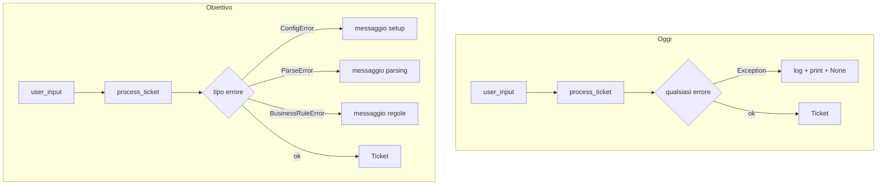

# Gestione degli errori — Manuale didattico

Manuale per introdurre la gestione degli errori nel progetto **Agentic Customer Care Triage System**.  
Complementa il [README.md](README.md): qui trovi il *perché*, il *come* e il *percorso* passo passo; nel README restano setup ed esecuzione.

---

## A chi serve

- **Studente:** capire se conviene partire da zero, modificare il progetto prima, o usare Cursor per tutto in una volta.
- **Docente / tutor:** avere una scaletta condivisa per le revisioni e la valutazione.

---

## Risposta breve

**Non serve né rifare tutto da zero senza progetto né chiedere a Cursor l’implementazione completa in una sola sessione.**

Il percorso consigliato è:

1. **Capire cosa c’è già** in questo repository (è già una base didattica valida).
2. **Imparare i concetti** su un esempio minuscolo (10–15 righe), senza LLM né Pydantic.
3. **Estendere il progetto reale a piccoli passi**, ognuno con uno o due test che falliscono e poi passano.
4. **Usare Cursor come tutor mirato** (anche con il piano gratuito), non come “refactor automatico di centinaia di righe”.

L’abbonamento a Cursor **non è necessario** per questo argomento. Conta molto di più **spezzare il lavoro** che avere il modello più potente.

---

## Stato attuale del progetto

Il codice ha già una gestione errori di **livello 1**. Non è assente: va **mappata** e poi **migliorata** a strati.

| Cosa esiste | Dove | Valore didattico |
|-------------|------|------------------|
| `raise ValueError(...)` | `client.py`, `parser.py`, `enrichment.py`, `router.py`, validatori in `schemas/ticket.py` | Fail-fast con messaggi in italiano |
| Cattura e rilancio | `parsing/parser.py` (`JSONDecodeError` → `ValueError`) | Incapsulamento senza gerarchia custom |
| Boundary unico | `main.py` — `except Exception` → log, stampa, `return None` | Pattern “confine applicazione” |
| Nessuna eccezione di dominio | ovunque | Spazio per l’esercizio, non un buco da riempire in blocco |

### Boundary attuale (`main.py`)

```python
except Exception as e:
    log_event("error", {"message": str(e), "input": user_input})
    print("\n[ERRORE]", str(e))
    return None
```

Ogni errore, da qualsiasi modulo, finisce qui con lo stesso trattamento: stesso log, stesso messaggio generico, stesso `None`.

### Incapsulamento già presente (`parser.py`)

```python
try:
    return json.loads(json_str)
except json.JSONDecodeError as e:
    raise ValueError(f"JSON non valido: {e}")
```

Qui c’è già l’idea di **tradurre** un errore di basso livello (JSON) in un messaggio comprensibile per il resto dell’app. Manca `raise ... from e` (vedi Modulo 1).

### Gap da affrontare gradualmente

- Nessuna gerarchia di eccezioni di dominio (`TriageError`, `ParseError`, …).
- Nessun `raise ... from e` (si perde la catena del traceback originale).
- Errori della SDK OpenAI non mappati in tipi dell’applicazione.
- I/O su `data/tickets.jsonl` senza gestione esplicita (righe corrotte, file mancante).
- Test solo su percorsi “felici”; nessun `pytest.raises` sui fallimenti.

### Flusso oggi vs obiettivo



---

## Concetti fondamentali

Prima di toccare il progetto, assicurati di distinguere questi ruoli.

### 1. Creare l’errore (`raise`)

Segnala che qualcosa è andato storto **in questo punto** del codice.

```python
if not api_key:
    raise ConfigError('API key non trovata. Imposta OPENAI_API_KEY in ".env".')
```

### 2. Incapsulare / tradurre (catturare e rilanciare)

Un modulo interno (es. parser JSON) conosce dettagli tecnici; il resto dell’app deve vedere errori **del dominio** (es. “risposta LLM non interpretabile”).

```python
except json.JSONDecodeError as e:
    raise ParseError(f"JSON non valido: {e}") from e
```

`from e` collega l’eccezione nuova a quella originale: utile in debug e nelle review.

### 3. Boundary (confine applicazione)

Un solo punto (qui: `process_ticket` in `main.py`) decide **cosa mostrare all’utente** e **cosa loggare**, invece di spargere `print` in ogni modulo.

### 4. Gerarchia di eccezioni

```text
Exception
└── TriageError          # base del dominio
    ├── ConfigError      # setup (.env, API key)
    ├── ParseError       # output LLM / JSON / schema
    ├── BusinessRuleError  # enrichment, routing
    ├── LLMError         # (opzionale) rete / API OpenAI
    └── StorageError     # (opzionale) file JSONL
```

Vantaggi:

- `except ParseError` senza intercettare errori di configurazione.
- `except TriageError` come rete di sicurezza per tutto il dominio.
- `except Exception` solo come fallback per bug imprevisti.

### 5. `return None` vs far risalire l’eccezione

| Scelta | Quando ha senso |
|--------|------------------|
| `return None` + messaggio | CLI didattica, demo con `run_tests()`: un errore non deve far crashare tutto lo script |
| Eccezione che risale | Librerie riusabili, API HTTP (status 4xx/5xx), test che verificano il tipo esatto |

In questo corso, **`None` + messaggio differenziato** in `main.py` è sufficiente.

---

## Cosa NON fare

| Approccio | Perché sconsigliato |
|-----------|---------------------|
| Prompt unico: *“implementa la gestione errori completa”* | Diff enorme, difficile da rivedere e da spiegare a voce |
| Copiare pattern da progetti enterprise | Retry policy, error codes HTTP, middleware — over-engineering su ~300 righe |
| Refactor + test + logging in una sola sessione | Nessun consolidamento intermedio; si “bruciano token” senza apprendimento |

**Regola pratica:** ogni sessione di lavoro (con o senza Cursor) = **un obiettivo**, **al massimo due file**, **almeno un test**.

---

## Percorso in 6 moduli

Durata indicativa: 30 min – 2 ore per modulo.

### Modulo 0 — Inventario (≈ 30 min, senza Cursor)

**Obiettivo:** sapere dove vivono già gli errori nel repo.

1. Cerca tutti i `raise` e tutti i `except` (editor o `rg "raise|except" src/`).
2. Per ciascuno, annota:
   - Chi **crea** l’errore?
   - Chi lo **trasforma**?
   - Chi lo **mostra** all’utente?
3. Traccia un caso concreto: *“L’LLM restituisce testo senza JSON”* — da `call_llm` → `parse_llm_output` → `main.py` → `[ERRORE]`.

**Domande guida:**

- Cosa succede se manca `OPENAI_API_KEY`?
- Cosa succede se il ticket viene salvato come `OPEN` e poi fallisce la chiamata LLM? (stato parziale in `data/tickets.jsonl`)
- `return None` è sempre la scelta giusta?

**Output atteso:** schema del flusso (anche su carta o in un commento nel quaderno).

**File da leggere:** `src/main.py`, `src/parsing/parser.py`, `src/client.py`, `src/tools/enrichment.py`, `src/tools/router.py`.

---

### Modulo 1 — Concetti su esempio minimale (fuori dal progetto)

**Obiettivo:** capire eccezioni custom e `raise ... from` senza rumore di LLM/Pydantic.

Crea un file temporaneo (es. `esempio_errori.py` nella home o in `/tmp`, **non** da committare):

```python
class ErroreApp(Exception):
    """Base per tutti gli errori dell'app didattica."""


class ErroreParsing(ErroreApp):
    """Input non interpretabile."""


def parse_numero(s: str) -> int:
    try:
        return int(s)
    except ValueError as e:
        raise ErroreParsing(f"non è un numero: {s!r}") from e


def main() -> None:
  for valore in ("42", "abc"):
      try:
          print(parse_numero(valore))
      except ErroreParsing as e:
          print("Parsing fallito:", e)
      except ErroreApp as e:
          print("Errore app:", e)


if __name__ == "__main__":
    main()
```

**Esercizi:**

1. Esegui con `"42"` e con `"abc"`. Osserva il traceback: con `from e` vedi anche `ValueError`.
2. Rimuovi temporaneamente `from e` e confronta il traceback.
3. Aggiungi `except Exception` e verifica che catturi tutto — perché in produzione il fallback va **limitato** al boundary?

Solo dopo questo modulo si passa al codice in `src/`.

---

### Modulo 2 — Gerarchia minima (`src/errors.py` + `client.py`)

**Obiettivo:** introdurre il primo tipo di dominio e un test dedicato.

1. Crea `src/errors.py`:

```python
class TriageError(Exception):
    """Base per errori del dominio triage."""


class ConfigError(TriageError):
    """Configurazione mancante o non valida (es. API key)."""


class ParseError(TriageError):
    """Output LLM o JSON non interpretabile."""


class BusinessRuleError(TriageError):
    """Violazione regole deterministiche (enrichment, routing)."""
```

2. In `src/client.py`, sostituisci il `ValueError` per API key mancante con `ConfigError`.
3. Aggiungi `tests/test_client.py` (o estendi un test esistente):

```python
import pytest
from client import get_client  # adatta import se necessario
from errors import ConfigError


def test_get_client_senza_api_key(monkeypatch, tmp_path):
    # Simula assenza di OPENAI_API_KEY e verifica ConfigError
    ...
```

**Prompt Cursor sicuro (esempio):**

> Aggiungi `src/errors.py` con `TriageError` e `ConfigError`. In `client.py` usa `ConfigError` al posto di `ValueError` per API key mancante. Aggiungi un test con `pytest.raises(ConfigError)`.

**Verifica:** `PYTHONPATH=src pytest tests/ -q`

---

### Modulo 3 — Parser (`parsing/parser.py`)

**Obiettivo:** incapsulamento corretto verso `ParseError`.

In `parse_llm_output` e nelle funzioni helper:

| Situazione | Eccezione |
|------------|-----------|
| Nessun `{...}` nella risposta | `ParseError` |
| `json.loads` fallisce | `ParseError` con `from e` |
| `TriageResult` Pydantic non valido | `ParseError` con `from e` — cattura `ValidationError`, **non** `Exception` |

Esempio target:

```python
from pydantic import ValidationError
from errors import ParseError

try:
    result = TriageResult(**data)
except ValidationError as e:
    raise ParseError(f"Schema TriageResult non valido: {e}") from e
```

**Test da aggiungere in `tests/test_parser.py`:**

- Stringa senza JSON (`"ciao mondo"`).
- JSON malformato (`"{ categoria: IT }"`).
- JSON valido ma campi mancanti o valori non ammessi.

```python
import pytest
from errors import ParseError
from parsing.parser import parse_llm_output


def test_parse_senza_json():
    with pytest.raises(ParseError):
        parse_llm_output("nessun json qui")
```

---

### Modulo 4 — Boundary in `main.py`

**Obiettivo:** messaggi differenziati senza cambiare la firma `Ticket | None`.

Sostituisci il blocco unico `except Exception` con handler tipizzati, in ordine dal più specifico al più generico:

```python
from errors import BusinessRuleError, ConfigError, ParseError, TriageError

try:
    ...
except ConfigError as e:
    log_event("error", {"type": "config", "message": str(e), "input": user_input})
    print("\n[ERRORE CONFIGURAZIONE]", str(e))
    return None
except ParseError as e:
    log_event("error", {"type": "parse", "message": str(e), "input": user_input})
    print("\n[ERRORE PARSING]", str(e))
    return None
except BusinessRuleError as e:
    log_event("error", {"type": "business", "message": str(e), "input": user_input})
    print("\n[ERRORE REGOLA]", str(e))
    return None
except TriageError as e:
    log_event("error", {"type": "triage", "message": str(e), "input": user_input})
    print("\n[ERRORE]", str(e))
    return None
except Exception as e:
    log_event("error", {"type": "unexpected", "message": str(e), "input": user_input})
    print("\n[ERRORE IMPREVISTO]", str(e))
    return None
```

Migra `enrichment.py` e `router.py` da `ValueError` a `BusinessRuleError` dove appropriato.

**Discussione:** perché l’ultimo `except Exception` resta comunque necessario?

---

### Modulo 5 — (Opzionale) OpenAI e storage

**Prerequisito:** moduli 2–4 solidi (spieghi ogni `raise` a voce).

| Area | File | Azione |
|------|------|--------|
| API OpenAI | `client.py` | Catturare eccezioni SDK → `LLMError(TriageError)` |
| JSONL | `storage/store.py` | Riga corrotta: log + `StorageError` o skip controllato |
| Stato parziale | `main.py` | (Avanzato) documentare che un ticket `OPEN` può restare se fallisce l’LLM |

Non mescolare rete, file system e parsing nello stesso pomeriggio: un concetto per sessione.

---

## Usare Cursor senza sprecare token

| Uso consigliato | Uso da evitare |
|-----------------|----------------|
| “Spiegami questo `except` in `main.py`” | “Refactora tutta la gestione errori” |
| “Scrivi solo il test per JSON invalido” | “Allinea tutto il progetto alle best practice” |
| “Ho usato `raise X from e`, il traceback è corretto?” | Incollare l’intero `src/` e chiedere una review totale |

**Modello didattico consigliato:**

1. Tu scrivi o abbozzi la modifica a mano.
2. Cursor corregge o integra su **un file**.
3. Spieghi il diff al docente (o in autovalutazione).

L’abbonamento Pro ha senso se userai Cursor spesso per **tutto il corso**; per questo modulo il free tier con prompt piccoli è spesso sufficiente.

---

## Inventario rapido dei `raise` attuali (punto di partenza)

Usa questa tabella come checklist del Modulo 0 e aggiornala man mano che migri.

| File | Tipo attuale | Esempio di messaggio | Migrazione target |
|------|--------------|----------------------|-------------------|
| `client.py` | `ValueError` | API key mancante | `ConfigError` |
| `parser.py` | `ValueError` | JSON non trovato / non valido | `ParseError` + `from e` |
| `schemas/ticket.py` | `ValueError` (Pydantic) | Validazione campi | Resta in Pydantic; parser traduce in `ParseError` |
| `enrichment.py` | `ValueError` | Ticket senza priorità | `BusinessRuleError` |
| `router.py` | `ValueError` | Regole routing | `BusinessRuleError` |
| `main.py` | `except Exception` | Qualsiasi | Handler per tipo |

---

## Checklist di completamento

Usala per autovalutazione o per la revisione col docente.

- [ ] So disegnare il flusso di un errore da `call_llm` / `parse_llm_output` fino a `[ERRORE]` in console.
- [ ] Esistono almeno tre eccezioni di dominio con gerarchia chiara sotto `TriageError`.
- [ ] Uso `raise ... from e` almeno nel parser.
- [ ] Ho almeno tre test con `pytest.raises` su percorsi di fallimento.
- [ ] So spiegare perché in `main.py` resta un `except Exception` finale.
- [ ] Non ho introdotto pattern superflui (retry automatici, codici HTTP, middleware) per questa CLI didattica.

---

## Messaggio riassuntivo (per iniziare subito)

> Il progetto ha già una gestione errori di livello 1: `ValueError`, try/except in `main`, wrapping nel parser. Non serve rifarlo da zero né chiedere a Cursor tutto in una volta.
>
> Percorso: (1) mappa gli errori esistenti, (2) impara eccezioni custom e `raise from` su un file di quindici righe, (3) aggiungi `errors.py` e migra un modulo alla volta con un test per tipo di errore, (4) usa Cursor solo per compiti singoli.
>
> L’abbonamento Cursor è opzionale; conta spezzare il lavoro. Al prossimo incontro ha senso rivedere insieme solo il Modulo 2 (`ConfigError` + test).

---

## Collegamenti

- [README.md](README.md) — setup, struttura, esecuzione
- `src/main.py` — pipeline e boundary
- `src/parsing/parser.py` — parsing e incapsulamento
- `tests/` — aggiungere qui i test sui fallimenti
