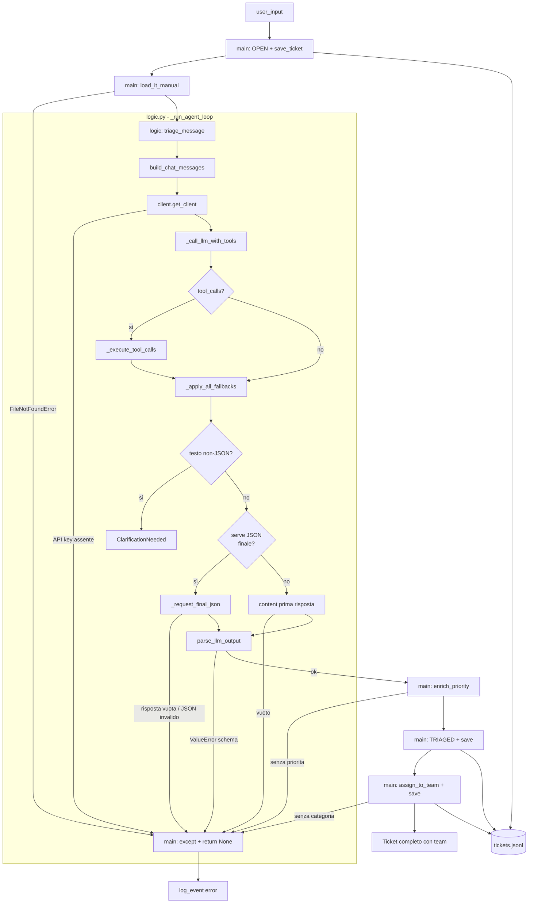
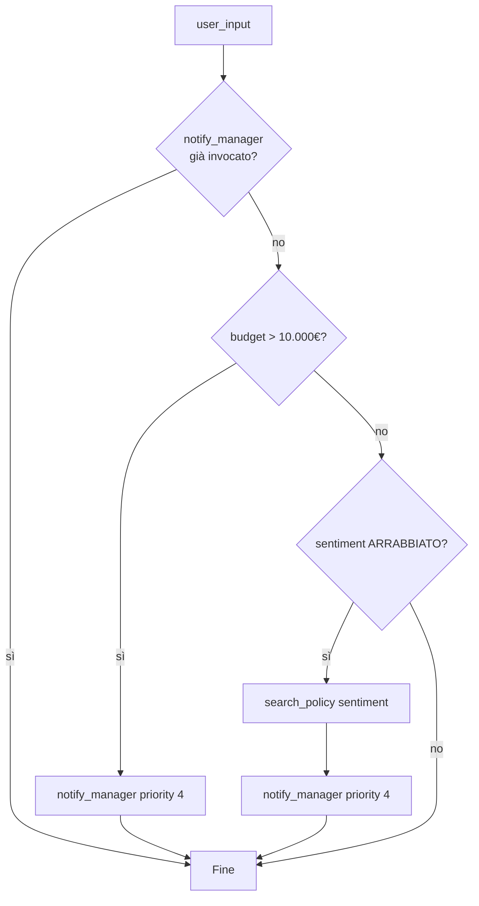
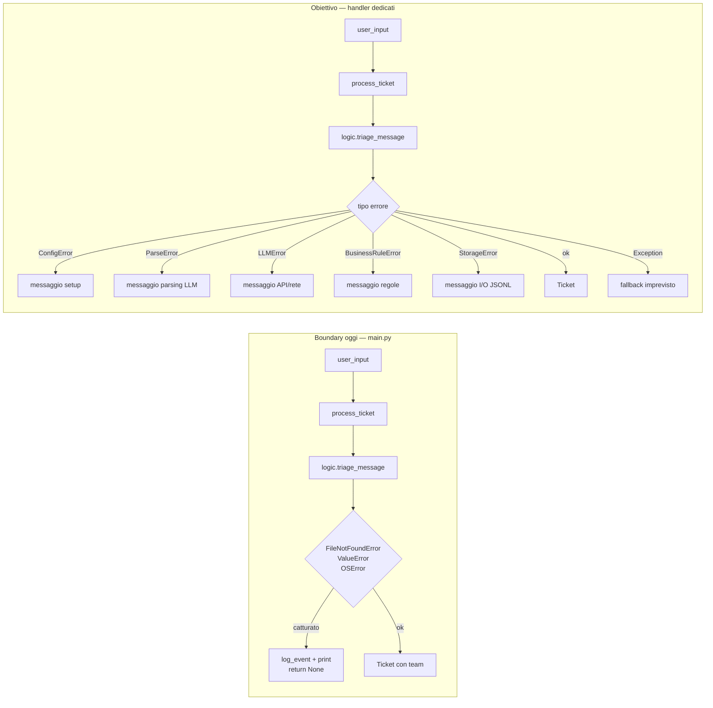

# Gestione degli errori — Manuale didattico

Manuale per introdurre e migliorare la gestione degli errori nel progetto **Agentic Customer Care Triage System**.  
Complementa il [README.md](README.md): qui trovi il *perché*, il *come* e il *percorso* passo passo; nel README restano setup, pipeline ed esecuzione.

---

## A chi serve

- **Studente:** capire se conviene partire da zero, modificare il progetto prima, o usare Cursor per tutto in una volta.
- **Docente / tutor:** avere una scaletta condivisa per le revisioni e la valutazione.

---

## Risposta breve

**Non serve né rifare tutto da zero senza progetto né chiedere a Cursor l’implementazione completa in una sola sessione.**

Il percorso consigliato è:

1. **Capire cosa c’è già** in questo repository (base didattica valida, già estesa con CoT, manuale IT e test sui fallimenti parziali).
2. **Imparare i concetti** su un esempio minuscolo (10–15 righe), senza LLM né Pydantic.
3. **Estendere il progetto reale a piccoli passi**, ognuno con uno o due test che falliscono e poi passano.
4. **Usare Cursor come tutor mirato** (anche con il piano gratuito), non come “refactor automatico di centinaia di righe”.

L’abbonamento a Cursor **non è necessario** per questo argomento. Conta molto di più **spezzare il lavoro** che avere il modello più potente.

---

## Stato attuale del progetto

Il codice ha una gestione errori di **livello 1–2**: fail-fast con `ValueError`, boundary in `main.py`, parser con `raise ... from e` su JSON e Pydantic, nucleo loop in `logic.py` (`_run_agent_loop`), memoria short/long-term, RAG semantica su policy (Lezione 10), suite di **48 test** sui fallimenti principali e sui fallback. Manca ancora una **gerarchia di eccezioni di dominio**.

### Nucleo agentico (`logic.py`) — riferimento rapido

Il triage LLM vive in un unico loop (vedi [README — Architettura](README.md#architettura)):

1. `build_chat_messages` — cronologia (`history`) + few-shot + manuale IT  
2. `_call_llm_with_tools` — prima risposta con `TOOLS_DEFINITION`  
3. `_execute_tool_calls` — tool locali (se `tool_calls`)  
4. `_apply_all_fallbacks` — policy (VIP, ARRABBIATO) + long-term (storico cliente)  
5. `_request_final_json` + `parse_llm_output` — JSON validato  

Se la prima risposta non è JSON e non ci sono tool, `logic` solleva `ClarificationNeeded` (non è un errore fatale: `main` stampa `[CHIARIMENTO]` e il ticket resta `OPEN`).

Gli errori di parsing/API nascono nei passi 2 e 5; il boundary in `main.py` li converte in `log_event` + `return None`.

### Pipeline e punti di fallimento

Ogni ticket attraversa snapshot append-only in `data/tickets.jsonl`:

| Fase | Azione | Errore tipico | Stato su disco se fallisce |
|------|--------|---------------|----------------------------|
| 1 | `OPEN` + `save_ticket` | I/O su JSONL | Nessuna riga (o riga OPEN se save parziale) |
| 2 | `load_it_manual()` | `FileNotFoundError` | Riga **OPEN** già scritta |
| 3 | `logic.triage_message()` (LLM, tool, `parse_llm_output`) | API key, rete, SDK, JSON/schema | Riga **OPEN** |
| 4 | `enrich_priority()` | Ticket senza `priorita` | Riga **OPEN** (triage solo in memoria) |
| 5 | `TRIAGED` + `save_ticket` | Validazione `Ticket` incompleto | Riga **OPEN** |
| 6 | `assign_to_team()` + `save_ticket` | Categoria assente | Riga **TRIAGED** senza `team` |



**Caso didattico importante:** se la chiamata LLM fallisce dopo il save `OPEN`, il ticket resta in JSONL senza classificazione. È uno **stato parziale** da discutere (rollback, flag `FAILED`, retry manuale).

**Demo attuali:** Lezione 9 (M1–M3) e Lezione 10 (L10 RAG) — vedi [README.md](README.md). **M1** può lasciare il ticket `OPEN` se l’LLM chiede chiarimento (`ClarificationNeeded`). **M2** verifica long-term + fallback escalation su storico Marco. **L10** invoca `semantic_policy_search` con query sinonimica (successo = score ≥ 0.38, non match lessicale). I fallback policy (VIP, ARRABBIATO) e long-term restano in `_apply_all_fallbacks`.

Il fallback **non è un errore**: è una guardia operativa in `_run_agent_loop` dopo la prima risposta LLM; le observation entrano nel contesto della seconda chiamata. Se un tool solleva eccezione, il boundary in `main.py` cattura `ValueError`/`OSError`.

**RAG `search_policy` (Lezione 10):** percorso **principale** = `semantic_policy_search` (embeddings + soglia 0.38). In condizioni normali l’LLM riceve `[RAG semantica | score=…]` — **non** si usano keyword. **Eccezione:** in `office_tools.py`, errori API key / rete / embeddings (`ValueError`, `OSError`, `RuntimeError`) o score sotto 0.38 non propagano al ticket: `search_policy` ripiega su `_search_policy_keyword` (Lezione 6). La demo L10 invoca `semantic_policy_search` direttamente; il fallback keyword compare solo se la RAG fallisce (messaggio `[NOTA] …` in `main.py`).

**ChromaDB (Lezione 10B — sotto-lezione):** installazione e laboratorio in [docs/LEZIONE_10B_CHROMADB.md](docs/LEZIONE_10B_CHROMADB.md). Chroma sostituisce la cache RAM dell’indice, non il contratto di `search_policy`. Errori I/O su `data/chroma/` → stessa **eccezione** keyword, senza far fallire il ticket.



Dettaglio scenari e comandi: [README — Demo Lezione 9](README.md#demo-lezione-9-m1m3), [README — RAG Lezione 10](README.md#rag-semantica-lezione-10).

### Cosa esiste oggi

| Cosa | Dove | Note |
|------|------|------|
| `raise ValueError(...)` | `client.py`, `logic.py`, `parser.py`, `enrichment.py`, `router.py`, `schemas/ticket.py` | Messaggi in italiano |
| `raise ... from e` | `parser.py` — `JSONDecodeError`, `ValidationError` | Catena traceback preservata |
| Boundary tipizzato | `main.py` — `except (FileNotFoundError, ValueError, OSError)` | Cattura errori da tutta la pipeline |
| Suite test essenziale | `tests/` — **40 test**, alcuni `pytest.raises` | Vedi tabella sotto |
| Percorsi centralizzati | `paths.py` | Manuale, policy, ticket, log, `.env` |
| Separazione agente / orchestrazione | `logic.py` (`_run_agent_loop`) vs `main.py` | Errori LLM nascono nel nucleo loop, gestiti in `main` |
| Nessuna eccezione di dominio | — | Obiettivo dei moduli 2–4 |

### Boundary attuale (`main.py`)

```python
except (FileNotFoundError, ValueError, OSError) as e:
    log_event("error", {"message": str(e), "input": user_input})
    print("\n[ERRORE]", str(e))
    return None
```

| Tipo catturato | Origine tipica | Esempio |
|----------------|----------------|---------|
| `FileNotFoundError` | `load_it_manual()` | `data/manuale_it.txt` assente |
| `ValueError` | `client`, `logic`, `parser`, Pydantic, enrichment, router | API key, risposta vuota LLM, JSON invalido |
| `OSError` | `save_ticket`, `log_event` | Permessi, disco pieno |

**Non catturato qui:** errori SDK OpenAI non mappati (es. `AuthenticationError`) — possono far crashare `process_ticket` se non derivano da `ValueError`/`OSError`. Modulo 5 opzionale.

### Incapsulamento nel parser (`parsing/parser.py`)

```python
except json.JSONDecodeError as e:
    raise ValueError(f"JSON non valido: {e}") from e

except ValidationError as e:
    raise ValueError(f"Errore validazione TriageResult: {e}") from e
```

Estrazione JSON con **parentesi bilanciate** (non regex greedy): riduce falsi positivi su testo extra.

**Migrazione didattica:** sostituire `ValueError` con `ParseError` mantenendo `from e` (Modulo 3).

### Gap da affrontare gradualmente

- Nessuna gerarchia `TriageError` / `ConfigError` / `ParseError` / `BusinessRuleError`.
- Errori OpenAI SDK non tradotti in tipi applicativi.
- JSONL: nessuna gestione esplicita di righe corrotte in `next_ticket_id()`.
- Boundary non distingue messaggi per tipo (config vs parsing vs regole).
- Stato parziale `OPEN` dopo fallimento LLM non documentato in UI/log dedicato.
- Suite essenziale (40 test): parser, store, enrichment, router, logic, memory, history_tools, tools, main; nessun E2E con API reale.

### Flusso oggi vs obiettivo



---

## Concetti fondamentali

Prima di toccare il progetto, assicurati di distinguere questi ruoli.

### 1. Creare l’errore (`raise`)

Segnala che qualcosa è andato storto **in questo punto** del codice.

```python
if not api_key:
    raise ConfigError('API key non trovata. Imposta OPENAI_API_KEY in ".env".')
```

### 2. Incapsulare / tradurre (catturare e rilanciare)

Un modulo interno (es. parser JSON) conosce dettagli tecnici; il resto dell’app deve vedere errori **del dominio** (es. “risposta LLM non interpretabile”).

```python
except json.JSONDecodeError as e:
    raise ParseError(f"JSON non valido: {e}") from e
```

`from e` collega l’eccezione nuova a quella originale: utile in debug e nelle review.

### 3. Boundary (confine applicazione)

Un solo punto (`process_ticket` in `main.py`) decide **cosa mostrare all’utente** e **cosa loggare**, invece di spargere `print` in ogni modulo.

### 4. Gerarchia di eccezioni

```text
Exception
└── TriageError          # base del dominio
    ├── ConfigError      # setup (.env, API key, manuale)
    ├── ParseError       # output LLM / JSON / schema
    ├── BusinessRuleError  # enrichment, routing
    ├── LLMError         # (opzionale) rete / API OpenAI
    └── StorageError     # (opzionale) file JSONL
```

Vantaggi:

- `except ParseError` senza intercettare errori di configurazione.
- `except TriageError` come rete di sicurezza per tutto il dominio.
- `except Exception` solo come fallback per bug imprevisti.

### 5. `return None` vs far risalire l’eccezione

| Scelta | Quando ha senso |
|--------|------------------|
| `return None` + messaggio | CLI didattica, `run_demo()`: un errore non deve far crashare tutti gli scenari M1–M3 |
| Eccezione che risale | Librerie riusabili, API HTTP (status 4xx/5xx), test che verificano il tipo esatto |

In questo corso, **`None` + messaggio differenziato** in `main.py` è sufficiente.

---

## Cosa NON fare

| Approccio | Perché sconsigliato |
|-----------|---------------------|
| Prompt unico: *“implementa la gestione errori completa”* | Diff enorme, difficile da rivedere e da spiegare a voce |
| Copiare pattern da progetti enterprise | Retry policy, error codes HTTP, middleware — over-engineering su ~400 righe |
| Refactor + test + logging in una sola sessione | Nessun consolidamento intermedio |

**Regola pratica:** ogni sessione = **un obiettivo**, **al massimo due file**, **almeno un test**.

---

## Percorso in 6 moduli

Durata indicativa: 30 min – 2 ore per modulo.

### Modulo 0 — Inventario (≈ 30 min, senza Cursor)

**Obiettivo:** mappare errori e **stati parziali** nel repo attuale.

1. Cerca tutti i `raise` e tutti i `except` (`rg "raise|except" src/`).
2. Per ciascuno annota: chi **crea**, chi **trasforma**, chi **mostra** all’utente.
3. Traccia due casi:
   - *“L’LLM restituisce testo senza JSON”* → `parse_llm_output` → `main` → `[ERRORE]`
   - *“Manca `manuale_it.txt`”* → dopo save `OPEN` → cosa c’è in `tickets.jsonl`?

**Domande guida:**

- Cosa succede se manca `OPENAI_API_KEY`?
- Cosa succede se manca `data/manuale_it.txt`?
- Perché l’ultimo snapshot può avere `team` valorizzato ma status ancora `TRIAGED`?
- `return None` è sempre la scelta giusta per un’API REST?

**File da leggere:** `src/main.py`, `src/logic.py` (`_run_agent_loop`, `_apply_all_fallbacks`, `ClarificationNeeded`), `src/memory/`, `src/tools/history_tools.py`, `src/client.py`, `src/prompts/triage_v1.py`, `src/parsing/parser.py`, `src/tools/office_tools.py`, `src/tools/registry.py`, `src/storage/store.py`, `src/tools/enrichment.py`, `src/tools/router.py`.

**Output atteso:** schema flusso errori + tabella stati parziali su JSONL.

---

### Modulo 1 — Concetti su esempio minimale (fuori dal progetto)

**Obiettivo:** eccezioni custom e `raise ... from` senza rumore di LLM/Pydantic.

Crea un file temporaneo (es. `esempio_errori.py`, **non** da committare):

```python
class ErroreApp(Exception):
    """Base per tutti gli errori dell'app didattica."""


class ErroreParsing(ErroreApp):
    """Input non interpretabile."""


def parse_numero(s: str) -> int:
    try:
        return int(s)
    except ValueError as e:
        raise ErroreParsing(f"non è un numero: {s!r}") from e


def main() -> None:
    for valore in ("42", "abc"):
        try:
            print(parse_numero(valore))
        except ErroreParsing as e:
            print("Parsing fallito:", e)
        except ErroreApp as e:
            print("Errore app:", e)


if __name__ == "__main__":
    main()
```

**Esercizi:** confronta traceback con e senza `from e`; aggiungi `except Exception` e discuti perché il fallback va limitato al boundary.

---

### Modulo 2 — Gerarchia minima (`src/errors.py` + `client.py`)

**Obiettivo:** primo tipo di dominio + test.

1. Crea `src/errors.py` con `TriageError`, `ConfigError`, `ParseError`, `BusinessRuleError`.
2. In `client.py`, sostituisci `ValueError` (API key) con `ConfigError`.
3. In `main.py`, aggiungi `except ConfigError` **prima** del blocco generico.
4. Aggiungi un test con `pytest.raises(ConfigError)` (es. in `tests/test_logic.py` mockando `get_client`, o file `tests/test_errors.py`).

**Prompt Cursor sicuro:**

> Aggiungi `src/errors.py` con `TriageError` e `ConfigError`. In `client.py` usa `ConfigError` per API key mancante. In `main.py` gestisci `ConfigError` con messaggio dedicato. Un test con `pytest.raises(ConfigError)`.

**Verifica:** `pytest tests/ -q`

---

### Modulo 3 — Parser (`parsing/parser.py`)

**Obiettivo:** `ParseError` al posto di `ValueError` (il `from e` c’è già).

| Situazione | Eccezione target |
|------------|------------------|
| Nessun `{...}` bilanciato | `ParseError` |
| `json.loads` fallisce | `ParseError` con `from e` |
| `TriageResult` non valido | `ParseError` con `from e` da `ValidationError` |

**Test già presenti** in `tests/test_parser.py`:

- JSON valido
- Senza JSON → `ValueError`

**Da aggiungere (opzionale):** JSON con campi mancanti → `ParseError` dopo migrazione; fence markdown se il modello restituisce ` ```json `.

```python
import pytest
from errors import ParseError
from parsing.parser import parse_llm_output


def test_parse_json_senza_campi_obbligatori():
    raw = '{"categoria":"IT"}'
    with pytest.raises(ParseError):
        parse_llm_output(raw)
```

---

### Modulo 4 — Boundary in `main.py`

**Obiettivo:** messaggi differenziati; firma `Ticket | None` invariata.

Sostituire il blocco unico con handler in ordine dal più specifico al più generico:

```python
from errors import BusinessRuleError, ConfigError, ParseError, TriageError

try:
    ...
except ConfigError as e:
    log_event("error", {"type": "config", "message": str(e), "input": user_input})
    print("\n[ERRORE CONFIGURAZIONE]", str(e))
    return None
except ParseError as e:
    log_event("error", {"type": "parse", "message": str(e), "input": user_input})
    print("\n[ERRORE PARSING]", str(e))
    return None
except BusinessRuleError as e:
    log_event("error", {"type": "business", "message": str(e), "input": user_input})
    print("\n[ERRORE REGOLA]", str(e))
    return None
except FileNotFoundError as e:
    log_event("error", {"type": "file", "message": str(e), "input": user_input})
    print("\n[ERRORE FILE]", str(e))
    return None
except TriageError as e:
    ...
except OSError as e:
    ...
except Exception as e:
    log_event("error", {"type": "unexpected", "message": str(e), "input": user_input})
    print("\n[ERRORE IMPREVISTO]", str(e))
    return None
```

Migrare `enrichment.py` e `router.py` da `ValueError` a `BusinessRuleError`.

**Discussione:** perché `FileNotFoundError` per il manuale può diventare `ConfigError` se il manuale è considerato prerequisito di deploy?

---

### Modulo 5 — (Opzionale) OpenAI e storage

| Area | File | Azione |
|------|------|--------|
| API OpenAI | `logic.py` (+ `client.get_client`) | Eccezioni SDK → `LLMError(TriageError)` |
| JSONL | `storage/store.py` | Riga corrotta in `next_ticket_id` → log + `StorageError` o skip documentato |
| Stato parziale | `main.py` | Log evento `ticket_stuck_open` se fallisce post-OPEN; (avanzato) status `FAILED` |

Un concetto per sessione: non mescolare rete, filesystem e parsing nello stesso pomeriggio.

---

## Usare Cursor senza sprecare token

| Uso consigliato | Uso da evitare |
|-----------------|----------------|
| “Spiegami questo `except` in `main.py`” | “Refactora tutta la gestione errori” |
| “Scrivi solo il test per JSON invalido” | “Allinea tutto il progetto alle best practice” |
| “Perché resta OPEN in JSONL se fallisce l’LLM?” | Incollare l’intero `src/` per review totale |

---

## Inventario rapido dei `raise` attuali

Checklist Modulo 0 — aggiornare dopo ogni migrazione.

| File | Tipo attuale | Esempio | Target |
|------|--------------|---------|--------|
| `client.py` | `ValueError` | API key mancante | `ConfigError` |
| `logic.py` | `ValueError` | Risposta vuota dal modello | `LLMError` o `ParseError` |
| `logic.py` | `ClarificationNeeded` | `_apply_all_fallbacks` — tool in conversation, non raise | Documentato in README; opz. `BusinessRuleError` se tool fallisce |
| `parser.py` | `ValueError` + `from e` | JSON / schema | `ParseError` + `from e` |
| `schemas/ticket.py` | `ValueError` (Pydantic) | Campi vuoti, TRIAGED incompleto | Resta in Pydantic; parser → `ParseError` |
| `main.py` | `FileNotFoundError` | Manuale assente | `ConfigError` o handler dedicato |
| `enrichment.py` | `ValueError` | Senza priorità | `BusinessRuleError` |
| `router.py` | `ValueError` | Senza categoria | `BusinessRuleError` |
| `store.py` | (nessuno) | `json.loads` su riga corrotta | `StorageError` (opz.) |
| `main.py` boundary | `FileNotFoundError`, `ValueError`, `OSError` | Tutti → stesso messaggio | Handler per tipo + `Exception` fallback |

---

## Test e copertura fallimenti

Suite essenziale: **48 test** (`pytest tests/ -q`, `pythonpath = src` in `pyproject.toml`). Nessuna chiamata API reale (mock su LLM e embeddings).

| File test | Cosa copre |
|-----------|------------|
| `test_parser.py` | JSON valido; assenza JSON |
| `test_store.py` | `next_ticket_id`; ultimo snapshot |
| `test_enrichment.py` | Keyword priorità |
| `test_router.py` | Routing 4 categorie |
| `test_logic.py` | Loop mock; fallback policy |
| `test_tools.py` | Tool + registry (mock embeddings per `search_policy`) |
| `test_policy_semantic.py` | Chunking, cosine, RAG sinonimi, fallback keyword (solo eccezione) |
| `test_session_manager.py` | Short-term memory |
| `test_extractors.py` | `cliente_nome`, sentiment |
| `test_history_tools.py` | Long-term memory |
| `test_main.py` | Scenari demo M1–M3 |

Fixture in `tests/conftest.py`: `triaged_ticket`, isolamento `TICKETS_PATH` su file temporaneo.

**Non coperto dai test:** errori SDK OpenAI non mappati, righe JSONL corrotte, E2E con API key reale.

---

## Checklist di completamento

- [ ] So disegnare il flusso di un errore da `logic.triage_message` → `_run_agent_loop` → `parse_llm_output` fino a `[ERRORE]` in console.
- [ ] So spiegare lo **stato parziale OPEN** in `tickets.jsonl` se fallisce LLM o manuale.
- [ ] Esistono almeno tre eccezioni di dominio sotto `TriageError`.
- [ ] `ParseError` usa `raise ... from e` (già nel parser come `ValueError`; da rinominare).
- [ ] Almeno cinque test con `pytest.raises` su percorsi di fallimento (oggi: parser, enrichment, logic — estendere dopo `errors.py`).
- [ ] Boundary in `main.py` con messaggi distinti per tipo.
- [ ] Resta un `except Exception` finale come rete di sicurezza.
- [ ] Nessun pattern superfluo (retry HTTP, middleware) per questa CLI.

---

## Messaggio riassuntivo

> Il progetto ha già boundary tipizzato, nucleo loop in `logic.py`, memoria short/long-term, RAG semantica su policy, `ClarificationNeeded` per turni ambigui, parser con `from e`, persistenza a snapshot (OPEN → TRIAGED → routed con `team`) e 48 test sui moduli core. Non serve rifare tutto né chiedere a Cursor un refactor unico.
>
> Percorso: (1) mappa errori e stati parziali su JSONL, (2) esercizio minimale su `raise from`, (3) `errors.py` e migra un modulo per volta con test, (4) boundary con messaggi per tipo in `main.py`.
>
> Prossimo passo consigliato: **Modulo 2** (`errors.py` + `ConfigError` in `client.py` + test dedicato).

---

## Collegamenti

- [README.md](README.md) — architettura, memoria, RAG L10, demo M1–M3 e L10, setup
- `src/main.py` — orchestrazione e boundary
- `src/logic.py` — nucleo loop agentico (`_run_agent_loop`, tool locali, fallback, JSON finale)
- `src/client.py` — connessione OpenAI
- `src/paths.py` — percorsi assoluti (log, dati, manuale, policy, `.env`)
- `src/parsing/parser.py` — parsing e incapsulamento
- `src/rag/policy_semantic.py` — chunking, embeddings, cosine similarity (Lezione 10)
- `src/tools/office_tools.py` — `search_policy` (RAG principale; keyword in eccezione), `notify_manager`
- `src/tools/history_tools.py` — `search_long_term_history`
- `src/memory/` — `SessionManager`, extractors
- `tests/conftest.py` — fixture condivise
- `tests/test_*.py` — suite essenziale (48 test); estendere dopo ogni migrazione errori
