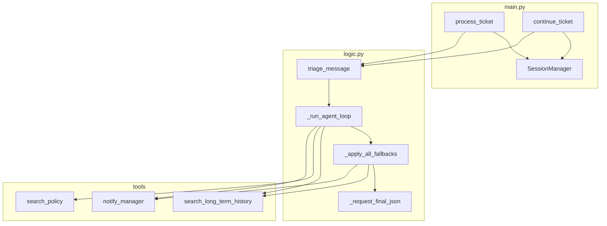
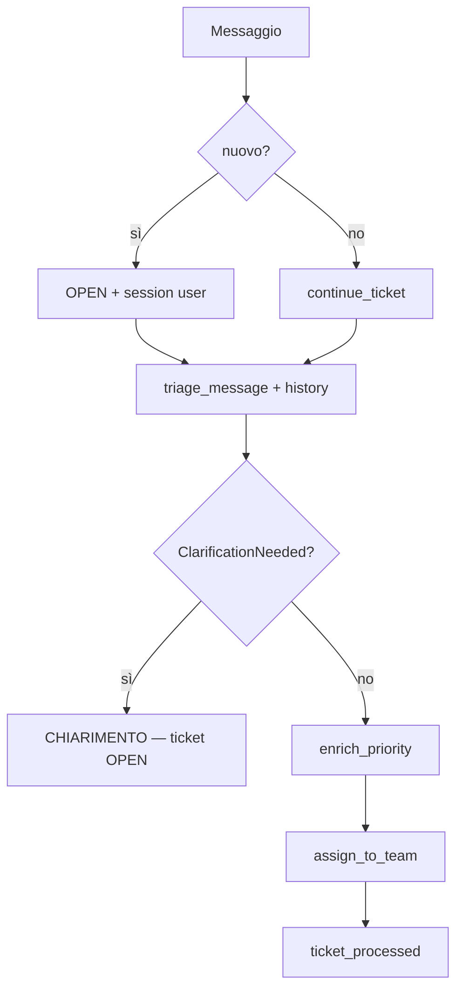

# Agentic Customer Care Triage System

Sistema agentico per triage ticket customer care: classificazione LLM (CoT + JSON), tool locali, **memoria short/long-term** (Lezione 9) e persistenza append-only.

## Architettura

| Modulo | Ruolo |
|--------|--------|
| [`main.py`](src/main.py) | Orchestrazione, `SessionManager`, demo didattiche M1–M3 |
| [`logic.py`](src/logic.py) | Loop agentico: LLM → tool → fallback → JSON |
| [`client.py`](src/client.py) | Client OpenAI (`OPENAI_API_KEY` solo nel file `.env`, non dalla shell) |

| Package / file | Ruolo |
|----------------|--------|
| [`memory/session_manager.py`](src/memory/session_manager.py) | Short-term: cronologia `user`/`assistant` per `ticket_id` |
| [`memory/extractors.py`](src/memory/extractors.py) | Estrazione `cliente_nome` e `sentiment` per audit log |
| [`tools/history_tools.py`](src/tools/history_tools.py) | Long-term: `search_long_term_history` |
| [`tools/office_tools.py`](src/tools/office_tools.py) | `search_policy`, `notify_manager` |
| [`tools/registry.py`](src/tools/registry.py) | `TOOL_MAP` e schema OpenAI |
| [`prompts/triage_v1.py`](src/prompts/triage_v1.py) | System prompt, 2 few-shot, `build_chat_messages(history=…)` |
| [`paths.py`](src/paths.py) | Percorsi repo (`LOG_FILE_PATH`, `DEMO_M2_LOG_PATH`, …) |



### API principali (`main.py`)

| Funzione | Uso |
|----------|-----|
| `process_ticket(messaggio)` | Nuovo ticket (`OPEN` → triage → routing) |
| `continue_ticket(ticket_id, messaggio)` | Turno successivo (short-term memory) |
| `seed_marco_angry_history(n, log_path, reset=…)` | Seed demo M2 (storico Marco) |
| `run_demo()` / `run_*_demo()` | Scenari didattici M3 → M1 → M2 |

## Memoria (Lezione 9)

### Short-term (9.1)

Stesso `ticket_id`, più turni. `SessionManager` (in-memory) conserva il thread; `build_chat_messages` inietta la cronologia nel contesto LLM.

| Turno | Comportamento |
|-------|----------------|
| 1 | Messaggio vago → LLM può rispondere con testo (`ClarificationNeeded`) → ticket resta `OPEN` |
| 2+ | `continue_ticket` → triage JSON con tutto il thread |

### Long-term (9.2)

Ogni `ticket_processed` in `logs/activity.jsonl` include `cliente_nome` e `sentiment`. Il tool `search_long_term_history` legge lo storico; se ≥4 ticket **IT + ARRABBIATO** in 24h → fallback `notify_manager` (priority 4).

**Demo M2 — due log distinti:**

| Operazione | File |
|------------|------|
| Seed storico (`seed_marco_angry_history`) | `logs/demo_m2_activity.jsonl` |
| Lettura storico + soglia escalation (`search_long_term_history`, `should_escalate_repeat_customer`) | `demo_m2_activity.jsonl` durante il patch in `run_ltm_demo()` |
| Eventi live della run (`log_event`, es. `ticket_received`, `ticket_processed`) | `logs/activity.jsonl` (sempre) |

Il seed con `reset=True` rende ripetibile la lezione; la **ricerca** long-term in M2 non legge il log principale, ma gli eventi della sessione corrente vengono comunque auditati in `activity.jsonl`.

## Pipeline ticket



## Tool e fallback

| Tool | Quando |
|------|--------|
| `search_long_term_history` | Cliente identificabile nel thread (`context_text`) |
| `search_policy` | Policy commerciale, sentiment ARRABBIATO |
| `notify_manager` | VIP >10k€, ARRABBIATO, o storico cliente critico |

[`_apply_all_fallbacks`](src/logic.py) in `logic.py` unisce fallback **policy** (VIP, ARRABBIATO) e **long-term** (storico Marco). I tool mancanti vengono eseguiti e le observation sono aggiunte alla conversazione prima del JSON finale.

## Output LLM

```json
{
  "analisi_problema": "1. Problema: … 2. Contesto: … 3. Categoria: … 4. Priorità: …",
  "categoria": "IT | BILLING | SALES | SECURITY",
  "priorita": "LOW | MEDIUM | HIGH | CRITICAL",
  "riassunto_breve": "max 15 parole",
  "messaggio_originale": "ultimo input utente del turno corrente"
}
```

## Demo Lezione 9 (M1–M3)

Metadati in `DEMO_SCENARIOS` (`Lesson9Scenario`: obiettivo, messaggi, cosa osservare). Ordine in `run_demo()`: **M3 → M1 → M2**.

| ID | Domanda guida | Segnale di successo |
|----|----------------|---------------------|
| **M3** | La pipeline funziona senza memoria? | `=== TICKET PROCESSATO ===`, categoria IT |
| **M1** | Perché serve il turno 2 senza ID server? | `[CHIARIMENTO]` o nota didattica, poi triage con server-X |
| **M2** | Cosa cambia con 4 ticket passati di Marco? | `[SEED]`, `search_long_term_history`, eventuale `🚨 [ESCALATION LIVE]` |

### Esecuzione

```bash
source .venv/bin/activate
pip install -e ".[test]"

# Tutti gli scenari (M3 → M1 → M2)
PYTHONPATH=src python3 src/main.py

# Un solo scenario
PYTHONPATH=src python3 src/main.py --scenario m3
PYTHONPATH=src python3 src/main.py --scenario m1
PYTHONPATH=src python3 src/main.py --scenario m2
```

**API key:** imposta `OPENAI_API_KEY=sk-...` nel file `.env` alla root del repo. Non viene letta da `export` in shell (`client.py` usa solo `dotenv_values` sul file).

### Testi demo (distinti dai few-shot)

| Scenario | Messaggi |
|----------|----------|
| **M1** | 1) «Ho un problema urgente con un server in produzione… non ho altri dettagli» → 2) «È il server-X in datacenter Roma.» |
| **M2** | «Sono Marco… cluster **db-primary** offline… quinto incidente» (few-shot usa `prod-02`) |
| **M3** | Accesso casella aziendale bloccata |

### Uso programmatico

```bash
PYTHONPATH=src python3 -c "
from main import process_ticket, continue_ticket
t = process_ticket('Ho un problema urgente con un server in produzione.')
if t:
    continue_ticket(t.id, 'È il server-X in datacenter Roma.')
"
```

## Struttura progetto

```
agentic-triage-system/
├── .env
├── README.md
├── GESTIONE_ERRORI.md
├── data/
│   ├── manuale_it.txt
│   ├── policy.txt
│   └── tickets.jsonl          # runtime, gitignored
├── logs/                      # gitignored
│   ├── activity.jsonl
│   └── demo_m2_activity.jsonl
├── src/
│   ├── main.py
│   ├── logic.py
│   ├── client.py
│   ├── paths.py
│   ├── memory/
│   ├── prompts/triage_v1.py
│   ├── parsing/parser.py
│   ├── schemas/ticket.py
│   ├── storage/store.py
│   └── tools/                 # registry, history, office, enrichment, router, logger
└── tests/
```

## Setup e test

```bash
python3 -m venv .venv
source .venv/bin/activate
pip install -e ".[test]"
# Crea .env nella root: OPENAI_API_KEY=sk-...  (obbligatorio per demo live, non basta export)
pytest tests/ -q
```

**40 test**, senza chiamate LLM reali (mock su `logic.get_client`).

| File | Verifica |
|------|----------|
| `test_session_manager.py` | Thread per `ticket_id` |
| `test_extractors.py` | `cliente_nome`, `sentiment` |
| `test_history_tools.py` | Storico e soglia escalation |
| `test_logic.py` | Loop, history, fallback |
| `test_tools.py` | Registry e tool |
| `test_main.py` | Scenari M1–M3, seed `reset` |

Errori e stati parziali: [`GESTIONE_ERRORI.md`](GESTIONE_ERRORI.md).

Modello: `gpt-4.1-mini`, `temperature=0`.
