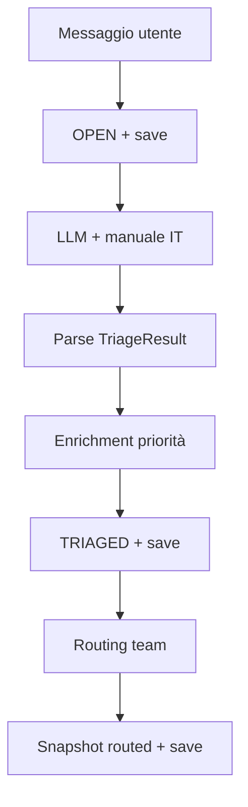

# Agentic Customer Care Triage System

Sistema agentico per il triage e il processamento di ticket customer care. Combina classificazione LLM con ragionamento strutturato (Chain-of-Thought), memoria documentale (manuale IT), regole deterministiche e persistenza append-only.

## Funzionalità

| Componente | Descrizione |
|------------|-------------|
| **Triage LLM** | Classificazione in `categoria` e `priorita` con output JSON validato (Pydantic) |
| **CoT** | Campo `analisi_problema` con 4 punti: Problema, Contesto, Categoria, Priorità |
| **Manuale IT** | Contenuto di `data/manuale_it.txt` iniettato nel prompt (es. VPN / GlobalProtect) |
| **Enrichment** | Bump priorità da keyword nel messaggio utente (senza seconda chiamata LLM) |
| **Routing** | Assegnazione `team` per categoria |
| **Logging** | Eventi in `logs/activity.jsonl` (path assoluto da repo root) |

## Pipeline



Ogni fase aggiunge una riga in `data/tickets.jsonl`. L’**ultima riga per `id`** è lo stato corrente del ticket.

Fasi di persistenza tipiche per un ticket:

1. `OPEN` — ricezione e ID
2. `TRIAGED` — classificazione + `analisi_problema` + enrichment
3. `TRIAGED` (con `team`) — dopo routing; stesso status, snapshot con team valorizzato

## Output LLM (`TriageResult`)

L’LLM restituisce **solo JSON** (nessun markdown), in questo ordine:

```json
{
  "analisi_problema": "1. Problema: ... 2. Contesto: ... 3. Categoria: ... 4. Priorità: ...",
  "categoria": "IT | BILLING | SALES | SECURITY",
  "priorita": "LOW | MEDIUM | HIGH | CRITICAL",
  "riassunto_breve": "max 15 parole",
  "messaggio_originale": "testo identico all'input utente"
}
```

Il messaggio utente originale non viene sovrascritto in pipeline: l’enrichment legge sempre `messaggio_originale` del ticket, non la copia eventualmente riformulata dal modello.

## Manuale IT e caso VPN

`data/manuale_it.txt` contiene procedure interne (password, VPN, stampanti). Per accesso **da casa alla rete aziendale**, l’agente deve:

1. Inferire il caso **VPN** da «casa» + «rete aziendale»
2. Citare nel `analisi_problema` la voce **Accesso VPN** del manuale
3. Suggerire di verificare che l’app **GlobalProtect** sia attiva

Esempio di ticket:

```text
Ciao, non riesco a collegarmi da casa alla rete aziendale, mi dà errore di connessione.
```

## Scenari demo vs few-shot

I **few-shot** in `prompts/triage_v1.py` stabilizzano il formato JSON e il CoT.  
I **5 scenari** in `main.py` (`DEMO_SCENARIOS`) coprono domini chiari e un caso **ambiguo**; i testi demo sono **diversi** dai few-shot, per verificare generalizzazione e RAG.

| Scenario | Dominio | Input demo (≠ few-shot) |
|----------|---------|-------------------------|
| A | IT / email | Casella aziendale bloccata |
| B | BILLING | Bonifico / verifica pagamento |
| C | SECURITY | Spam crypto |
| D | IT / VPN | **Ticket studente** (`VPN_STUDENT_TICKET`) |
| E | **SALES vs IT (ambiguo)** | Acquisto corso + pagina pagamento non carica (`AMBIGUOUS_RAG_TICKET`) |

### Test RAG forte (Scenario E)

Il ticket mescola intento commerciale («acquistare il corso») e sintomo tecnico («pagina di pagamento non carica»). Senza manuale, l’LLM tende a **SALES**; con la voce **Portale pagamenti / acquisti online** in `data/manuale_it.txt` l’agente deve:

| Criterio | Atteso |
|----------|--------|
| `categoria` | **IT** (malfunzionamento portale/checkout) |
| `analisi_problema` | Confronto SALES vs IT; citazione **MANUALE**; blocco tecnico vs richiesta commerciale pura |
| Persistenza | Riga `TRIAGED` in `data/tickets.jsonl` |

```bash
PYTHONPATH=src python -c "
from main import process_ticket, AMBIGUOUS_RAG_TICKET
process_ticket(AMBIGUOUS_RAG_TICKET)
"
```

Lo Scenario E non ha few-shot dedicato: la disambiguazione dipende solo da `SYSTEM_PROMPT` + voce nel manuale IT (test RAG puro).

```bash
PYTHONPATH=src python src/main.py
# oppure
PYTHONPATH=src python -c "from main import run_demo_scenarios; run_demo_scenarios()"
```

## Enrichment priorità

Keyword nel `messaggio_originale` (case-insensitive):

| Keyword | Priorità minima |
|---------|-----------------|
| `urgente`, `bloccato`, `bloccata` | HIGH |
| `subito`, `non funziona` | MEDIUM |

La priorità non viene mai abbassata (es. CRITICAL resta CRITICAL).

## Routing team

| Categoria | Team |
|-----------|------|
| IT | `team_tecnico` |
| BILLING | `amministrazione` |
| SALES | `commerciale` |
| SECURITY | `sicurezza` |

## Struttura progetto

```
agentic-triage-system/
├── pyproject.toml
├── .env                      # OPENAI_API_KEY (non committare)
├── data/
│   ├── manuale_it.txt        # memoria documentale IT
│   └── tickets.jsonl         # snapshot ticket (gitignored)
├── logs/
│   └── activity.jsonl        # log eventi (gitignored)
├── tests/
│   ├── conftest.py           # fixture condivise
│   ├── test_parser.py
│   ├── test_store.py
│   ├── test_enrichment.py
│   └── test_router.py
└── src/
    ├── paths.py              # percorsi assoluti repo
    ├── main.py               # orchestrazione pipeline
    ├── client.py             # OpenAI (gpt-4.1-mini, temperature=0)
    ├── schemas/ticket.py     # Ticket, TriageResult
    ├── prompts/triage_v1.py  # system prompt, few-shot, build_prompt()
    ├── parsing/parser.py     # estrazione JSON + validazione
    ├── storage/store.py      # persistenza JSONL
    └── tools/
        ├── enrichment.py
        ├── router.py
        └── logger.py
```

## Setup

```bash
python3 -m venv .venv
source .venv/bin/activate
pip install -e ".[test]"
```

Crea `.env` nella root del repository:

```env
OPENAI_API_KEY=sk-...
```

## Esecuzione

**Singolo ticket:**

```bash
PYTHONPATH=src python -c "
from main import process_ticket, VPN_STUDENT_TICKET
process_ticket(VPN_STUDENT_TICKET)
"
```

**Quattro scenari demo** (richiede API key e credito OpenAI):

```bash
PYTHONPATH=src python src/main.py
```

## Test

I test non chiamano l’LLM. `pytest` aggiunge automaticamente `src/` al path (`pyproject.toml`).

```bash
pytest tests/ -q
# oppure, con venv attivo:
.venv/bin/python -m pytest tests/ -q
```

Copertura attuale: parser, store, enrichment, router, validazione schema `TRIAGED`.

## Riferimenti

- Gestione errori e casi limite: `GESTIONE_ERRORI.md`
- Modello: `gpt-4.1-mini`, `temperature=0` per output deterministico
