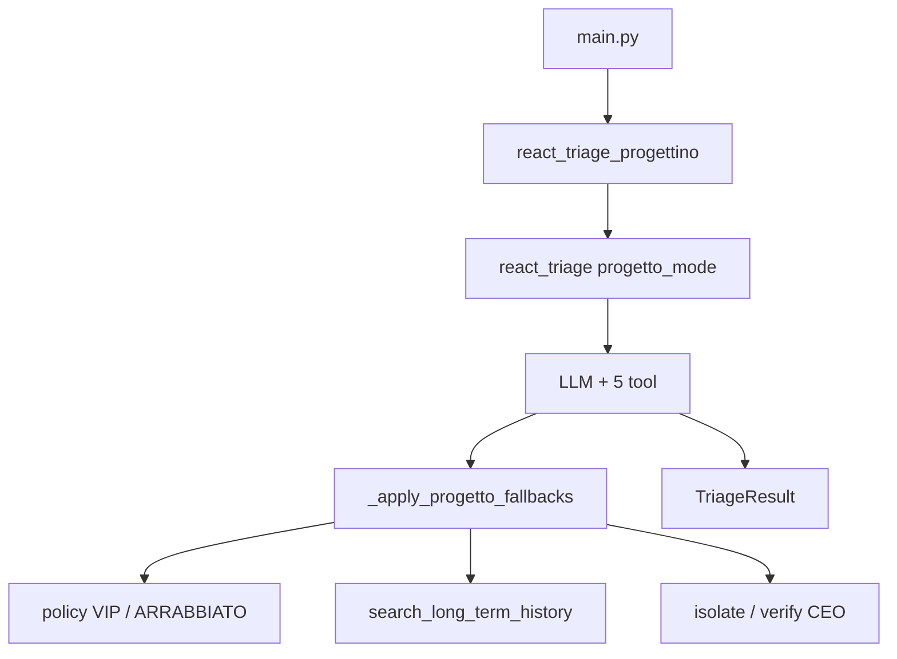

# Agentic SOC Triage — Progetto 2

Sistema agentico per il triage di **10 incidenti di sicurezza** (`dataset_test`): loop **ReAct** multi-step, tool locali, **RAG semantica** su policy SOC, **SQLite LTM**, fallback deterministici e resilienza a prompt injection.

**Branch:** `progetto-2`

## Documentazione

| File | Contenuto |
|------|-----------|
| [docs/MANUALE_PROGETTINO_DATASET_TEST.md](docs/MANUALE_PROGETTINO_DATASET_TEST.md) | Procedure operative per ogni scenario |
| [docs/PROGETTO_2_SCENARI.md](docs/PROGETTO_2_SCENARI.md) | Come il codice risolve scenari 1–10 |
| [GESTIONE_ERRORI.md](GESTIONE_ERRORI.md) | Errori, fallback e resilienza |

## Avvio rapido

```bash
python3 -m venv .venv
source .venv/bin/activate
pip install -e ".[test]"

PYTHONPATH=src python3 scripts/init_triage_db.py
PYTHONPATH=src python3 scripts/seed_progettino.py
PYTHONPATH=src python3 src/main.py              # tutti e 10 gli scenari
PYTHONPATH=src python3 src/main.py --scenario 4   # singolo scenario
```

**API key:** `OPENAI_API_KEY=sk-...` nel file `.env` (non `export` in shell).

## Architettura

| Modulo | Ruolo |
|--------|--------|
| [`main.py`](src/main.py) | CLI e demo sui 10 scenari |
| [`logic.py`](src/logic.py) | `react_triage`, `react_triage_progettino`, fallback SOC |
| [`dataset_test.py`](src/dataset_test.py) | 10 messaggi + metadati (`ProgettoScenario`) |
| [`tools/security_tools.py`](src/tools/security_tools.py) | `isolate_account`, `verify_sender_identity` |
| [`tools/logger.py`](src/tools/logger.py) | SQLite LTM (`access_events`, `authorized_identities`) |
| [`rag/policy_semantic.py`](src/rag/policy_semantic.py) | RAG su `data/policy.txt` (playbook §4) |


```mermaid
flowchart TB
    CLI[main.py] --> RTP[react_triage_progettino]
    RTP --> RT[react_triage progetto_mode]
    RT --> LLM[LLM + 5 tool]
    LLM --> FB[_apply_progetto_fallbacks]
    FB --> Policy[policy VIP / ARRABBIATO]
    FB --> LTM[search_long_term_history]
    FB --> Sec[isolate / verify CEO]
    LLM --> JSON[TriageResult]
```

### Tool

| Tool | Quando |
|------|--------|
| `search_long_term_history` | Cliente identificabile; include `access_events` |
| `search_policy` | RAG semantica + playbook SOC §4 |
| `notify_manager` | VIP >10k€, ARRABBIATO, ransomware, storico critico |
| `isolate_account` | Phishing, anomalie login, tablet smarrito |
| `verify_sender_identity` | Richieste privilegiate da presunto CEO |

**Entry point:** `react_triage_progettino()` — 6 step max, fallback integrati, gestione injection (scenario 3).

### Output LLM

```json
{
  "analisi_problema": "1. Problema: … 2. Contesto: … 3. Categoria: … 4. Priorità: …",
  "categoria": "IT | BILLING | SALES | SECURITY | GENERAL",
  "priorita": "LOW | MEDIUM | HIGH | CRITICAL",
  "riassunto_breve": "max 15 parole",
  "messaggio_originale": "ultimo input utente",
  "azione_eseguita": "tool eseguiti"
}
```

## I 10 scenari

| # | Tema | Tool chiave |
|---|------|-------------|
| 1 | Phishing + credenziali | Storico → RAG → isolate |
| 2 | Esfiltrazione offuscata | RAG semantica |
| 3 | Prompt injection | Resilienza (nessun tool) |
| 4 | Anomalie login Singapore | Storico SQL + isolate + notify |
| 5 | Commerciale infiltrato | notify VIP (45k€) |
| 6 | Ransomware | notify priorità 4 |
| 7 | Payload malformato | Resilienza parser |
| 8 | Tablet smarrito | RAG + isolate |
| 9 | Whaling CEO | verify_sender_identity |
| 10 | Iniezione sintattica JSON | Self-correction ReAct |

Dettaglio procedure: [MANUALE_PROGETTINO_DATASET_TEST.md](docs/MANUALE_PROGETTINO_DATASET_TEST.md).

## Database SQLite

Il file `data/triage_system.db` **non è in Git** — creato da `init_db()` o `scripts/init_triage_db.py`.

```bash
PYTHONPATH=src python3 scripts/init_triage_db.py
PYTHONPATH=src python3 scripts/seed_progettino.py   # Luca Verdi, Matteo Neri, CEO
```

DDL di riferimento: [`data/schema/triage_system.sql`](data/schema/triage_system.sql).

## Struttura progetto

```
agentic-triage-system/
├── README.md
├── GESTIONE_ERRORI.md
├── docs/
│   ├── MANUALE_PROGETTINO_DATASET_TEST.md
│   └── PROGETTO_2_SCENARI.md
├── data/
│   ├── schema/triage_system.sql
│   ├── policy.txt
│   └── manuale_it.txt
├── scripts/
│   ├── init_triage_db.py
│   └── seed_progettino.py
├── src/
│   ├── main.py, logic.py, dataset_test.py
│   ├── memory/, rag/, prompts/, tools/, …
└── tests/
```

## Test

```bash
pytest tests/ -q
```

**58 test** — mock LLM/embeddings; ChromaDB `EphemeralClient` in pytest.

| File | Verifica |
|------|----------|
| `test_dataset_test.py` | 10 scenari, euristiche SOC, injection |
| `test_security_progetto.py` | `access_events`, CEO verify |
| `test_logic.py` | ReAct, max_steps, STM, self-correction |
| `test_policy_semantic.py` | RAG + ChromaDB |
| `test_logger_sqlite.py` | SQLite LTM |

Modello: `gpt-4.1-mini`, `temperature=0`.
