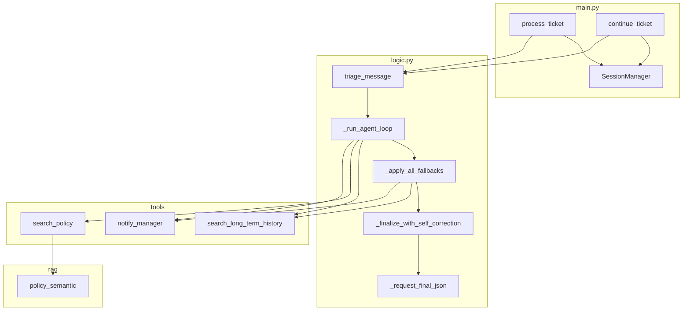
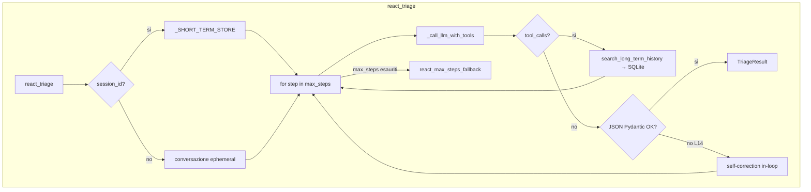
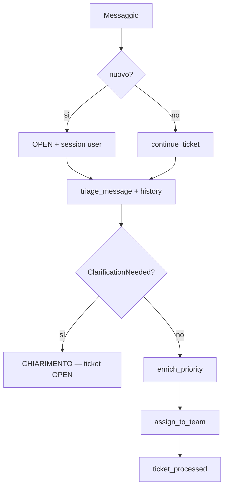
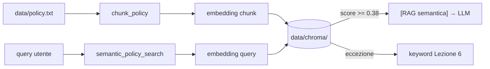

# Agentic Customer Care Triage System

Sistema agentico per triage ticket customer care: classificazione LLM (CoT + JSON), tool locali, **memoria short/long-term** (Lezione 9), **RAG semantica su policy con ChromaDB** (Lezione 10/10B), **self-correction e emergency fallback** (Lezione 11), **benchmark e log analytics** (Lezione 12), **loop ReAct e SQLite LTM** (Lezione 13) e **planning multi-step con controllo loop** (Lezione 14).

**Branch corrente:** `lesson-14-planning-loops` — include le **lezioni 9–14**.

## Percorso didattico e branch Git

Indice completo lezioni, branch e comandi: **[docs/CORSO_LEZIONI.md](docs/CORSO_LEZIONI.md)**.

| Branch | Fino a lezione | Uso |
|--------|----------------|-----|
| `main` | 9 — Memoria | Base M1–M3 senza RAG |
| `lesson-10-rag-semantica` | 10 — RAG + ChromaDB | + `rag/chroma_store.py`, demo `l10` |
| `lesson-11-resilienza-self-correction` | 11 — Resilienza | + self-correction, emergency fallback |
| `lesson-12-benchmark-log-analytics` | 12 — Benchmark | + `benchmark.py`, `analytics/log_kpi.py` |
| `lesson-13-react-sqlite` | 13 — ReAct + SQLite | + `react_triage`, LTM SQLite indicizzata |
| `lesson-14-planning-loops` | **14 — Planning loop** | + `max_steps=4`, STM ReAct, self-correction in-loop (questo branch) |

| Guida | File |
|-------|------|
| 10B ChromaDB | [docs/LEZIONE_10B_CHROMADB.md](docs/LEZIONE_10B_CHROMADB.md) |
| 11 Resilienza | [docs/LEZIONE_11_RESILIENZA.md](docs/LEZIONE_11_RESILIENZA.md) |
| 12 Benchmark | [docs/LEZIONE_12_PROMPT_OPTIMIZATION.md](docs/LEZIONE_12_PROMPT_OPTIMIZATION.md) |
| 13 ReAct + SQLite | [docs/LEZIONE_13_REACT_SQLITE.md](docs/LEZIONE_13_REACT_SQLITE.md) |
| 14 Planning loop | [docs/LEZIONE_14_PLANNING_LOOPS.md](docs/LEZIONE_14_PLANNING_LOOPS.md) |

[GESTIONE_ERRORI.md](GESTIONE_ERRORI.md)

## Architettura

| Modulo | Ruolo |
|--------|--------|
| [`main.py`](src/main.py) | Orchestrazione, `SessionManager`, demo M1–M3, L10–L14 |
| [`logic.py`](src/logic.py) | Loop agentico + `react_triage` (ReAct multi-step) |
| [`benchmark.py`](src/benchmark.py) | Suite benchmark 5 ticket (Lezione 12) |
| [`client.py`](src/client.py) | Client OpenAI (`OPENAI_API_KEY` solo nel file `.env`, non dalla shell) |

| Package / file | Ruolo |
|----------------|--------|
| [`memory/session_manager.py`](src/memory/session_manager.py) | Short-term: cronologia `user`/`assistant` per `ticket_id` |
| [`memory/extractors.py`](src/memory/extractors.py) | Estrazione `cliente_nome` e `sentiment` per audit log |
| [`tools/history_tools.py`](src/tools/history_tools.py) | Long-term: delega a SQLite |
| [`tools/logger.py`](src/tools/logger.py) | Audit JSONL + SQLite LTM (`init_db`, `log_triage_to_sqlite`) |
| [`rag/policy_semantic.py`](src/rag/policy_semantic.py), [`rag/chroma_store.py`](src/rag/chroma_store.py) | RAG policy + indice ChromaDB (Lezione 10/10B) |
| [`tools/office_tools.py`](src/tools/office_tools.py) | `search_policy` (RAG semantica; keyword solo in eccezione), `notify_manager` |
| [`tools/registry.py`](src/tools/registry.py) | `TOOL_MAP` e schema OpenAI |
| [`prompts/triage_v1.py`](src/prompts/triage_v1.py) | System prompt, few-shot, `build_chat_messages(history=…)` |
| [`analytics/log_kpi.py`](src/analytics/log_kpi.py) | KPI da `activity.jsonl` (Lezione 12) |
| [`paths.py`](src/paths.py) | Percorsi repo (`TRIAGE_DB_PATH`, `LOG_FILE_PATH`, `DEMO_M2_DB_PATH`, …) |


```mermaid
flowchart TB
    subgraph main_py [main.py]
        PT[process_ticket]
        CT[continue_ticket]
        SM[SessionManager]
        PT --> SM
        CT --> SM
    end
    subgraph logic_py [logic.py]
        TM[triage_message]
        Loop[_run_agent_loop]
        FB[_apply_all_fallbacks]
        TM --> Loop
        Loop --> FB
        FB --> SC[_finalize_with_self_correction]
        SC --> JSON[_request_final_json]
    end
    subgraph tools_pkg [tools]
        LTM[search_long_term_history]
        SP[search_policy]
        NM[notify_manager]
    end
    subgraph rag_pkg [rag]
        RAG[policy_semantic]
    end
    SP --> RAG
    PT --> TM
    CT --> TM
    Loop --> LTM
    Loop --> SP
    Loop --> NM
    FB --> LTM
    FB --> NM
```

### Motore ReAct (Lezioni 13–14)


```mermaid
flowchart TB
    subgraph react_py [react_triage]
        RT[react_triage] --> STM{session_id?}
        STM -->|sì| Store[_SHORT_TERM_STORE]
        STM -->|no| Ephemeral[conversazione ephemeral]
        Store --> Loop[for step in max_steps]
        Ephemeral --> Loop
        Loop --> LLM[_call_llm_with_tools]
        LLM --> Tools{tool_calls?}
        Tools -->|sì| LTM[search_long_term_history → SQLite]
        LTM --> Loop
        Tools -->|no| Valid{JSON Pydantic OK?}
        Valid -->|sì| Out[TriageResult]
        Valid -->|no L14| SC[self-correction in-loop]
        SC --> Loop
        Loop -->|max_steps esauriti| FB[react_max_steps_fallback]
    end
```

### API principali (`main.py`)

| Funzione | Uso |
|----------|-----|
| `process_ticket(messaggio)` | Nuovo ticket (`OPEN` → triage → routing) |
| `continue_ticket(ticket_id, messaggio)` | Turno successivo (short-term memory) |
| `seed_marco_sqlite(n, db_path, reset=…)` | Seed demo M2 su SQLite (LTM indicizzata) |
| `seed_marco_angry_history(…)` | Legacy JSONL (pre-L13); preferire `seed_marco_sqlite` |
| `run_demo()` / `run_*_demo()` | Scenari didattici M3 → M1 → M2 |
| `run_l10_rag_demo()` | Demo Lezione 10: RAG semantica |
| `run_l11_resilience_demo()` | Demo Lezione 11: self-correction |
| `run_l13_react_demo()` | Demo Lezione 13: ReAct + SQLite |
| `run_l14_planning_demo()` | Demo Lezione 14: STM + max_steps |
| `process_ticket_react(msg, session_id=…)` | Wrapper demo ReAct multi-turn |

## Memoria (Lezione 9)

### Short-term (9.1)

Stesso `ticket_id`, più turni. `SessionManager` (in-memory) conserva il thread; `build_chat_messages` inietta la cronologia nel contesto LLM.

| Turno | Comportamento |
|-------|----------------|
| 1 | Messaggio vago → LLM può rispondere con testo (`ClarificationNeeded`) → ticket resta `OPEN` |
| 2+ | `continue_ticket` → triage JSON con tutto il thread |

### Long-term (9.2 + 13)

Dual-write: ogni ticket processato va in `logs/activity.jsonl` (KPI L12) **e** in `data/triage_system.db` (LTM indicizzata). Il tool `search_long_term_history` interroga SQLite con indice `idx_cliente`; se ≥4 ticket **IT + ARRABBIATO** in 24h → fallback `notify_manager` (priority 4).

**Demo M2 — database isolato:**

| Operazione | File |
|------------|------|
| Seed storico (`seed_marco_sqlite`) | `data/demo_m2_triage.db` |
| Lettura storico + soglia escalation | `demo_m2_triage.db` durante `run_ltm_demo()` |
| Eventi live + LTM principale | `logs/activity.jsonl` + `data/triage_system.db` |

## Pipeline ticket


```mermaid
flowchart TD
    In[Messaggio] --> New{nuovo?}
    New -->|sì| Open[OPEN + session user]
    New -->|no| Cont[continue_ticket]
    Open --> Triage[triage_message + history]
    Cont --> Triage
    Triage --> Clarify{ClarificationNeeded?}
    Clarify -->|sì| Stop["CHIARIMENTO — ticket OPEN"]
    Clarify -->|no| Enrich[enrich_priority]
    Enrich --> Route[assign_to_team]
    Route --> Log[ticket_processed]
```

## Tool e fallback

| Tool | Quando |
|------|--------|
| `search_long_term_history` | Cliente identificabile nel thread |
| `search_policy` | **Principale:** RAG semantica. **Eccezione:** keyword (Lezione 6) se API/score fallisce |
| `notify_manager` | VIP >10k€, ARRABBIATO, o storico cliente critico |

[`_apply_all_fallbacks`](src/logic.py) unisce fallback policy e long-term prima della fase JSON finale.

## Output LLM

```json
{
  "analisi_problema": "1. Problema: … 2. Contesto: … 3. Categoria: … 4. Priorità: …",
  "categoria": "IT | BILLING | SALES | SECURITY | GENERAL",
  "priorita": "LOW | MEDIUM | HIGH | CRITICAL",
  "riassunto_breve": "max 15 parole",
  "messaggio_originale": "ultimo input utente del turno corrente",
  "azione_eseguita": "opzionale; valorizzato in emergency fallback (L11)"
}
```

## RAG semantica (Lezione 10)

Dalla Lezione 10 la ricerca policy **non usa più il match per parole chiave come strategia predefinita** (quello restava in Lezione 6). L’agente chiama `search_policy`, che delega a `semantic_policy_search` in [`rag/policy_semantic.py`](src/rag/policy_semantic.py) e [`rag/chroma_store.py`](src/rag/chroma_store.py) (Lezione 10B):

1. **Paragraph chunking** — split su `\n\n` (paragrafi autocontenuti)
2. **Embeddings** — OpenAI `text-embedding-3-small` (indicizzazione chunk + query)
3. **ChromaDB** — indice persistente in `data/chroma/`, metrica cosine, `score = 1 - distance`
4. **Soglia** — 0.38; sopra soglia → risposta RAG all’LLM

**Percorso principale (atteso):** observation con `[RAG semantica | score=0.xxx]` e testo del chunk.

**Eccezione (rete di sicurezza):** se embedding/API/Chroma fallisce o score &lt; 0.38, `search_policy` ripiega su `_search_policy_keyword` (Lezione 6). Dettaglio: [LEZIONE_10B — §7](docs/LEZIONE_10B_CHROMADB.md#7-collegamento-concettuale-con-search_policy).


```mermaid
flowchart LR
    Q[query utente] --> RAG[semantic_policy_search]
    Policy[data/policy.txt] --> Chunk[chunk_policy]
    Chunk --> EmbC[embedding chunk]
    EmbC --> Chroma[(data/chroma/)]
    RAG --> EmbQ[embedding query]
    EmbQ --> Chroma
    Chroma -->|score >= 0.38| Obs["[RAG semantica] → LLM"]
    Chroma -->|eccezione| KW["keyword Lezione 6"]
```

### Demo L10

La demo chiama **direttamente** `semantic_policy_search`. Query **senza parole in comune** con la policy (es. «annullare contratto e riavere i soldi» → paragrafo «recesso / 14 giorni»).

```bash
PYTHONPATH=src python3 src/main.py --scenario l10
```

### Lezione 10B — ChromaDB

[docs/LEZIONE_10B_CHROMADB.md](docs/LEZIONE_10B_CHROMADB.md) — `pip install -e .` (include `chromadb`), `data/chroma/`, script `scripts/esercizio_chroma_policy.py`, indice in `chroma_store.py` + `policy_semantic.py`.

## Resilienza e Self-Correction (Lezione 11)

[`_finalize_with_self_correction`](src/logic.py) — `MAX_TRIAGE_JSON_RETRIES = 3`.

| Tipo errore | Comportamento |
|-------------|---------------|
| Hard error | `main.py` → `[ERRORE]` |
| Soft error | Retry in-context con messaggio Pydantic |
| Emergency fallback | `GENERAL` / `CRITICAL`, `azione_eseguita` |

Eventi log: `triage_json_retry`, `emergency_fallback`. Guida: [LEZIONE_11_RESILIENZA.md](docs/LEZIONE_11_RESILIENZA.md).

```bash
PYTHONPATH=src python3 src/main.py --scenario l11
```

## Benchmark e Log Analytics (Lezione 12)

| Componente | Ruolo |
|------------|--------|
| [`benchmark.py`](src/benchmark.py) | 5 ticket stress → report KPI |
| [`analytics/log_kpi.py`](src/analytics/log_kpi.py) | Analisi `activity.jsonl` |

Guida: [LEZIONE_12_PROMPT_OPTIMIZATION.md](docs/LEZIONE_12_PROMPT_OPTIMIZATION.md). Stub prompt: [`triage_v2.py`](src/prompts/triage_v2.py).

```bash
PYTHONPATH=src python3 src/benchmark.py
PYTHONPATH=src python3 -m analytics.log_kpi
```

## ReAct e SQLite (Lezione 13)

[`react_triage`](src/logic.py) implementa il ciclo **Thought → Action → Observation** con `max_steps=4` (Lezione 14). Con `session_id` riusa `_SHORT_TERM_STORE` per thread multi-turno ReAct. La pipeline classica `triage_message` resta per benchmark e demo M1–M3.

Guide: [LEZIONE_13_REACT_SQLITE.md](docs/LEZIONE_13_REACT_SQLITE.md), [LEZIONE_14_PLANNING_LOOPS.md](docs/LEZIONE_14_PLANNING_LOOPS.md).

```bash
PYTHONPATH=src python3 src/main.py --scenario l13
PYTHONPATH=src python3 src/main.py --scenario l14
```

## Planning Multi-Step (Lezione 14)

| Meccanismo | Dettaglio |
|------------|-----------|
| `max_steps = 4` | Hard stop deterministico sul loop ReAct |
| `_SHORT_TERM_STORE` | Memoria conversazione per `session_id` stringa |
| Self-correction in-loop | Errore Pydantic reiniettato nel ciclo prima del fallback |
| Evento log | `react_max_steps_fallback` in `activity.jsonl` |

## Database SQLite (Lezioni 13–14)

Il file [`data/triage_system.db`](data/triage_system.db) **non è in Git** (come `data/chroma/` e `logs/`): viene creato a runtime da `init_db()`.

| Artefatto | In Git? | Ruolo |
|-----------|---------|--------|
| `data/schema/triage_system.sql` | Sì | DDL di riferimento |
| `data/triage_system.db` | No (gitignored) | LTM runtime indicizzata |
| `data/demo_m2_triage.db` | No (gitignored) | Seed isolato demo M2 |

**Dopo checkout su `lesson-13-*` o `lesson-14-*`:**

```bash
# Opzione A — script dedicato (senza chiamate LLM)
PYTHONPATH=src python3 scripts/init_triage_db.py

# Opzione B — qualsiasi avvio di main.py crea il DB all'inizio
PYTHONPATH=src python3 src/main.py --scenario m3

ls -la data/triage_system.db
```

Guida completa: [LEZIONE_13_REACT_SQLITE.md](docs/LEZIONE_13_REACT_SQLITE.md).

## Demo ed esecuzione

Ordine `run_demo()`: **M3 → M1 → M2**.

| ID | Focus |
|----|--------|
| **M3** | Pipeline base senza memoria multi-turno |
| **M1** | Short-term: chiarimento → triage con server-X |
| **M2** | Long-term: storico Marco, escalation |

```bash
source .venv/bin/activate
pip install -e ".[test]"

# Branch L13/L14: bootstrap SQLite (opzionale — anche main.py lo fa all'avvio)
PYTHONPATH=src python3 scripts/init_triage_db.py

PYTHONPATH=src python3 src/main.py              # M3 → M1 → M2
PYTHONPATH=src python3 src/main.py --scenario m3
PYTHONPATH=src python3 src/main.py --scenario m1
PYTHONPATH=src python3 src/main.py --scenario m2
PYTHONPATH=src python3 src/main.py --scenario l10
PYTHONPATH=src python3 src/main.py --scenario l11
PYTHONPATH=src python3 src/main.py --scenario l13
PYTHONPATH=src python3 src/main.py --scenario l14
PYTHONPATH=src python3 src/benchmark.py
PYTHONPATH=src python3 -m analytics.log_kpi
```

**API key:** `OPENAI_API_KEY=sk-...` in `.env` (non `export` in shell).

| Scenario | Messaggi |
|----------|----------|
| **M1** | Server vago → «È il server-X in datacenter Roma.» |
| **M2** | Marco, cluster **db-primary** offline, quinto incidente |
| **M3** | Casella aziendale bloccata |
| **L13** | Marco Rossi, budget 15k, ReAct + SQLite |
| **L14** | Marco Rossi turno 2, STM + LTM su `session_01` |

## Struttura progetto

```
agentic-triage-system/
├── README.md
├── GESTIONE_ERRORI.md
├── docs/
│   ├── CORSO_LEZIONI.md
│   ├── LEZIONE_10B_CHROMADB.md
│   ├── LEZIONE_11_RESILIENZA.md
│   ├── LEZIONE_12_PROMPT_OPTIMIZATION.md
│   ├── LEZIONE_13_REACT_SQLITE.md
│   └── LEZIONE_14_PLANNING_LOOPS.md
├── data/
│   ├── schema/triage_system.sql # DDL SQLite (versionato)
│   ├── manuale_it.txt
│   ├── policy.txt
│   ├── triage_system.db         # LTM SQLite (runtime, gitignored)
│   ├── demo_m2_triage.db        # seed demo M2 isolato (gitignored)
│   ├── chroma/                  # indice ChromaDB (runtime, gitignored)
│   └── tickets.jsonl
├── logs/
├── scripts/
│   ├── init_triage_db.py        # bootstrap SQLite post-clone
│   └── esercizio_chroma_policy.py
├── src/
│   ├── main.py, logic.py, benchmark.py
│   ├── memory/, rag/, analytics/, prompts/, tools/, …
└── tests/
```

## Setup e test

```bash
python3 -m venv .venv
source .venv/bin/activate
pip install -e ".[test]"

# Branch L13/L14: crea il database SQLite locale
PYTHONPATH=src python3 scripts/init_triage_db.py

pytest tests/ -q
```

**69 test** su questo branch ([CORSO_LEZIONI](docs/CORSO_LEZIONI.md) per conteggi altri branch). Mock LLM/embeddings; ChromaDB `EphemeralClient` in pytest.

| File | Verifica |
|------|----------|
| `test_logic.py` | Loop, self-correction, ReAct, max_steps, STM |
| `test_logger_sqlite.py` | SQLite init, insert, query indicizzata |
| `test_policy_semantic.py` | RAG + Chroma, sinonimi, soglia |
| `test_benchmark.py` | Report benchmark (mock) |
| `test_log_kpi.py` | KPI su fixture JSONL |

Errori: [`GESTIONE_ERRORI.md`](GESTIONE_ERRORI.md).

Modello: `gpt-4.1-mini`, `temperature=0`.
