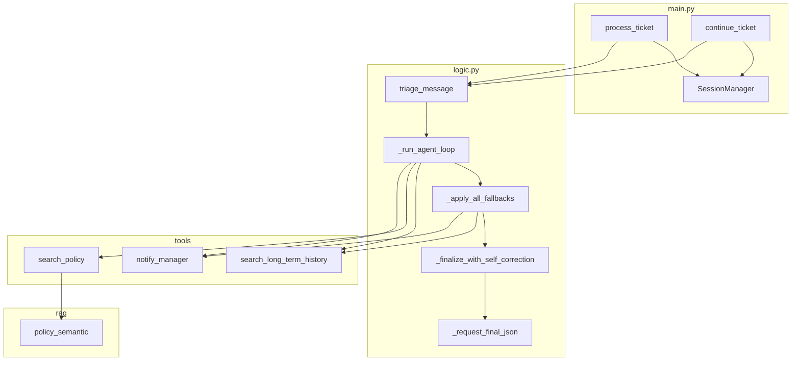
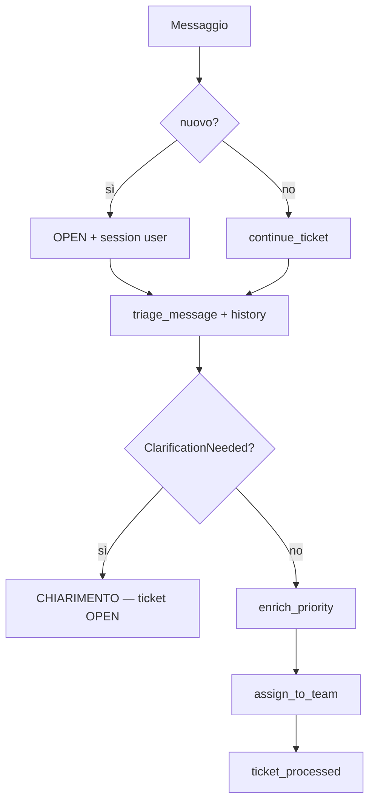
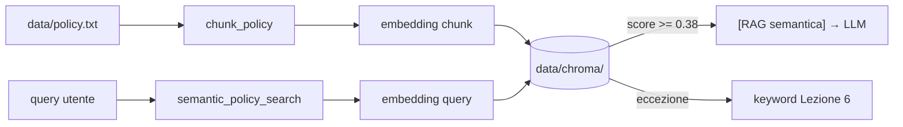

# Agentic Customer Care Triage System

Sistema agentico per triage ticket customer care: classificazione LLM (CoT + JSON), tool locali, **memoria short/long-term** (Lezione 9), **RAG semantica su policy con ChromaDB** (Lezione 10/10B), **self-correction e emergency fallback** (Lezione 11), **benchmark e log analytics** (Lezione 12) e persistenza append-only.

**Branch corrente:** `lesson-12-benchmark-log-analytics` — include le **lezioni 9–12**.

## Percorso didattico e branch Git

Indice completo: **[docs/CORSO_LEZIONI.md](docs/CORSO_LEZIONI.md)**.

| Branch | Fino a lezione |
|--------|----------------|
| `main` | 9 — Memoria |
| `lesson-10-rag-semantica` | 10 — RAG + ChromaDB |
| `lesson-11-resilienza-self-correction` | 11 — Resilienza |
| `lesson-12-benchmark-log-analytics` | **12 — Benchmark** (questo branch) |

| Guida | File |
|-------|------|
| 10B ChromaDB | [docs/LEZIONE_10B_CHROMADB.md](docs/LEZIONE_10B_CHROMADB.md) |
| 11 Resilienza | [docs/LEZIONE_11_RESILIENZA.md](docs/LEZIONE_11_RESILIENZA.md) |
| 12 Benchmark | [docs/LEZIONE_12_PROMPT_OPTIMIZATION.md](docs/LEZIONE_12_PROMPT_OPTIMIZATION.md) |

[GESTIONE_ERRORI.md](GESTIONE_ERRORI.md)

## Architettura

| Modulo | Ruolo |
|--------|--------|
| [`main.py`](src/main.py) | Orchestrazione, `SessionManager`, demo M1–M3, L10, L11 |
| [`logic.py`](src/logic.py) | Loop agentico: LLM → tool → fallback → self-correction JSON |
| [`benchmark.py`](src/benchmark.py) | Suite benchmark 5 ticket (Lezione 12) |
| [`client.py`](src/client.py) | Client OpenAI (`OPENAI_API_KEY` solo nel file `.env`, non dalla shell) |

| Package / file | Ruolo |
|----------------|--------|
| [`memory/session_manager.py`](src/memory/session_manager.py) | Short-term: cronologia `user`/`assistant` per `ticket_id` |
| [`memory/extractors.py`](src/memory/extractors.py) | Estrazione `cliente_nome` e `sentiment` per audit log |
| [`tools/history_tools.py`](src/tools/history_tools.py) | Long-term: `search_long_term_history` |
| [`rag/policy_semantic.py`](src/rag/policy_semantic.py), [`rag/chroma_store.py`](src/rag/chroma_store.py) | RAG policy + indice ChromaDB (Lezione 10/10B) |
| [`tools/office_tools.py`](src/tools/office_tools.py) | `search_policy` (RAG semantica; keyword solo in eccezione), `notify_manager` |
| [`tools/registry.py`](src/tools/registry.py) | `TOOL_MAP` e schema OpenAI |
| [`prompts/triage_v1.py`](src/prompts/triage_v1.py) | System prompt, 2 few-shot, `build_chat_messages(history=…)` |
| [`paths.py`](src/paths.py) | Percorsi repo (`LOG_FILE_PATH`, `DEMO_M2_LOG_PATH`, …) |


```mermaid
flowchart TB
    subgraph main_py [main.py]
        PT[process_ticket]
        CT[continue_ticket]
        SM[SessionManager]
        PT --> SM
        CT --> SM
    end
    subgraph logic_py [logic.py]
        TM[triage_message]
        Loop[_run_agent_loop]
        FB[_apply_all_fallbacks]
        TM --> Loop
        Loop --> FB
        FB --> SC[_finalize_with_self_correction]
        SC --> JSON[_request_final_json]
    end
    subgraph tools_pkg [tools]
        LTM[search_long_term_history]
        SP[search_policy]
        NM[notify_manager]
    end
    subgraph rag_pkg [rag]
        RAG[policy_semantic]
    end
    SP --> RAG
    PT --> TM
    CT --> TM
    Loop --> LTM
    Loop --> SP
    Loop --> NM
    FB --> LTM
    FB --> NM
```

### API principali (`main.py`)

| Funzione | Uso |
|----------|-----|
| `process_ticket(messaggio)` | Nuovo ticket (`OPEN` → triage → routing) |
| `continue_ticket(ticket_id, messaggio)` | Turno successivo (short-term memory) |
| `seed_marco_angry_history(n, log_path, reset=…)` | Seed demo M2 (storico Marco) |
| `run_demo()` / `run_*_demo()` | Scenari didattici M3 → M1 → M2 |
| `run_l10_rag_demo()` | Demo Lezione 10: RAG semantica su `data/policy.txt` |
| `run_l11_resilience_demo()` | Demo Lezione 11: self-correction e emergency fallback |

## Resilienza e Self-Correction (Lezione 11)

Dopo tool e fallback policy/LTM, la validazione JSON passa da [`_finalize_with_self_correction`](src/logic.py) con `max_retries=3` (`MAX_TRIAGE_JSON_RETRIES`).

| Tipo errore | Esempio | Comportamento |
|-------------|---------|---------------|
| **Hard error** | API key assente, timeout, `FileNotFoundError` manuale | Propaga a `main.py` → `[ERRORE]` |
| **Soft error** | JSON malformato, campi Pydantic mancanti | Self-correction: errore reinviato all’LLM come turno `user` |
| **Emergency fallback** | 3 tentativi falliti | `TriageResult` deterministico: `GENERAL` / `CRITICAL`, `azione_eseguita="Emergency Fallback attivato"` |

`ClarificationNeeded` (turno ambiguo M1) **non** attiva il self-correction.

Eventi in `logs/activity.jsonl`: `triage_json_retry`, `emergency_fallback`.

```bash
PYTHONPATH=src python3 src/main.py --scenario l11
```

## Benchmark e Log Analytics (Lezione 12)

| Componente | Ruolo |
|------------|--------|
| [`benchmark.py`](src/benchmark.py) | 5 ticket di stress → report KPI a terminale |
| [`analytics/log_kpi.py`](src/analytics/log_kpi.py) | KPI da `logs/activity.jsonl` |
| [`docs/LEZIONE_12_PROMPT_OPTIMIZATION.md`](docs/LEZIONE_12_PROMPT_OPTIMIZATION.md) | Workflow v1 → `triage_v2` senza cambiare Python |
| [`prompts/triage_v2.py`](src/prompts/triage_v2.py) | Few-shot estensione ARRABBIATO (stub, non attivo di default) |

Report benchmark (formato corso):

```text
=== REPORT DI BENCHMARK AGENTE ===
Successi immediati o riparati: N/5
Interventi di Fallback di emergenza: M/5
```

KPI log: accuratezza triage (con golden set manuale), tool usage rate, conteggio `triage_json_retry` come proxy costo riparazione.

```bash
PYTHONPATH=src python3 src/benchmark.py
PYTHONPATH=src python3 -m analytics.log_kpi
```

## Memoria (Lezione 9)

### Short-term (9.1)

Stesso `ticket_id`, più turni. `SessionManager` (in-memory) conserva il thread; `build_chat_messages` inietta la cronologia nel contesto LLM.

| Turno | Comportamento |
|-------|----------------|
| 1 | Messaggio vago → LLM può rispondere con testo (`ClarificationNeeded`) → ticket resta `OPEN` |
| 2+ | `continue_ticket` → triage JSON con tutto il thread |

### Long-term (9.2)

Ogni `ticket_processed` in `logs/activity.jsonl` include `cliente_nome` e `sentiment`. Il tool `search_long_term_history` legge lo storico; se ≥4 ticket **IT + ARRABBIATO** in 24h → fallback `notify_manager` (priority 4).

**Demo M2 — due log distinti:**

| Operazione | File |
|------------|------|
| Seed storico (`seed_marco_angry_history`) | `logs/demo_m2_activity.jsonl` |
| Lettura storico + soglia escalation (`search_long_term_history`, `should_escalate_repeat_customer`) | `demo_m2_activity.jsonl` durante il patch in `run_ltm_demo()` |
| Eventi live della run (`log_event`, es. `ticket_received`, `ticket_processed`) | `logs/activity.jsonl` (sempre) |

Il seed con `reset=True` rende ripetibile la lezione; la **ricerca** long-term in M2 non legge il log principale, ma gli eventi della sessione corrente vengono comunque auditati in `activity.jsonl`.

## Pipeline ticket


```mermaid
flowchart TD
    In[Messaggio] --> New{nuovo?}
    New -->|sì| Open[OPEN + session user]
    New -->|no| Cont[continue_ticket]
    Open --> Triage[triage_message + history]
    Cont --> Triage
    Triage --> Clarify{ClarificationNeeded?}
    Clarify -->|sì| Stop["CHIARIMENTO — ticket OPEN"]
    Clarify -->|no| Enrich[enrich_priority]
    Enrich --> Route[assign_to_team]
    Route --> Log[ticket_processed]
```

## Tool e fallback

| Tool | Quando |
|------|--------|
| `search_long_term_history` | Cliente identificabile nel thread (`context_text`) |
| `search_policy` | **Percorso principale:** RAG semantica (embeddings + cosine). **Eccezione:** `_search_policy_keyword` (Lezione 6) solo se API assente, score &lt; 0.38 o errore indice |
| `notify_manager` | VIP >10k€, ARRABBIATO, o storico cliente critico |

[`_apply_all_fallbacks`](src/logic.py) in `logic.py` unisce fallback **policy** (VIP, ARRABBIATO) e **long-term** (storico Marco). I tool mancanti vengono eseguiti e le observation sono aggiunte alla conversazione prima del JSON finale.

## Output LLM

```json
{
  "analisi_problema": "1. Problema: … 2. Contesto: … 3. Categoria: … 4. Priorità: …",
  "categoria": "IT | BILLING | SALES | SECURITY",
  "priorita": "LOW | MEDIUM | HIGH | CRITICAL",
  "riassunto_breve": "max 15 parole",
  "messaggio_originale": "ultimo input utente del turno corrente"
}
```

## RAG semantica (Lezione 10)

Dalla Lezione 10 la ricerca policy **non usa più il match per parole chiave come strategia predefinita** (quello restava in Lezione 6). L’agente chiama `search_policy`, che delega a `semantic_policy_search` in [`rag/policy_semantic.py`](src/rag/policy_semantic.py) e [`rag/chroma_store.py`](src/rag/chroma_store.py) (Lezione 10B):

1. **Paragraph chunking** — split su `\n\n` (paragrafi autocontenuti)
2. **Embeddings** — OpenAI `text-embedding-3-small` (indicizzazione chunk + query)
3. **ChromaDB** — indice persistente in `data/chroma/`, metrica cosine, `score = 1 - distance`
4. **Soglia** — 0.38; sopra soglia → risposta RAG all’LLM

**Percorso principale (atteso):** observation con `[RAG semantica | score=0.xxx]` e testo del chunk.

**Eccezione (rete di sicurezza):** se embedding/API fallisce o score &lt; 0.38, `search_policy` ripiega su `_search_policy_keyword` (Lezione 6) — risposta **senza** prefisso `[RAG semantica …]`. Dettaglio in [docs/LEZIONE_10B_CHROMADB.md — §7](docs/LEZIONE_10B_CHROMADB.md#7-collegamento-concettuale-con-search_policy).


```mermaid
flowchart LR
    Q[query utente] --> RAG[semantic_policy_search]
    Policy[data/policy.txt] --> Chunk[chunk_policy]
    Chunk --> EmbC[embedding chunk]
    EmbC --> Chroma[(data/chroma/)]
    RAG --> EmbQ[embedding query]
    EmbQ --> Chroma
    Chroma -->|score >= 0.38| Obs["[RAG semantica] → LLM"]
    Chroma -->|eccezione| KW["keyword Lezione 6"]
```

### Demo L10

La demo chiama **direttamente** `semantic_policy_search` (non il wrapper `search_policy`). Query **senza parole in comune** con la policy (es. «annullare contratto e riavere i soldi» → paragrafo «recesso / 14 giorni»). Con API ok vedi solo il ramo RAG; il fallback keyword appare solo nel messaggio `[NOTA] …` se la RAG fallisce.

```bash
PYTHONPATH=src python3 src/main.py --scenario l10
```

Richiede `OPENAI_API_KEY` in `.env` per embeddings reali.

### Lezione 10B — ChromaDB (sotto-lezione)

Per **installare, configurare e usare** un database vettoriale persistente (ChromaDB embedded), seguire la guida didattica dedicata:

**[docs/LEZIONE_10B_CHROMADB.md](docs/LEZIONE_10B_CHROMADB.md)**

Contiene: prerequisiti, `pip install -e .` (include `chromadb`), configurazione `data/chroma/`, script `scripts/esercizio_chroma_policy.py`, checklist docente e troubleshooting. L’indice vettoriale è integrato in `chroma_store.py` + `policy_semantic.py`.

## Demo Lezione 9 (M1–M3)

Metadati in `DEMO_SCENARIOS` (`Lesson9Scenario`: obiettivo, messaggi, cosa osservare). Ordine in `run_demo()`: **M3 → M1 → M2**.

| ID | Domanda guida | Segnale di successo |
|----|----------------|---------------------|
| **M3** | La pipeline funziona senza memoria? | `=== TICKET PROCESSATO ===`, categoria IT |
| **M1** | Perché serve il turno 2 senza ID server? | `[CHIARIMENTO]` o nota didattica, poi triage con server-X |
| **M2** | Cosa cambia con 4 ticket passati di Marco? | `[SEED]`, `search_long_term_history`, eventuale `🚨 [ESCALATION LIVE]` |

### Esecuzione

```bash
source .venv/bin/activate
pip install -e ".[test]"

# Tutti gli scenari (M3 → M1 → M2)
PYTHONPATH=src python3 src/main.py

# Un solo scenario
PYTHONPATH=src python3 src/main.py --scenario m3
PYTHONPATH=src python3 src/main.py --scenario m1
PYTHONPATH=src python3 src/main.py --scenario m2
PYTHONPATH=src python3 src/main.py --scenario l10   # RAG semantica (Lezione 10)
PYTHONPATH=src python3 src/main.py --scenario l11   # Self-correction (Lezione 11)
PYTHONPATH=src python3 src/benchmark.py           # Benchmark (Lezione 12, richiede API)
PYTHONPATH=src python3 -m analytics.log_kpi         # KPI da activity.jsonl (Lezione 12)
```

**API key:** imposta `OPENAI_API_KEY=sk-...` nel file `.env` alla root del repo. Non viene letta da `export` in shell (`client.py` usa solo `dotenv_values` sul file).

### Testi demo (distinti dai few-shot)

| Scenario | Messaggi |
|----------|----------|
| **M1** | 1) «Ho un problema urgente con un server in produzione… non ho altri dettagli» → 2) «È il server-X in datacenter Roma.» |
| **M2** | «Sono Marco… cluster **db-primary** offline… quinto incidente» (few-shot usa `prod-02`) |
| **M3** | Accesso casella aziendale bloccata |

### Uso programmatico

```bash
PYTHONPATH=src python3 -c "
from main import process_ticket, continue_ticket
t = process_ticket('Ho un problema urgente con un server in produzione.')
if t:
    continue_ticket(t.id, 'È il server-X in datacenter Roma.')
"
```

## Struttura progetto

```
agentic-triage-system/
├── .env
├── .env.example
├── README.md
├── GESTIONE_ERRORI.md
├── docs/
│   ├── CORSO_LEZIONI.md
│   ├── LEZIONE_10B_CHROMADB.md
│   ├── LEZIONE_11_RESILIENZA.md
│   └── LEZIONE_12_PROMPT_OPTIMIZATION.md
├── data/
│   ├── manuale_it.txt
│   ├── policy.txt
│   ├── chroma/                  # indice ChromaDB (runtime, gitignored dopo integrazione)
│   └── tickets.jsonl          # runtime, gitignored
├── logs/                      # gitignored
│   ├── activity.jsonl
│   └── demo_m2_activity.jsonl
├── scripts/esercizio_chroma_policy.py
├── src/
│   ├── main.py
│   ├── logic.py
│   ├── client.py
│   ├── paths.py
│   ├── memory/
│   ├── rag/                   # policy_semantic.py, chroma_store.py (L10/10B)
│   ├── analytics/log_kpi.py   # KPI JSONL (Lezione 12)
│   ├── benchmark.py           # Suite benchmark (Lezione 12)
│   ├── prompts/triage_v1.py
│   ├── prompts/triage_v2.py   # Ottimizzazione prompt (L12, opt-in)
│   ├── parsing/parser.py
│   ├── schemas/ticket.py
│   ├── storage/store.py
│   └── tools/                 # registry, history, office, enrichment, router, logger
└── tests/
```

## Setup e test

```bash
python3 -m venv .venv
source .venv/bin/activate
pip install -e ".[test]"
# Crea .env nella root: OPENAI_API_KEY=sk-...  (obbligatorio per demo live, non basta export)
pytest tests/ -q
```

**62 test** su questo branch ([CORSO_LEZIONI](docs/CORSO_LEZIONI.md) per conteggi altri branch). Mock LLM/embeddings; ChromaDB `EphemeralClient` in pytest.

| File | Verifica |
|------|----------|
| `test_session_manager.py` | Thread per `ticket_id` |
| `test_extractors.py` | `cliente_nome`, `sentiment` |
| `test_history_tools.py` | Storico e soglia escalation |
| `test_logic.py` | Loop, history, fallback |
| `test_tools.py` | Registry e tool (mock embeddings) |
| `test_policy_semantic.py` | Chunking, cosine, RAG sinonimi, fallback keyword (eccezione) |
| `test_main.py` | Scenari M1–M3, seed `reset` |
| `test_benchmark.py` | Report benchmark (mock) |
| `test_log_kpi.py` | KPI su fixture JSONL |

Errori e stati parziali: [`GESTIONE_ERRORI.md`](GESTIONE_ERRORI.md).

Modello: `gpt-4.1-mini`, `temperature=0`.
