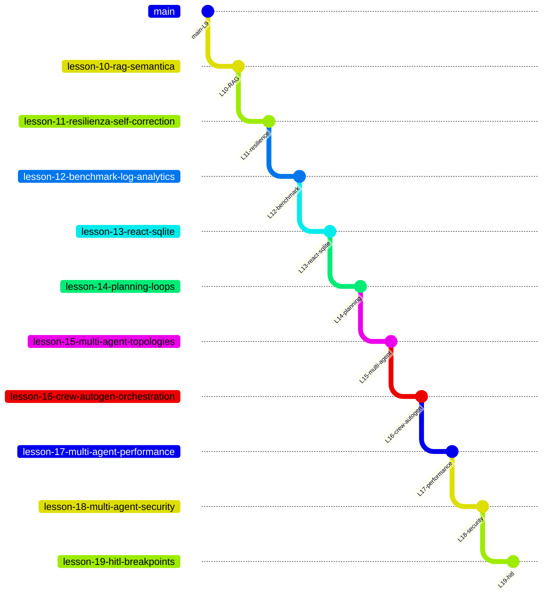

# Percorso didattico — Agentic Customer Care Triage System

Indice delle **lezioni**, **branch Git** e documentazione di riferimento.  
Ogni branch contiene il codice **cumulativo** fino alla lezione indicata; le lezioni successive vivono sui branch successivi.

## Mappa branch ↔ lezioni

| Branch Git | Ultima lezione inclusa | Checkout | Test (indicativo) |
|------------|------------------------|----------|-------------------|
| [`main`](.) | **Lezione 9** — Memoria agentica | `git checkout main` | ~40 |
| [`lesson-10-rag-semantica`](.) | **Lezione 10** — RAG + ChromaDB 10B | `git checkout lesson-10-rag-semantica` | ~49 |
| [`lesson-11-resilienza-self-correction`](.) | **Lezione 11** — Self-correction | `git checkout lesson-11-resilienza-self-correction` | ~54 |
| [`lesson-12-benchmark-log-analytics`](.) | **Lezione 12** — Benchmark e analytics | `git checkout lesson-12-benchmark-log-analytics` | ~62 |
| [`lesson-13-react-sqlite`](.) | **Lezione 13** — ReAct + SQLite LTM | `git checkout lesson-13-react-sqlite` | ~66 |
| [`lesson-14-planning-loops`](.) | **Lezione 14** — Planning e controllo loop | `git checkout lesson-14-planning-loops` | ~69 |
| [`lesson-15-multi-agent-topologies`](.) | **Lezione 15** — Multi-agent e topologie | `git checkout lesson-15-multi-agent-topologies` | ~76 |
| [`lesson-16-crew-autogen-orchestration`](.) | **Lezione 16** — CrewAI & AutoGen | `git checkout lesson-16-crew-autogen-orchestration` | ~83 |
| [`lesson-17-multi-agent-performance`](.) | **Lezione 17** — Performance MAS | `git checkout lesson-17-multi-agent-performance` | ~106 |
| [`lesson-18-multi-agent-security`](.) | **Lezione 18** — Sicurezza MAS | `git checkout lesson-18-multi-agent-security` | ~150 |
| [`lesson-19-hitl-breakpoints`](.) | **Lezione 19** — HITL e resume | `git checkout lesson-19-hitl-breakpoints` | ~174 |



**Settimana 8 (lezioni 11–12):** resilienza, error recovery, benchmarking — vedi [LEZIONE_11_RESILIENZA.md](LEZIONE_11_RESILIENZA.md) e [LEZIONE_12_PROMPT_OPTIMIZATION.md](LEZIONE_12_PROMPT_OPTIMIZATION.md).

**Settimana 9 (lezioni 13–14):** ReAct, SQLite, planning multi-step — vedi [LEZIONE_13_REACT_SQLITE.md](LEZIONE_13_REACT_SQLITE.md) e [LEZIONE_14_PLANNING_LOOPS.md](LEZIONE_14_PLANNING_LOOPS.md).

**Settimana 12 (lezioni 15–17):** modelli multi-agente, orchestrazione e performance — manuale demo live: **[SETTIMANA_12_DEMO_LIVE.md](SETTIMANA_12_DEMO_LIVE.md)**; teoria: [LEZIONE_15](LEZIONE_15_MULTI_AGENT_COORDINATION.md), [LEZIONE_16](LEZIONE_16_CREW_AUTOGEN.md), [LEZIONE_17](LEZIONE_17_MULTI_AGENT_PERFORMANCE.md).

**Settimana 13 (lezione 18):** sicurezza MAS — guardrail, hand-off, tool gate — manuale demo live: **[SETTIMANA_13_DEMO_LIVE.md](SETTIMANA_13_DEMO_LIVE.md)**; teoria: [LEZIONE_18](LEZIONE_18_MULTI_AGENT_SECURITY.md).

**Settimana 14 (lezione 19):** HITL, breakpoint, resume workflow — guida uso breakpoint: [LEZIONE_19 § guida pratica](LEZIONE_19_HITL_BREAKPOINTS.md#come-usare-i-breakpoint-guida-pratica); demo live: **[SETTIMANA_14_DEMO_LIVE.md](SETTIMANA_14_DEMO_LIVE.md)**; teoria completa: [LEZIONE_19](LEZIONE_19_HITL_BREAKPOINTS.md).

---

## Tabella lezioni

| Lezione | Tema | Codice / artefatti principali | Documentazione |
|---------|------|------------------------------|----------------|
| **Base** | CoT, JSON, loop agentico, tool, persistenza | `logic.py`, `main.py`, `storage/`, `tools/` | [README](../README.md), [GESTIONE_ERRORI](../GESTIONE_ERRORI.md) |
| **6** | Policy keyword (rete di sicurezza) | `_search_policy_keyword` in `office_tools.py` | README — Tool e fallback |
| **9** | Memoria short/long-term | `memory/`, `history_tools.py`, demo M1–M3 | [README — Memoria](../README.md#memoria-lezione-9) |
| **10** | RAG semantica su `policy.txt` | `rag/policy_semantic.py`, demo `l10` | [README — RAG](../README.md#rag-semantica-lezione-10) |
| **10B** | ChromaDB (vettori persistenti) | `rag/chroma_store.py`, `data/chroma/`, `scripts/esercizio_chroma_policy.py` | [LEZIONE_10B_CHROMADB.md](LEZIONE_10B_CHROMADB.md) |
| **11** | Self-correction, emergency fallback | `_finalize_with_self_correction`, `TriageStats` | [LEZIONE_11_RESILIENZA.md](LEZIONE_11_RESILIENZA.md) |
| **12** | Benchmark, KPI log, prompt v2 | `benchmark.py`, `analytics/log_kpi.py` | [LEZIONE_12_PROMPT_OPTIMIZATION.md](LEZIONE_12_PROMPT_OPTIMIZATION.md) |
| **13** | ReAct multi-step, SQLite LTM | `react_triage`, `init_db`, `scripts/init_triage_db.py` | [LEZIONE_13_REACT_SQLITE.md](LEZIONE_13_REACT_SQLITE.md) |
| **14** | max_steps, STM ReAct, self-correction in-loop | `_SHORT_TERM_STORE`, `session_id` | [LEZIONE_14_PLANNING_LOOPS.md](LEZIONE_14_PLANNING_LOOPS.md) |
| **15** | Multi-agent, topologie, hand-off Blackboard | `orchestration/`, `SharedHandoffContext` | [LEZIONE_15_MULTI_AGENT_COORDINATION.md](LEZIONE_15_MULTI_AGENT_COORDINATION.md) |
| **16** | CrewAI sequenziale + AutoGen GroupChat | `multi_agent_triage`, `crew_pipeline`, `autogen_team` | [LEZIONE_16_CREW_AUTOGEN.md](LEZIONE_16_CREW_AUTOGEN.md) |
| **17** | Pruning, cache pipeline, benchmark MAS | `message_pruning`, `pipeline_cache`, `benchmark_multi_agent` | [LEZIONE_17_MULTI_AGENT_PERFORMANCE.md](LEZIONE_17_MULTI_AGENT_PERFORMANCE.md) |
| **18** | Guardrail input, hand-off sanitizer, tool gate | `input_guardrail`, `handoff_sanitizer`, `tool_policy_gate`, `security_alerts` | [LEZIONE_18_MULTI_AGENT_SECURITY.md](LEZIONE_18_MULTI_AGENT_SECURITY.md) |
| **19** | HITL breakpoint, `ticket_states`, resume CLI | `hitl_breakpoints`, `hitl_store`, `hitl_pipeline`, `hitl_cli` | [LEZIONE_19_HITL_BREAKPOINTS.md](LEZIONE_19_HITL_BREAKPOINTS.md) |

---

## Comandi rapidi per lezione

> **Manuale demo live Settimana 12:** [SETTIMANA_12_DEMO_LIVE.md](SETTIMANA_12_DEMO_LIVE.md) — prerequisiti, sequenza `all`, output atteso per scenario.

| Lezione | Comando |
|---------|---------|
| 15 — Multi-agent topologie | `PYTHONPATH=src python3 src/main.py` oppure `--scenario l15` |
| 16a — CrewAI pipeline | `PYTHONPATH=src python3 src/main.py --scenario l16a` |
| 16b — AutoGen GroupChat | `PYTHONPATH=src python3 src/main.py --scenario l16b` |
| 17a — Pruning before/after | `PYTHONPATH=src python3 src/main.py --scenario l17a` |
| 17b — Benchmark latenza MAS | `PYTHONPATH=src python3 src/main.py --scenario l17b` |
| 18a — Input Guardrail | `PYTHONPATH=src python3 src/main.py --scenario l18a` |
| 18b — Hand-off + tool gate | `PYTHONPATH=src python3 src/main.py --scenario l18b` |
| 19a — Breakpoint HITL | `PYTHONPATH=src python3 src/main.py --scenario l19a` |
| 19b — Approve / reject | `PYTHONPATH=src python3 src/main.py --scenario l19b` |
| CLI operatore HITL | `PYTHONPATH=src python3 -m orchestration.hitl_cli list` |
| Settimana 12–14 — tutte le demo | `PYTHONPATH=src python3 src/main.py --scenario all` |
| Report HTML (auto a fine run) | `logs/week12_demo_report.html` |
| 12 — benchmark monolitico | `PYTHONPATH=src python3 src/benchmark.py` |
| 17 — benchmark multi-agent | `PYTHONPATH=src python3 src/benchmark_multi_agent.py` |
| 12/17 — KPI log | `PYTHONPATH=src python3 -m analytics.log_kpi` |
| 16/17 — dipendenze framework | `pip install -e ".[multiagent]"` |
| init DB (post-clone) | `PYTHONPATH=src python3 scripts/init_triage_db.py` |
| Test (qualsiasi branch) | `pytest tests/ -q` |

**Prerequisito demo live:** `OPENAI_API_KEY` nel file `.env` (non `export` in shell).

---

## Settimane del corso (riferimento)

| Settimana | Contenuto | Branch tipico |
|-----------|-----------|---------------|
| Memoria e tool | Lezione 9 (M1–M3) | `main` |
| Knowledge / RAG | Lezione 10 + 10B | `lesson-10-rag-semantica` |
| **Settimana 8** | Resilienza, error recovery, benchmarking | `lesson-11-*` → `lesson-12-*` |
| **Settimana 9** | ReAct, SQLite, planning multi-step | `lesson-13-*` → `lesson-14-*` |
| **Settimana 12** | Multi-agent, orchestrazione, performance MAS | `lesson-15-*` → `lesson-17-*` |
| **Settimana 13** | Sicurezza MAS: guardrail, hand-off, tool gate | `lesson-18-*` |
| **Settimana 14** | HITL: breakpoint, ticket_states, resume | `lesson-19-*` |

---

## Documentazione trasversale

| File | Contenuto |
|------|-----------|
| [README.md](../README.md) | Architettura, setup, demo, struttura repo (allineato al branch corrente) |
| [GESTIONE_ERRORI.md](../GESTIONE_ERRORI.md) | Manuale errori, moduli 0–5, collegamento L11–L16 |
| [LEZIONE_10B_CHROMADB.md](LEZIONE_10B_CHROMADB.md) | Laboratorio ChromaDB |
| [LEZIONE_11_RESILIENZA.md](LEZIONE_11_RESILIENZA.md) | Hard vs soft error, self-correction, fallback |
| [LEZIONE_12_PROMPT_OPTIMIZATION.md](LEZIONE_12_PROMPT_OPTIMIZATION.md) | Benchmark, analytics, triage_v2 |
| [LEZIONE_13_REACT_SQLITE.md](LEZIONE_13_REACT_SQLITE.md) | ReAct, SQLite indicizzato, dual-write |
| [LEZIONE_14_PLANNING_LOOPS.md](LEZIONE_14_PLANNING_LOOPS.md) | max_steps, STM, self-correction in-loop |
| [LEZIONE_15_MULTI_AGENT_COORDINATION.md](LEZIONE_15_MULTI_AGENT_COORDINATION.md) | Topologie, Role/Goal/Backstory, Blackboard |
| [LEZIONE_16_CREW_AUTOGEN.md](LEZIONE_16_CREW_AUTOGEN.md) | CrewAI, AutoGen, multi_agent_triage |
| [LEZIONE_17_MULTI_AGENT_PERFORMANCE.md](LEZIONE_17_MULTI_AGENT_PERFORMANCE.md) | Pruning, cache pipeline, benchmark MAS |
| [LEZIONE_18_MULTI_AGENT_SECURITY.md](LEZIONE_18_MULTI_AGENT_SECURITY.md) | Guardrail, hand-off sanitizer, tool gate |
| [SETTIMANA_12_DEMO_LIVE.md](SETTIMANA_12_DEMO_LIVE.md) | **Manuale operativo demo live L15–L17** |
| [SETTIMANA_13_DEMO_LIVE.md](SETTIMANA_13_DEMO_LIVE.md) | **Manuale operativo demo live L18** |

---

## Per docenti — review Settimana 8

| Criterio | Dove verificare |
|----------|-----------------|
| `max_retries` ≤ 3, no loop infinito | `logic.MAX_TRIAGE_JSON_RETRIES`, `tests/test_logic.py` |
| Fallback Pydantic-valido | `_emergency_triage_result`, `test_emergency_triage_result_is_valid_pydantic` |
| Report benchmark | `tests/test_benchmark.py`, `src/benchmark.py` |
| KPI log | `tests/test_log_kpi.py`, eventi `triage_json_retry` / `emergency_fallback` |

## Per docenti — review Settimana 9

| Criterio | Dove verificare |
|----------|-----------------|
| SQLite init + indice `idx_cliente` | `scripts/init_triage_db.py`, `tests/test_logger_sqlite.py` |
| LTM O(log N) vs JSONL audit | Dual-write in `main._log_ticket_processed` |
| Loop ReAct base | `react_triage`, `test_react_triage_with_tool_then_json` |
| `max_steps = 4` hard stop | `DEFAULT_REACT_MAX_STEPS`, `test_react_max_steps_fallback` |
| STM ReAct (`session_id`) | `_SHORT_TERM_STORE`, `test_short_term_store_preserves_session` |
| Self-correction in-loop | `test_react_self_correction_in_loop` |
| Benchmark L12 invariato | `pytest tests/test_benchmark.py`, usa `triage_message` |

Push suggerito dopo ogni lezione:

```bash
git push -u origin lesson-11-resilienza-self-correction
git push -u origin lesson-12-benchmark-log-analytics
git push -u origin lesson-13-react-sqlite
git push -u origin lesson-14-planning-loops
git push -u origin lesson-15-multi-agent-topologies
git push -u origin lesson-16-crew-autogen-orchestration
```

## Per docenti — review Settimana 12 (panoramica)

Vedi [SETTIMANA_12_DEMO_LIVE.md](SETTIMANA_12_DEMO_LIVE.md) per la checklist completa e la timeline delle 3 sessioni.

| Verifica rapida | Comando |
|-----------------|---------|
| Default CLI = solo L15 | `PYTHONPATH=src python3 src/main.py` |
| Sequenza intera | `PYTHONPATH=src python3 src/main.py --scenario all` |
| Senza API key | `all` esegue L15 e salta LLM con `[SKIP]` |

## Per docenti — review Settimana 12 (L15)

| Criterio | Dove verificare |
|----------|-----------------|
| 3 topologie documentate | `orchestration/topologies.py`, `TOPOLOGY_CATALOG` |
| Tool partizionati Analyst/Resolver | `IMPESUD_AGENT_TEAM`, `test_analyst_resolver_tool_partition` |
| Hand-off Blackboard | `simulate_analyst_handoff`, `test_simulate_handoff_marco_rossi` |
| Demo senza LLM | `main.py --scenario l15` |
| Retrocompatibilità L12–L16 | `pytest tests/ -q` |

## Per docenti — review Settimana 12 (L16)

| Criterio | Dove verificare |
|----------|-----------------|
| CrewAI sequenziale | `crew_pipeline.crew_triage`, demo `l16a` |
| AutoGen GroupChat | `autogen_team.autogen_triage`, demo `l16b` |
| Hand-off Blackboard | `build_resolver_task_description`, test handoff |
| JSON finale valido | `finalize_multi_agent_output`, `parse_llm_output` |
| Dipendenze opzionali | `pip install -e ".[multiagent]"` |
| Retrocompatibilità | `pytest tests/ -q` (~106), benchmark L12 |


## Per docenti — review Settimana 12 (L17)

| Criterio | Dove verificare |
|----------|-----------------|
| Message pruning | `orchestration/message_pruning.py`, `test_message_pruning.py` |
| Cache pipeline | `pipeline_cache.py`, `test_pipeline_cache.py` |
| CLI L15–L19 | `main.WEEK12_SCENARIOS`, `test_cli_scenarios_week12_only` |
| Demo l17a/l17b | `run_l17a_pruning_demo`, `benchmark_multi_agent.py` |
| KPI L17 in log | `analytics/log_kpi.performance_metrics` |
| Retrocompatibilità | `pytest tests/ -q` (~106), benchmark L12 |

Push suggerito:

```bash
git push -u origin lesson-17-multi-agent-performance
```

## Per docenti — review Settimana 13 (L18)

| Criterio | Dove verificare |
|----------|-----------------|
| Input guardrail | `orchestration/input_guardrail.py`, `test_input_guardrail.py` |
| Allerte SQLite | `security_store.py`, tabella `security_alerts`, `test_security_store.py` |
| Hand-off sanitizer | `handoff_sanitizer.py`, `test_handoff_sanitizer.py` |
| Tool policy gate | `tool_policy_gate.py`, `test_tool_policy_gate.py` |
| Demo l18a/l18b (no LLM) | `main.run_l18a_guardrail_demo`, `run_l18b_handoff_tool_gate_demo` |
| KPI L18 in log | `analytics/log_kpi.security_metrics` |
| Retrocompatibilità | `pytest tests/ -q` (~150), benchmark L12 |

Push suggerito:

```bash
git push -u origin lesson-18-multi-agent-security
```

## Per docenti — review Settimana 14 (L19)

| Criterio | Dove verificare |
|----------|-----------------|
| Breakpoint HITL | `hitl_breakpoints.py`, `test_hitl_breakpoints.py` |
| SQLite ticket_states | `hitl_store.py`, `test_hitl_store.py` |
| Pause / resume ReAct | `hitl_pipeline.py`, `logic.react_triage_resume`, `test_hitl_pipeline.py` |
| CLI operatore | `hitl_cli.py`, `test_hitl_cli.py` |
| Demo l19a/l19b (no LLM) | `main.run_l19a_hitl_breakpoint_demo`, `run_l19b_hitl_resume_demo` |
| KPI L19 in log | `analytics/log_kpi.hitl_metrics` |
| Retrocompatibilità | `pytest tests/ -q` (~174), benchmark L12 |

Push suggerito:

```bash
git push -u origin lesson-19-hitl-breakpoints
```
