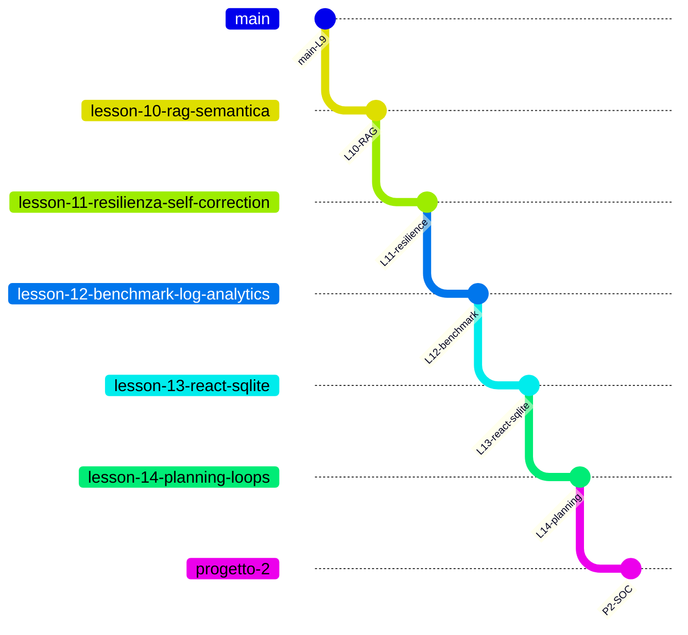

# Percorso didattico — Agentic Customer Care Triage System

Indice delle **lezioni**, **branch Git** e documentazione di riferimento.  
Ogni branch contiene il codice **cumulativo** fino alla lezione indicata; le lezioni successive vivono sui branch successivi.

## Mappa branch ↔ lezioni

| Branch Git | Ultima lezione inclusa | Checkout | Test (indicativo) |
|------------|------------------------|----------|-------------------|
| [`main`](.) | **Lezione 9** — Memoria agentica | `git checkout main` | ~40 |
| [`lesson-10-rag-semantica`](.) | **Lezione 10** — RAG + ChromaDB 10B | `git checkout lesson-10-rag-semantica` | ~49 |
| [`lesson-11-resilienza-self-correction`](.) | **Lezione 11** — Self-correction | `git checkout lesson-11-resilienza-self-correction` | ~54 |
| [`lesson-12-benchmark-log-analytics`](.) | **Lezione 12** — Benchmark e analytics | `git checkout lesson-12-benchmark-log-analytics` | ~62 |
| [`lesson-13-react-sqlite`](.) | **Lezione 13** — ReAct + SQLite LTM | `git checkout lesson-13-react-sqlite` | ~66 |
| [`lesson-14-planning-loops`](.) | **Lezione 14** — Planning e controllo loop | `git checkout lesson-14-planning-loops` | ~69 |
| [`progetto-2`](.) | **Progetto 2** — 10 scenari SOC `dataset_test` | `git checkout progetto-2` | ~88 |



**Settimana 8 (lezioni 11–12):** resilienza, error recovery, benchmarking — vedi [LEZIONE_11_RESILIENZA.md](LEZIONE_11_RESILIENZA.md) e [LEZIONE_12_PROMPT_OPTIMIZATION.md](LEZIONE_12_PROMPT_OPTIMIZATION.md).

**Settimana 9 (lezioni 13–14):** ReAct, SQLite, planning multi-step — vedi [LEZIONE_13_REACT_SQLITE.md](LEZIONE_13_REACT_SQLITE.md) e [LEZIONE_14_PLANNING_LOOPS.md](LEZIONE_14_PLANNING_LOOPS.md).

**Progetto finale (Progetto 2):** 10 scenari SOC su `react_triage_progettino` — vedi [MANUALE_PROGETTINO_DATASET_TEST.md](MANUALE_PROGETTINO_DATASET_TEST.md) (procedure studente) e [PROGETTO_2_SCENARI.md](PROGETTO_2_SCENARI.md) (soluzione di riferimento).

---

## Tabella lezioni

| Lezione | Tema | Codice / artefatti principali | Documentazione |
|---------|------|------------------------------|----------------|
| **Base** | CoT, JSON, loop agentico, tool, persistenza | `logic.py`, `main.py`, `storage/`, `tools/` | [README](../README.md), [GESTIONE_ERRORI](../GESTIONE_ERRORI.md) |
| **6** | Policy keyword (rete di sicurezza) | `_search_policy_keyword` in `office_tools.py` | README — Tool e fallback |
| **9** | Memoria short/long-term | `memory/`, `history_tools.py`, demo M1–M3 | [README — Memoria](../README.md#memoria-lezione-9) |
| **10** | RAG semantica su `policy.txt` | `rag/policy_semantic.py`, demo `l10` | [README — RAG](../README.md#rag-semantica-lezione-10) |
| **10B** | ChromaDB (vettori persistenti) | `rag/chroma_store.py`, `data/chroma/`, `scripts/esercizio_chroma_policy.py` | [LEZIONE_10B_CHROMADB.md](LEZIONE_10B_CHROMADB.md) |
| **11** | Self-correction, emergency fallback | `_finalize_with_self_correction`, `TriageStats` | [LEZIONE_11_RESILIENZA.md](LEZIONE_11_RESILIENZA.md) |
| **12** | Benchmark, KPI log, prompt v2 | `benchmark.py`, `analytics/log_kpi.py` | [LEZIONE_12_PROMPT_OPTIMIZATION.md](LEZIONE_12_PROMPT_OPTIMIZATION.md) |
| **13** | ReAct multi-step, SQLite LTM | `react_triage`, `init_db`, `scripts/init_triage_db.py` | [LEZIONE_13_REACT_SQLITE.md](LEZIONE_13_REACT_SQLITE.md) |
| **14** | max_steps, STM ReAct, self-correction in-loop | `_SHORT_TERM_STORE`, `session_id` | [LEZIONE_14_PLANNING_LOOPS.md](LEZIONE_14_PLANNING_LOOPS.md) |
| **Progettino** | Dataset test SOC (10 scenari) | `react_triage`, tool sicurezza, policy SOC | [MANUALE_PROGETTINO_DATASET_TEST.md](MANUALE_PROGETTINO_DATASET_TEST.md) |
| **Progetto 2** | Implementazione completa 10 scenari | `dataset_test.py`, `security_tools`, `seed_progettino` | [PROGETTO_2_SCENARI.md](PROGETTO_2_SCENARI.md) |

---

## Comandi rapidi per lezione

| Lezione | Comando |
|---------|---------|
| 9 — tutte le demo memoria | `PYTHONPATH=src python3 src/main.py` |
| 9 — singolo scenario | `PYTHONPATH=src python3 src/main.py --scenario m1` (o `m2`, `m3`) |
| 10 — RAG | `PYTHONPATH=src python3 src/main.py --scenario l10` |
| 11 — resilienza | `PYTHONPATH=src python3 src/main.py --scenario l11` |
| 12 — benchmark | `PYTHONPATH=src python3 src/benchmark.py` |
| 12 — KPI log | `PYTHONPATH=src python3 -m analytics.log_kpi` |
| 13 — ReAct + SQLite | `PYTHONPATH=src python3 src/main.py --scenario l13` |
| 14 — Planning multi-step | `PYTHONPATH=src python3 src/main.py --scenario l14` |
| Progetto 2 — dataset SOC | `PYTHONPATH=src python3 scripts/seed_progettino.py` poi `--scenario progetto2` |
| Progetto 2 — test scenari | `PYTHONPATH=src pytest tests/test_dataset_test.py tests/test_security_progetto.py -q` |
| 13/14 — init DB (post-clone) | `PYTHONPATH=src python3 scripts/init_triage_db.py` |
| Test (qualsiasi branch) | `pytest tests/ -q` |

**Prerequisito demo live:** `OPENAI_API_KEY` nel file `.env` (non `export` in shell).

---

## Settimane del corso (riferimento)

| Settimana | Contenuto | Branch tipico |
|-----------|-----------|---------------|
| Memoria e tool | Lezione 9 (M1–M3) | `main` |
| Knowledge / RAG | Lezione 10 + 10B | `lesson-10-rag-semantica` |
| **Settimana 8** | Resilienza, error recovery, benchmarking | `lesson-11-*` → `lesson-12-*` |
| **Settimana 9** | ReAct, SQLite, planning multi-step | `lesson-13-*` → `lesson-14-*` |
| **Progetto finale** | 10 scenari SOC `dataset_test` | `progetto-2` |

---

## Documentazione trasversale

| File | Contenuto |
|------|-----------|
| [README.md](../README.md) | Architettura, setup, demo, struttura repo (allineato al branch corrente) |
| [GESTIONE_ERRORI.md](../GESTIONE_ERRORI.md) | Manuale errori, moduli 0–5, collegamento L11–L14 |
| [LEZIONE_10B_CHROMADB.md](LEZIONE_10B_CHROMADB.md) | Laboratorio ChromaDB |
| [LEZIONE_11_RESILIENZA.md](LEZIONE_11_RESILIENZA.md) | Hard vs soft error, self-correction, fallback |
| [LEZIONE_12_PROMPT_OPTIMIZATION.md](LEZIONE_12_PROMPT_OPTIMIZATION.md) | Benchmark, analytics, triage_v2 |
| [LEZIONE_13_REACT_SQLITE.md](LEZIONE_13_REACT_SQLITE.md) | ReAct, SQLite indicizzato, dual-write |
| [LEZIONE_14_PLANNING_LOOPS.md](LEZIONE_14_PLANNING_LOOPS.md) | max_steps, STM, self-correction in-loop |
| [MANUALE_PROGETTINO_DATASET_TEST.md](MANUALE_PROGETTINO_DATASET_TEST.md) | Progetto finale: 10 scenari SOC, procedure operative |
| [PROGETTO_2_SCENARI.md](PROGETTO_2_SCENARI.md) | Progetto 2: svolgimento codice scenari 1–10 |

---

## Per docenti — review Settimana 8

| Criterio | Dove verificare |
|----------|-----------------|
| `max_retries` ≤ 3, no loop infinito | `logic.MAX_TRIAGE_JSON_RETRIES`, `tests/test_logic.py` |
| Fallback Pydantic-valido | `_emergency_triage_result`, `test_emergency_triage_result_is_valid_pydantic` |
| Report benchmark | `tests/test_benchmark.py`, `src/benchmark.py` |
| KPI log | `tests/test_log_kpi.py`, eventi `triage_json_retry` / `emergency_fallback` |

## Per docenti — review Settimana 9

| Criterio | Dove verificare |
|----------|-----------------|
| SQLite init + indice `idx_cliente` | `scripts/init_triage_db.py`, `tests/test_logger_sqlite.py` |
| LTM O(log N) vs JSONL audit | Dual-write in `main._log_ticket_processed` |
| Loop ReAct base | `react_triage`, `test_react_triage_with_tool_then_json` |
| `max_steps = 4` hard stop | `DEFAULT_REACT_MAX_STEPS`, `test_react_max_steps_fallback` |
| STM ReAct (`session_id`) | `_SHORT_TERM_STORE`, `test_short_term_store_preserves_session` |
| Self-correction in-loop | `test_react_self_correction_in_loop` |
| Benchmark L12 invariato | `pytest tests/test_benchmark.py`, usa `triage_message` |

## Per docenti — review Progetto 2

| Criterio | Dove verificare |
|----------|-----------------|
| 10 scenari in `dataset_test.py` | `DATASET_TEST`, `get_scenario()` |
| Tool `isolate_account` / `verify_sender_identity` | `tools/security_tools.py`, `tests/test_security_progetto.py` |
| Fallback SOC in ReAct | `_apply_progetto_fallbacks`, `react_triage_progettino` |
| Seed Luca / Matteo / CEO | `scripts/seed_progettino.py` |
| Policy SOC §4 in RAG | `data/policy.txt`, demo `--scenario l10` |
| Prompt injection (scenario 3) | `test_progettino_clarification_injection_returns_security` |
| Report demo live | `python3 src/main.py --scenario progetto2` |

Push suggerito dopo ogni lezione:

```bash
git push -u origin lesson-11-resilienza-self-correction
git push -u origin lesson-12-benchmark-log-analytics
git push -u origin lesson-13-react-sqlite
git push -u origin lesson-14-planning-loops
git push -u origin progetto-2
```
