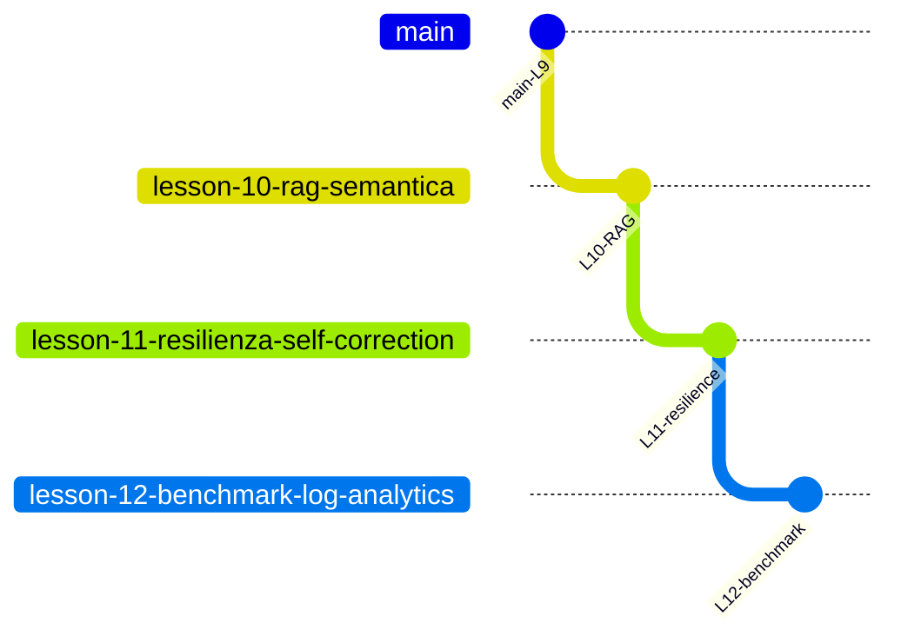

# Percorso didattico — Agentic Customer Care Triage System

Indice delle **lezioni**, **branch Git** e documentazione di riferimento.  
Ogni branch contiene il codice **cumulativo** fino alla lezione indicata; le lezioni successive vivono sui branch successivi.

## Mappa branch ↔ lezioni

| Branch Git | Ultima lezione inclusa | Checkout | Test (indicativo) |
|------------|------------------------|----------|-------------------|
| [`main`](.) | **Lezione 9** — Memoria agentica | `git checkout main` | ~40 |
| [`lesson-10-rag-semantica`](.) | **Lezione 10** — RAG semantica (+ 10B doc) | `git checkout lesson-10-rag-semantica` | ~48 |
| [`lesson-11-resilienza-self-correction`](.) | **Lezione 11** — Self-correction | `git checkout lesson-11-resilienza-self-correction` | ~53 |
| [`lesson-12-benchmark-log-analytics`](.) | **Lezione 12** — Benchmark e analytics | `git checkout lesson-12-benchmark-log-analytics` | ~61 |



**Settimana 8 (lezioni 11–12):** resilienza, error recovery, benchmarking — vedi [LEZIONE_11_RESILIENZA.md](LEZIONE_11_RESILIENZA.md) e [LEZIONE_12_PROMPT_OPTIMIZATION.md](LEZIONE_12_PROMPT_OPTIMIZATION.md).

---

## Tabella lezioni

| Lezione | Tema | Codice / artefatti principali | Documentazione |
|---------|------|------------------------------|----------------|
| **Base** | CoT, JSON, loop agentico, tool, persistenza | `logic.py`, `main.py`, `storage/`, `tools/` | [README](../README.md), [GESTIONE_ERRORI](../GESTIONE_ERRORI.md) |
| **6** | Policy keyword (rete di sicurezza) | `_search_policy_keyword` in `office_tools.py` | README — Tool e fallback |
| **9** | Memoria short/long-term | `memory/`, `history_tools.py`, demo M1–M3 | [README — Memoria](../README.md#memoria-lezione-9) |
| **10** | RAG semantica su `policy.txt` | `rag/policy_semantic.py`, demo `l10` | [README — RAG](../README.md#rag-semantica-lezione-10) |
| **10B** | ChromaDB (vettori persistenti) | `scripts/esercizio_chroma_policy.py` | [LEZIONE_10B_CHROMADB.md](LEZIONE_10B_CHROMADB.md) |
| **11** | Self-correction, emergency fallback | `_finalize_with_self_correction`, `TriageStats` | [LEZIONE_11_RESILIENZA.md](LEZIONE_11_RESILIENZA.md) |
| **12** | Benchmark, KPI log, prompt v2 | `benchmark.py`, `analytics/log_kpi.py` | [LEZIONE_12_PROMPT_OPTIMIZATION.md](LEZIONE_12_PROMPT_OPTIMIZATION.md) |

---

## Comandi rapidi per lezione

| Lezione | Comando |
|---------|---------|
| 9 — tutte le demo memoria | `PYTHONPATH=src python3 src/main.py` |
| 9 — singolo scenario | `PYTHONPATH=src python3 src/main.py --scenario m1` (o `m2`, `m3`) |
| 10 — RAG | `PYTHONPATH=src python3 src/main.py --scenario l10` |
| 11 — resilienza | `PYTHONPATH=src python3 src/main.py --scenario l11` |
| 12 — benchmark | `PYTHONPATH=src python3 src/benchmark.py` |
| 12 — KPI log | `PYTHONPATH=src python3 -m analytics.log_kpi` |
| Test (qualsiasi branch) | `pytest tests/ -q` |

**Prerequisito demo live:** `OPENAI_API_KEY` nel file `.env` (non `export` in shell).

---

## Settimane del corso (riferimento)

| Settimana | Contenuto | Branch tipico |
|-----------|-----------|---------------|
| Memoria e tool | Lezione 9 (M1–M3) | `main` |
| Knowledge / RAG | Lezione 10 + 10B | `lesson-10-rag-semantica` |
| **Settimana 8** | Resilienza, error recovery, benchmarking | `lesson-11-*` → `lesson-12-*` |

---

## Documentazione trasversale

| File | Contenuto |
|------|-----------|
| [README.md](../README.md) | Architettura, setup, demo, struttura repo (allineato al branch corrente) |
| [GESTIONE_ERRORI.md](../GESTIONE_ERRORI.md) | Manuale errori, moduli 0–5, collegamento L11/L12 |
| [LEZIONE_10B_CHROMADB.md](LEZIONE_10B_CHROMADB.md) | Laboratorio ChromaDB |
| [LEZIONE_11_RESILIENZA.md](LEZIONE_11_RESILIENZA.md) | Hard vs soft error, self-correction, fallback |
| [LEZIONE_12_PROMPT_OPTIMIZATION.md](LEZIONE_12_PROMPT_OPTIMIZATION.md) | Benchmark, analytics, triage_v2 |

---

## Per docenti — review Settimana 8

| Criterio | Dove verificare |
|----------|-----------------|
| `max_retries` ≤ 3, no loop infinito | `logic.MAX_TRIAGE_JSON_RETRIES`, `tests/test_logic.py` |
| Fallback Pydantic-valido | `_emergency_triage_result`, `test_emergency_triage_result_is_valid_pydantic` |
| Report benchmark | `tests/test_benchmark.py`, `src/benchmark.py` |
| KPI log | `tests/test_log_kpi.py`, eventi `triage_json_retry` / `emergency_fallback` |

Push suggerito dopo ogni lezione:

```bash
git push -u origin lesson-11-resilienza-self-correction
git push -u origin lesson-12-benchmark-log-analytics
```
