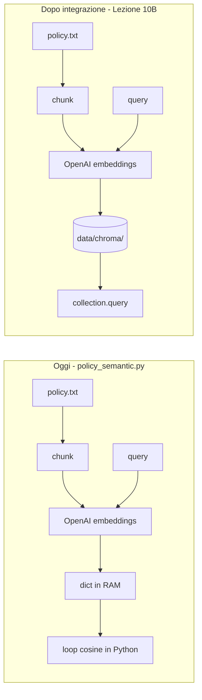
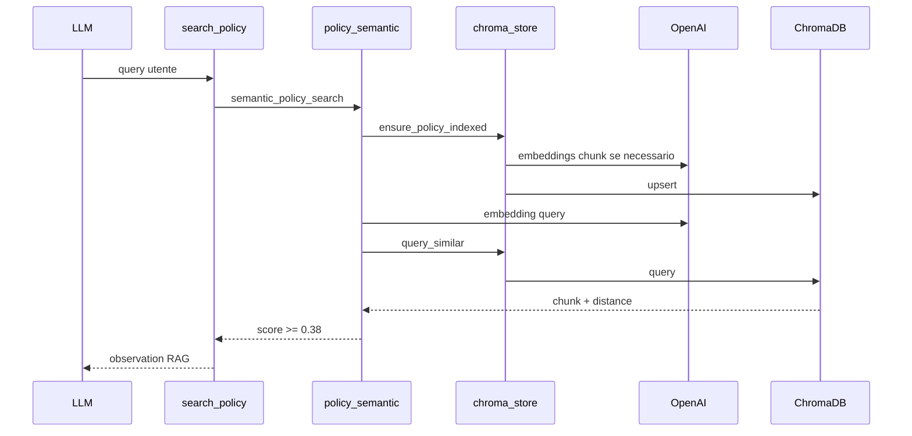
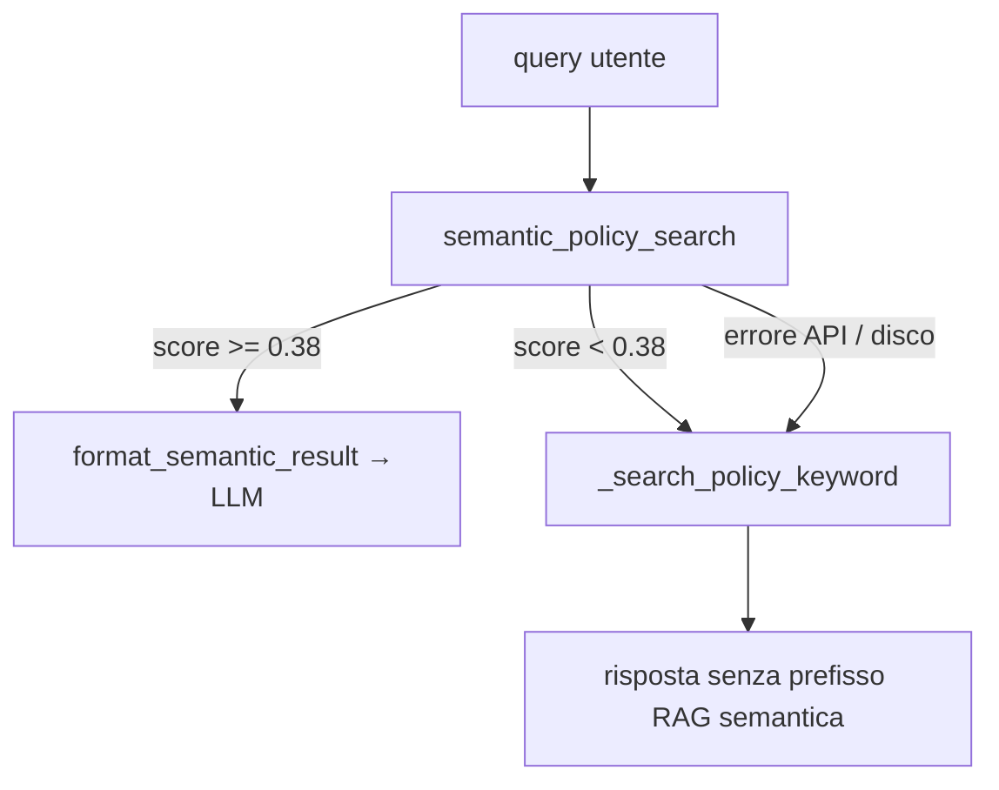

# Lezione 10B — ChromaDB: installazione, configurazione e uso

**Sotto-lezione** del corso *Agentic Customer Care Triage System*.  
Complementa la [Lezione 10 (RAG semantica)](../README.md#rag-semantica-lezione-10): qui passiamo dalla **cache in-memory** degli embedding a un **database vettoriale persistente** su disco.

> **Stato del codice nel repository:** al momento la pipeline in `src/rag/policy_semantic.py` usa ancora una cache Python in RAM. Questa lezione prepara studenti e docente all’integrazione ChromaDB (prossimo passo di sviluppo). Gli esercizi sotto funzionano **subito** con uno script autonomo; dopo l’integrazione, gli stessi concetti vivranno in `src/rag/chroma_store.py`.

---

## Obiettivi didattici

Al termine della sotto-lezione lo studente sa:

1. Spiegare **perché** serve un vector store oltre a «calcolo cosine in Python».
2. **Installare** ChromaDB nel virtual environment del progetto.
3. **Configurare** persistenza locale (`data/chroma/`) e una collection con metrica **cosine**.
4. **Indicizzare** chunk di testo con embedding OpenAI e **interrogare** la collection.
5. Collegare il flusso al tool `search_policy` e alla demo `--scenario l10`.

---

## Prerequisiti

| Requisito | Verifica |
|-----------|----------|
| Lezione 10 letta (chunking, embeddings, soglia 0.38) | [README — RAG semantica](../README.md#rag-semantica-lezione-10) |
| Virtual environment attivo | `source .venv/bin/activate` |
| File `.env` con `OPENAI_API_KEY` | Come in [README — Setup](../README.md#setup-e-test) |
| `data/policy.txt` presente | Policy Impesud del progetto |

---

## 1. Perché un database vettoriale?

### Cosa fa oggi il progetto (Lezione 10)

In `src/rag/policy_semantic.py` la pipeline è:

1. Leggere `data/policy.txt` e spezzarlo in paragrafi (`chunk_policy`).
2. Chiamare OpenAI `text-embedding-3-small` per ogni chunk (e per la query).
3. Confrontare la query con **ogni** chunk in memoria (`cosine_similarity` in Python).
4. Tenere i vettori in un dizionario `_policy_index_cache` **fino alla chiusura del processo**.

### Limiti della cache in-memory

| Problema | Effetto in classe / produzione |
|----------|--------------------------------|
| Nessuna persistenza | Ogni riavvio = nuove chiamate API e latenza |
| Scalabilità | Con migliaia di chunk, il loop Python diventa lento |
| Un solo processo | Difficile condividere l’indice tra worker o istanze |
| Operatività | Nessun posto standard dove «vedere» cosa è indicizzato |

Un **database vettoriale** (qui **ChromaDB** in modalità *embedded*) memorizza id, testo, embedding e metadati su disco e espone API di **upsert** e **query** ottimizzate.



---

## 2. Cos’è ChromaDB (in breve)

- **Libreria Python** (`chromadb`) che può girare **senza server separato** (`PersistentClient`).
- Salva i dati in una cartella locale (nel nostro progetto: `data/chroma/`).
- Organizza i documenti in **collection** (es. `policy_chunks`).
- Ogni record ha: `id`, `document` (testo), `embedding` (vettore), `metadata` opzionale.
- La ricerca restituisce i vicini più simili (con spazio metrico configurabile, es. **cosine**).

**Non serve Docker** per questa lezione. Non servono variabili d’ambiente aggiuntive oltre a `OPENAI_API_KEY` (per generare gli embedding).

---

## 3. Installazione

Dalla root del repository, con il venv attivo:

```bash
cd /percorso/agentic-triage-system
source .venv/bin/activate

# Installa il pacchetto del corso (se non l’hai già fatto)
pip install -e ".[test]"

# Aggiunge ChromaDB al venv (passo specifico Lezione 10B)
pip install "chromadb>=0.5"
```

### Verifica installazione

```bash
python -c "import chromadb; print('ChromaDB', chromadb.__version__)"
```

Output atteso: una versione tipo `0.5.x` o superiore (il numero esatto può variare).

### Problemi comuni in installazione

| Sintomo | Causa probabile | Cosa fare |
|---------|-----------------|-----------|
| `pip: command not found` | venv non attivato | `source .venv/bin/activate` |
| Download molto lento | dipendenze native di Chroma | Attendere; usare rete stabile |
| `Permission denied` su `.venv` | permessi cartella | Ricreare il venv con `python3 -m venv .venv` |

---

## 4. Configurazione nel progetto

### 4.1 Percorsi (convenzione del corso)

| Percorso | Ruolo |
|----------|--------|
| `data/policy.txt` | Documento sorgente da indicizzare |
| `data/chroma/` | Persistenza ChromaDB (creata al primo avvio, **non** in git) |
| `.env` | Solo `OPENAI_API_KEY` per gli embedding OpenAI |

Dopo l’integrazione nel codice, `src/paths.py` esporrà qualcosa come:

```python
CHROMA_PATH = REPO_ROOT / "data" / "chroma"
```

Per ora puoi usare lo stesso percorso negli script della lezione.

### 4.2 Collection e metrica cosine

Per allinearsi alla Lezione 10 (similarità del coseno), la collection va creata con metadata:

```python
collection = client.get_or_create_collection(
    name="policy_chunks",
    metadata={"hnsw:space": "cosine"},
)
```

Chroma restituisce una **distanza** coseno (0 = identici). Nel progetto convertiremo in **score** per l’LLM con:

`score = 1 - distance`

e manterremo la soglia **0.38** già usata in `semantic_policy_search`.

### 4.3 Re-indicizzazione quando cambia la policy

Buona pratica (da implementare in `chroma_store.py`):

1. Calcolare un **hash** (SHA-256) del file `data/policy.txt`.
2. Salvarlo nei metadata della collection (`policy_hash=...`).
3. Se il file cambia → eliminare/ricreare la collection e rifare `upsert`.

Così il secondo avvio della demo L10 **non** richiama OpenAI se la policy è invariata.

### 4.4 `.env` — nessuna chiave Chroma

Crea o aggiorna `.env` alla root (non committare):

```env
OPENAI_API_KEY=sk-progetto-corso
```

Chroma embedded **non** richiede API key proprie.

---

## 5. Laboratorio guidato — script autonomo

Salva il file seguente come `scripts/esercizio_chroma_policy.py` (crea la cartella `scripts/` se non esiste).

```python
"""
Esercizio Lezione 10B — ChromaDB + policy Impesud.
Esecuzione dalla root del repo:
  source .venv/bin/activate
  pip install chromadb
  PYTHONPATH=src python scripts/esercizio_chroma_policy.py
"""

from __future__ import annotations

import hashlib
from pathlib import Path

import chromadb
from openai import OpenAI

from client import get_client
from paths import POLICY_PATH, REPO_ROOT
from rag.policy_semantic import EMBEDDING_MODEL, chunk_policy, embed_texts

CHROMA_PATH = REPO_ROOT / "data" / "chroma"
COLLECTION_NAME = "policy_chunks_esercizio"
THRESHOLD = 0.38

# Query didattica L10 (sinonimi, non parole della policy)
DEMO_QUERY = "Voglio annullare il contratto e riavere i soldi: quali sono i termini?"


def policy_hash(path: Path) -> str:
    return hashlib.sha256(path.read_bytes()).hexdigest()


def get_collection(client: chromadb.ClientAPI, content_hash: str):
    """Crea o ricrea la collection se la policy è cambiata."""
    try:
        existing = client.get_collection(COLLECTION_NAME)
        stored = (existing.metadata or {}).get("policy_hash")
        if stored == content_hash:
            print(f"[OK] Collection '{COLLECTION_NAME}' già allineata al file policy.")
            return existing
        print("[INFO] Policy cambiata — ricreo la collection.")
        client.delete_collection(COLLECTION_NAME)
    except Exception:
        pass

    return client.get_or_create_collection(
        name=COLLECTION_NAME,
        metadata={"hnsw:space": "cosine", "policy_hash": content_hash},
    )


def index_policy(client: OpenAI, collection, policy_path: Path) -> None:
    text = policy_path.read_text(encoding="utf-8")
    chunks = chunk_policy(text)
    if not chunks:
        raise ValueError("Nessun chunk estratto da policy.txt")

    print(f"[INFO] Chunk trovati: {len(chunks)}")
    vectors = embed_texts(client, chunks)

    collection.upsert(
        ids=[f"chunk-{i}" for i in range(len(chunks))],
        documents=chunks,
        embeddings=vectors,
        metadatas=[{"chunk_index": i, "source": str(policy_path)} for i in range(len(chunks))],
    )
    print("[OK] Upsert completato in ChromaDB.")


def search(collection, client: OpenAI, query: str, top_k: int = 3) -> None:
    query_vec = embed_texts(client, [query])[0]
    result = collection.query(query_embeddings=[query_vec], n_results=top_k)

    docs = result["documents"][0]
    distances = result["distances"][0]

    print(f"\n=== Query ===\n{query}\n")
    for rank, (doc, dist) in enumerate(zip(docs, distances, strict=True), start=1):
        score = 1.0 - dist
        flag = "PASS" if score >= THRESHOLD else "sotto soglia"
        print(f"--- Risultato #{rank} | score={score:.3f} ({flag}) ---")
        print(doc[:400] + ("..." if len(doc) > 400 else ""))
        print()


def main() -> None:
    if not POLICY_PATH.exists():
        raise FileNotFoundError(f"Policy non trovata: {POLICY_PATH}")

    CHROMA_PATH.mkdir(parents=True, exist_ok=True)
    chroma = chromadb.PersistentClient(path=str(CHROMA_PATH))
    openai_client = get_client()

    p_hash = policy_hash(POLICY_PATH)
    collection = get_collection(chroma, p_hash)

    # Indicizza solo se la collection è vuota (primo run o dopo delete)
    if collection.count() == 0:
        index_policy(openai_client, collection, POLICY_PATH)
    else:
        print(f"[OK] Collection contiene già {collection.count()} record.")

    search(collection, openai_client, DEMO_QUERY)

    print(f"Persistenza Chroma: {CHROMA_PATH.resolve()}")
    print("Esegui di nuovo lo script: senza modifiche a policy.txt non dovrebbe re-indicizzare.")


if __name__ == "__main__":
    main()
```

### Esecuzione

```bash
source .venv/bin/activate
pip install chromadb
PYTHONPATH=src python scripts/esercizio_chroma_policy.py
```

### Cosa osservare in classe

| Segnale | Significato didattico |
|---------|------------------------|
| `[INFO] Chunk trovati: N` | Stesso chunking della Lezione 10 (`\n\n`) |
| Primo run: chiamate OpenAI | Costo indicizzazione (una tantum per hash) |
| Secondo run: «già allineata» / nessun upsert | Persistenza funziona |
| Risultato #1 con score ≥ 0.38 e testo su **14 giorni** / **recesso** | RAG semantica ok (su questa query il fallback keyword non troverebbe quel paragrafo) |
| Cartella `data/chroma/` popolata | Indice su disco, non in RAM |

### Ispezionare la persistenza

```bash
ls -la data/chroma/
```

Vedrai file e sottocartelle gestiti da Chroma (non modificarli a mano durante la lezione).

---

## 6. Uso nel progetto (dopo integrazione docente)

Quando il codice sarà aggiornato, il flusso **non cambierà** per l’agente LLM:

| Pezzo | File | Ruolo |
|-------|------|--------|
| Tool agente | `src/tools/office_tools.py` → `search_policy()` | Invariato |
| Pipeline RAG | `src/rag/policy_semantic.py` | Chunk + embed query; query su Chroma |
| Store vettoriale | `src/rag/chroma_store.py` (nuovo) | Client, upsert, query, hash policy |
| Demo | `python src/main.py --scenario l10` | Stessa query sinonimica |



### Comandi rapidi post-integrazione

```bash
# Demo ufficiale (agente + tool)
PYTHONPATH=src python3 src/main.py --scenario l10

# Test automatici (mock, senza API)
pytest tests/test_policy_semantic.py tests/test_tools.py -q
```

---

## 7. Collegamento concettuale con `search_policy`

### Cosa è cambiato dalla Lezione 6 alla 10

| Lezione | Meccanismo policy | Ruolo delle parole chiave |
|---------|-------------------|---------------------------|
| **6** | `_search_policy_keyword` | **Unico** modo: match su token nella query |
| **10** | `semantic_policy_search` (embeddings + similarità) | **Percorso principale** dell’agente |
| **10B** | come 10, ma indice su ChromaDB | Invariato per la ricerca; cambia solo dove vivono i vettori |

Dalla Lezione 10 in poi **non usiamo più le keyword per la ricerca policy in condizioni normali**. L’agente invoca `search_policy`, che delega subito alla RAG semantica. Le keyword restano solo come **rete di sicurezza** nel codice (`_search_policy_keyword`), non come strategia predefinita.

### Flusso reale di `search_policy` (agente in triage)

In [`src/tools/office_tools.py`](../src/tools/office_tools.py):



| Percorso | Quando si attiva | Cosa vede l’LLM |
|----------|------------------|-----------------|
| **RAG semantica** (normale) | API ok e miglior chunk sopra soglia 0.38 | `[RAG semantica \| score=0.xxx]` + testo chunk |
| **Fallback keyword** (eccezione) | Embedding fallito, Chroma non disponibile, o score sotto soglia | Testo policy senza prefisso `[RAG semantica …]` (match per parole o messaggio generico) |

**Demo L10** (`--scenario l10`): chiama direttamente `semantic_policy_search`, non `search_policy`. In caso di successo mostri **solo** il ramo RAG; il fallback keyword compare solo nel messaggio `[NOTA] …` se la RAG fallisce o è sotto soglia (vedi [`src/main.py`](../src/main.py)).

### Cosa cambia con ChromaDB

ChromaDB sostituisce la **cache in RAM** dentro `semantic_policy_search` (indicizzazione + query). **Non** sostituisce il tool `search_policy` e **non** elimina il fallback keyword: in caso di errore o score basso il comportamento resta quello descritto sopra (vedi anche [GESTIONE_ERRORI.md](../GESTIONE_ERRORI.md)).

### Messaggio tipico verso l’LLM (percorso principale)

Quando la RAG va a buon fine — caso atteso in lezione e in produzione con API configurata:

```text
[RAG semantica | score=0.842]
2.2 Recesso per ripensamento (Clienti Consumer):
- Il recesso per ripensamento segue le norme di legge vigenti ...
```

Esempio di **fallback keyword** (solo se la RAG non passa la soglia): risposta senza intestazione `[RAG semantica | score=…]`, spesso generica o basata su parole presenti nella query (es. «rimborso» nella query utente, non «annullare contratto» come in L10).

---

## 8. Checklist docente (45–60 min)

| Min | Attività |
|-----|----------|
| 5 | Ripasso Lezione 10: cache RAM vs persistenza |
| 10 | `pip install chromadb` + verifica import |
| 15 | Live coding o run `esercizio_chroma_policy.py` |
| 10 | Secondo run: mostrare assenza re-indicizzazione |
| 10 | Modificare una riga in `policy.txt` → hash diverso → re-upsert |
| 5 | `ls data/chroma/` e domande (vedi sotto) |
| 5 | Anteprima integrazione in `chroma_store.py` |

### Domande per gli studenti

1. Perché salviamo gli embedding su disco invece di ricalcolarli a ogni avvio?
2. Cosa succede al punteggio se usiamo metrica `l2` invece di `cosine`?
3. Perché la query L10 trova il paragrafo sul recesso senza le parole «recesso» o «rimborso»?
4. Perché la demo L10 non «usa le keyword», ma `search_policy` nel codice ha ancora `_search_policy_keyword`?

---

## 9. Troubleshooting

| Sintomo | Diagnosi | Soluzione |
|---------|----------|-----------|
| `API key non trovata` | `.env` assente o vuoto | Aggiungere `OPENAI_API_KEY` in `.env` alla root |
| `ModuleNotFoundError: chromadb` | pacchetto non installato nel venv | `pip install chromadb` con venv attivo |
| `ModuleNotFoundError: client` | `PYTHONPATH` mancante | `PYTHONPATH=src python ...` |
| Score sempre sotto 0.38 | policy diversa o embedding reali vs attesi | Verificare `data/policy.txt`; ripetere indicizzazione (cancella collection o cambia file) |
| `Permission denied` su `data/chroma` | permessi filesystem | `chmod u+rwx data` o ricreare cartella |
| Collection «bloccata» dopo test manuali | esperimenti in classe | `rm -rf data/chroma/` e rieseguire (solo in dev) |

Per errori nel flusso ticket (non solo RAG), resta valida la guida [GESTIONE_ERRORI.md](../GESTIONE_ERRORI.md).

---

## 10. Prossimi passi (sviluppo repository)

1. Aggiungere `chromadb` in `pyproject.toml`.
2. Implementare `src/rag/chroma_store.py`.
3. Refactor `policy_semantic.py` per usare Chroma al posto di `_policy_index_cache`.
4. Aggiornare test con `EphemeralClient` nei pytest.
5. Aggiungere `data/chroma/` a `.gitignore`.

Piano tecnico dettagliato: file piano interno *ChromaDB RAG vettoriale* (Cursor plan).

---

## Riferimenti

- [README — RAG semantica (Lezione 10)](../README.md#rag-semantica-lezione-10)
- [README — Demo L10](../README.md#demo-l10)
- [GESTIONE_ERRORI.md — RAG search_policy](../GESTIONE_ERRORI.md)
- Documentazione ChromaDB: https://docs.trychroma.com/
