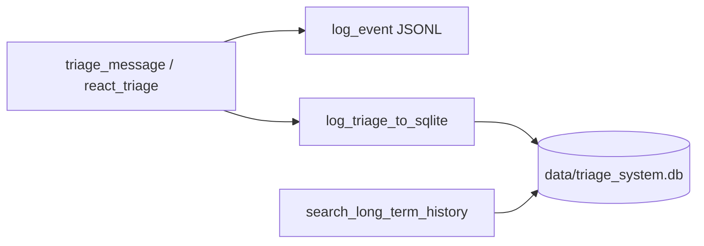
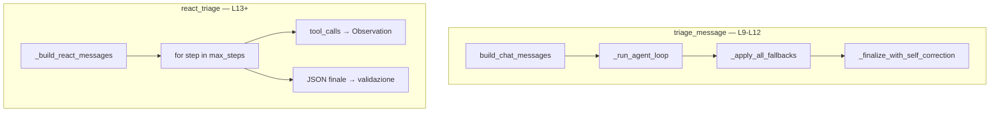

# Lezione 13 — Architettura ReAct e Upgrade Infrastrutturale (SQLite)

**Settimana 9 (parte 1)** — complementa [README — ReAct e SQLite](../README.md#react-e-sqlite-lezione-13) e [CORSO_LEZIONI.md](CORSO_LEZIONI.md).

**Branch:** `lesson-13-react-sqlite` (include lezioni 9–12).

## Obiettivi didattici

1. Capire perché la Long-Term Memory su file flat JSONL non scala (O(N)).
2. Migrare lo storico cliente su **SQLite indicizzato** (O(log N)).
3. Introdurre il loop **ReAct** (Thought → Action → Observation) multi-step.
4. Mantenere **dual-write** JSONL + SQLite (audit L12 + LTM L13).

## 13.1 Perché SQLite?

Fino alla Settimana 8, `logs/activity.jsonl` è lo strumento di audit per KPI, benchmark e analytics. Per interrogare lo storico di un cliente specifico, però, scansionare riga per riga non è sostenibile in produzione.

| Aspetto | JSONL (`log_event`) | SQLite (`log_triage_to_sqlite`) |
|---
**Branch storico demo:** `lesson-13-react-sqlite`. Su `lesson-19-hitl-breakpoints` (e branch successivi a L13), `main.py` non espone più la demo CLI di questa lezione — fare checkout su `lesson-13-react-sqlite`.
------|---------------------|----------------------------------|
| Scopo | Audit operativo, KPI L12 | Long-Term Memory per cliente |
| Ricerca per `cliente_nome` | O(N) scan sequenziale | O(log N) con indice `idx_cliente` |
| File | `logs/activity.jsonl` | `data/triage_system.db` |
| Tool LLM | — | `search_long_term_history` |

### Schema tabella `tickets`

```sql
CREATE TABLE tickets (
    id INTEGER PRIMARY KEY AUTOINCREMENT,
    cliente_nome TEXT NOT NULL,
    categoria TEXT NOT NULL,
    priorita TEXT NOT NULL,      -- es. "HIGH" (allineato a TriageResult)
    sentiment TEXT NOT NULL,
    riassunto_breve TEXT NOT NULL,
    lingua TEXT NOT NULL,
    azione_eseguita TEXT,
    created_at TIMESTAMP DEFAULT CURRENT_TIMESTAMP
);
CREATE INDEX idx_cliente ON tickets(cliente_nome);
```

> **Primo avvio:** `data/triage_system.db` **non è in Git** (`.gitignore`). Dopo checkout su branch L13–L16 eseguire `PYTHONPATH=src python3 scripts/init_triage_db.py` oppure qualsiasi `src/main.py` (bootstrap automatico all'avvio). DDL versionato: [`data/schema/triage_system.sql`](../data/schema/triage_system.sql).

### Dual-write in pipeline

Ogni ticket processato via `main.process_ticket` scrive:

1. `log_event("ticket_processed", …)` → JSONL (KPI, benchmark)
2. `log_triage_to_sqlite({…})` → SQLite (LTM indicizzata)



## 13.2 Framework ReAct

Il tool calling **single-step** (L9–L12) esegue tool e fallback in un unico turno LLM. ReAct decompone il problema in micro-obiettivi iterativi:

| Fase | Ruolo |
|------|--------|
| **Thought** | L'LLM valuta il contesto e pianifica il prossimo passo |
| **Action** | Invoca un tool (es. `search_long_term_history` su SQLite) |
| **Observation** | Il runtime Python esegue la query e restituisce il risultato grezzo |

Il ciclo ripete finché l'agente produce JSON finale **senza** ulteriori `tool_calls`, o finché si esaurisce `max_steps`.

### API `react_triage`

```python
from logic import react_triage

result = react_triage(
    user_input="Sono Marco Rossi. Budget 15.000€, voglio un manager.",
    manuale=manuale_it,
    max_steps=8,  # default su branch L13; L14 abbassa a 4
)
```

**Coesistenza con L9–L12:**

| API | Uso |
|-----|-----|
| `triage_message()` | Pipeline classica: benchmark L12, demo M1–M3, l10, l11 |
| `react_triage()` | Demo L13/L14, laboratorio ReAct multi-step |

### Due motori agentici



## Demo e comandi

```bash
git checkout lesson-13-react-sqlite

# 1. Crea data/triage_system.db (senza API key)
PYTHONPATH=src python3 scripts/init_triage_db.py

# 2. Demo ReAct (Marco Rossi, budget 15k) — richiede OPENAI_API_KEY in .env
PYTHONPATH=src python3 src/main.py --scenario l13

# Demo M2 (seed SQLite isolato su demo_m2_triage.db)
PYTHONPATH=src python3 src/main.py --scenario m2

# Test mirati
pytest tests/test_logger_sqlite.py tests/test_logic.py -k react -q
pytest tests/ -q   # ~66 su questo branch
```

**Cosa osservare in console (L13):**

- `🎬 [ReAct Engine]` — avvio loop
- `🔄 [STEP n/m]` — iterazione corrente
- `🛠️ [ACTION]` / `📥 [OBSERVATION]` — ciclo ReAct
- `💾 [Database SQLite]` — record indicizzato salvato

## File modificati

| File | Ruolo |
|------|--------|
| [`paths.py`](../src/paths.py) | `TRIAGE_DB_PATH`, `DEMO_M2_DB_PATH` |
| [`tools/logger.py`](../src/tools/logger.py) | `init_db`, `log_triage_to_sqlite`, `search_long_term_history_sql` |
| [`tools/history_tools.py`](../src/tools/history_tools.py) | Delega a SQLite (`log_path` deprecato) |
| [`tools/registry.py`](../src/tools/registry.py) | Tool map → `search_long_term_history_sql` |
| [`logic.py`](../src/logic.py) | `react_triage()` |
| [`main.py`](../src/main.py) | Su branch L13: dual-write, demo `l13`; su L17: solo scenari L15–L17 (vedi nota in testa) |
| [`scripts/init_triage_db.py`](../scripts/init_triage_db.py) | Setup SQLite post-clone |
| [`data/schema/triage_system.sql`](../data/schema/triage_system.sql) | DDL versionato |

## Checklist docente

- [ ] Dopo checkout, `data/triage_system.db` creato con `init_triage_db.py` o `main.py`
- [ ] Studente spiega differenza O(N) vs O(log N) per LTM
- [ ] Dual-write JSONL + SQLite compreso (KPI vs storico cliente)
- [ ] Demo L13 mostra almeno un ciclo Action → Observation
- [ ] Demo M2 usa `data/demo_m2_triage.db` (DB isolato, non mescolato col principale)
- [ ] `triage_message` resta il percorso del benchmark L12

## Collegamenti

- [Lezione 17 — Performance MAS](LEZIONE_17_MULTI_AGENT_PERFORMANCE.md) — pruning su `react_triage`, cache tool
- [Lezione 14 — Planning loop](LEZIONE_14_PLANNING_LOOPS.md) — `max_steps=4`, STM, self-correction in-loop
- [Lezione 15 — Multi-agent](LEZIONE_15_MULTI_AGENT_COORDINATION.md) — topologie, ruoli, Blackboard
- [Lezione 16 — CrewAI/AutoGen](LEZIONE_16_CREW_AUTOGEN.md) — `multi_agent_triage`, demo `l16a`/`l16b`
- [Lezione 18 — Sicurezza MAS](LEZIONE_18_MULTI_AGENT_SECURITY.md) — guardrail, tool gate
- [Lezione 19 — HITL](LEZIONE_19_HITL_BREAKPOINTS.md) — breakpoint e resume ReAct (branch `lesson-19-hitl-breakpoints`)
- [GESTIONE_ERRORI.md](../GESTIONE_ERRORI.md) — errori ReAct e fallback
- [LEZIONE_12_PROMPT_OPTIMIZATION.md](LEZIONE_12_PROMPT_OPTIMIZATION.md) — KPI su JSONL invariati
