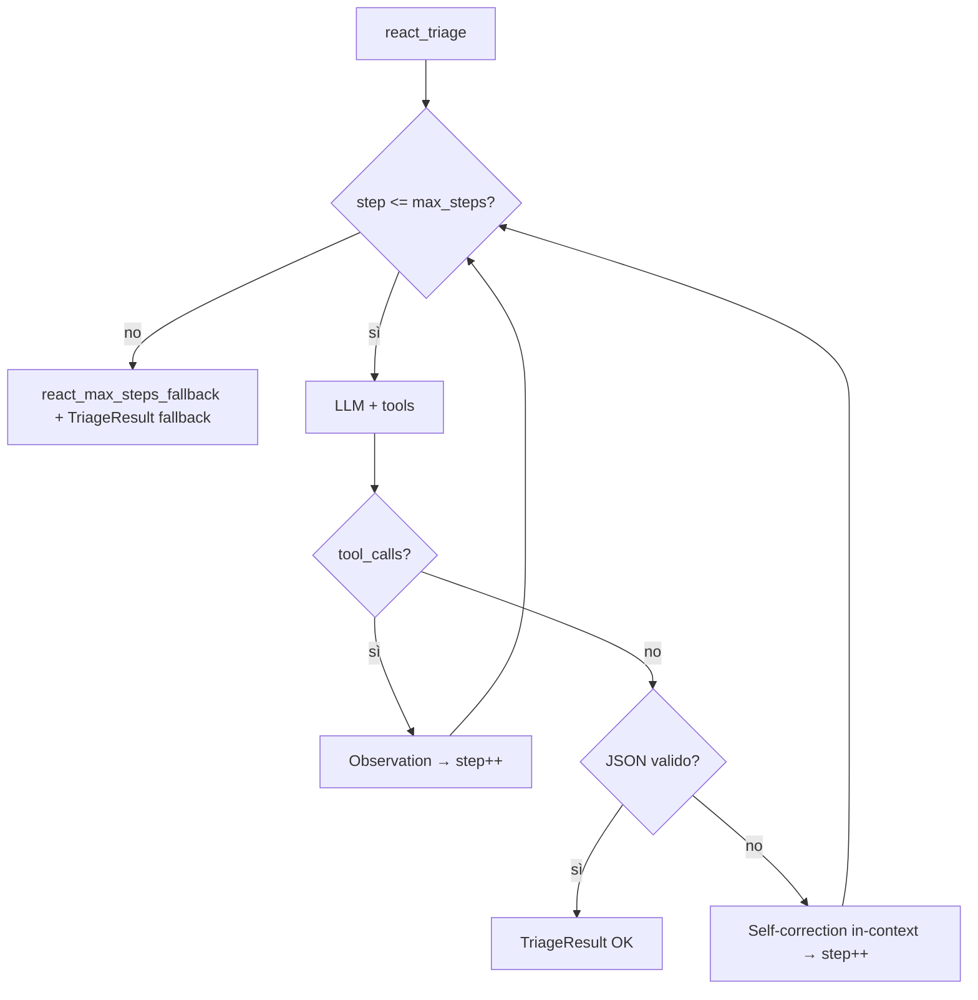

# Lezione 14 — Planning Multi-Step Avanzato e Controllo dei Loop

**Settimana 9 (parte 2)** — complementa [README — Planning Multi-Step](../README.md#planning-multi-step-lezione-14) e [CORSO_LEZIONI.md](CORSO_LEZIONI.md).

**Branch:** `lesson-14-planning-loops` (include lezioni 9–13).

## Obiettivi didattici

1. Prevenire **Infinite Reasoning Loops** con un contatore deterministico (`max_steps = 4`).
2. Implementare **Short-Term Memory** ReAct tramite `_SHORT_TERM_STORE` e `session_id`.
3. Applicare **self-correction in-loop** (errore Pydantic reiniettato nel ciclo ReAct).
4. Verificare convergenza su demo multi-turno Marco Rossi (STM + LTM SQLite).

## 14.1 Prevenzione loop e riparazione sintattica

Lasciare l'agente libero di ciclare Thought → Action espone il sistema a loop infiniti che esauriscono il budget API.

| Meccanismo | Implementazione |
|---
**Branch storico demo:** `lesson-14-planning-loops`. Su `lesson-20-structured-telemetry` (e branch successivi a L14), `main.py` non espone più la demo CLI di questa lezione — fare checkout su `lesson-14-planning-loops`.
---------|-----------------|
| Hard stop | `DEFAULT_REACT_MAX_STEPS = 4` in [`logic.py`](../src/logic.py) |
| Fallback strutturato | `TriageResult` con `azione_eseguita: "Fallback per interruzione ciclo ReAct"` |
| Audit JSONL | `event_type: react_max_steps_fallback` |
| Self-correction in-loop | JSON invalido → messaggio `user` con errore Pydantic → prossimo step |



### Self-correction: L11 vs L14

| Aspetto | Lezione 11 (`triage_message`) | Lezione 14 (`react_triage`) |
|---------|--------------------------------|-----------------------------|
| Quando | Dopo `_run_agent_loop`, fase JSON finale | Dentro il loop ReAct, al primo JSON senza tool |
| Meccanismo | `_finalize_with_self_correction` (max 3 retry LLM dedicati) | Append errore Pydantic + **consuma uno step** ReAct |
| Fallback | `_emergency_triage_result` | Fallback ReAct + `react_max_steps_fallback` |

Entrambi convivono: il benchmark L12 usa ancora L11; le demo L13/L14 usano ReAct.

## 14.2 Short-Term Memory ReAct

Due sistemi di memoria a breve termine coesistono per scopi didattici distinti:

| Sistema | Chiave | Modulo | Demo |
|---------|--------|--------|------|
| `SessionManager` | `ticket_id` (int) | `memory/session_manager.py` | M1 — chiarimento multi-turno |
| `_SHORT_TERM_STORE` | `session_id` (str) | `logic.py` | L14 — thread ReAct Marco Rossi |

```python
from logic import react_triage

# Turno 1 — inizializza session_01
react_triage(ticket_1, manuale, session_id="session_01")

# Turno 2 — riusa conversazione accumulata (Thought/Action/Observation precedenti)
react_triage(ticket_2, manuale, session_id="session_01")
```

Wrapper demo in [`main.py`](../src/main.py):

```python
process_ticket_react(ticket_1, session_id="session_01")
process_ticket_react(ticket_2, session_id="session_01")
```

## Demo L14

Due ticket Marco Rossi sulla stessa `session_01`:

| Turno | Messaggio | Cosa verificare |
|-------|-----------|-----------------|
| 1 | Budget 15.000€, richiesta manager | ReAct + scrittura SQLite |
| 2 | Richiesta sconto sul progetto precedente | STM (thread) + LTM (`search_long_term_history`) |

```bash
git checkout lesson-14-planning-loops

# Bootstrap SQLite (se assente)
PYTHONPATH=src python3 scripts/init_triage_db.py

PYTHONPATH=src python3 src/main.py --scenario l14
```

## Test automatici (L14)

| Test | Verifica |
|------|----------|
| `test_react_max_steps_fallback` | Tool loop infinito → fallback al step 4 |
| `test_react_self_correction_in_loop` | JSON invalido → JSON valido entro max_steps |
| `test_short_term_store_preserves_session` | Stesso `session_id` → conversazione crescente |

```bash
pytest tests/test_logic.py -k "react or short_term" -q
pytest tests/ -q   # ~69 su questo branch
```

## File chiave

| File | Modifica L14 |
|------|----------------|
| [`logic.py`](../src/logic.py) | `session_id`, `_SHORT_TERM_STORE`, in-loop self-correction, `max_steps=4` |
| [`main.py`](../src/main.py) | Su branch L14: `run_l14_planning_demo`; su `lesson-20-structured-telemetry`: scenari L15–L20 |
| [`scripts/init_triage_db.py`](../scripts/init_triage_db.py) | Setup SQLite post-clone (eredita da L13) |

## Checklist docente

- [ ] Dopo checkout, bootstrap SQLite con `init_triage_db.py` o `main.py`
- [ ] Studente spiega perché `max_steps=4` è un hard stop deterministico
- [ ] Demo L14: secondo ticket sfrutta STM + LTM
- [ ] Evento `react_max_steps_fallback` visibile in `logs/activity.jsonl` se si forza loop
- [ ] Benchmark L12 (`triage_message`) ancora verde — nessuna regressione

## Prerequisito

[LEZIONE_13_REACT_SQLITE.md](LEZIONE_13_REACT_SQLITE.md) — SQLite LTM e loop ReAct base.

## Collegamenti

- [Lezione 17 — Performance MAS](LEZIONE_17_MULTI_AGENT_PERFORMANCE.md) — ottimizzazione STM ReAct
- [GESTIONE_ERRORI.md](../GESTIONE_ERRORI.md) — tipi errore ReAct
- [LEZIONE_11_RESILIENZA.md](LEZIONE_11_RESILIENZA.md) — self-correction classica
- [LEZIONE_12_PROMPT_OPTIMIZATION.md](LEZIONE_12_PROMPT_OPTIMIZATION.md) — KPI JSONL

## Prossimo passo

[LEZIONE_15_MULTI_AGENT_COORDINATION.md](LEZIONE_15_MULTI_AGENT_COORDINATION.md) — modelli multi-agente, topologie e Blackboard → [L16](LEZIONE_16_CREW_AUTOGEN.md) orchestrazione CrewAI/AutoGen.
