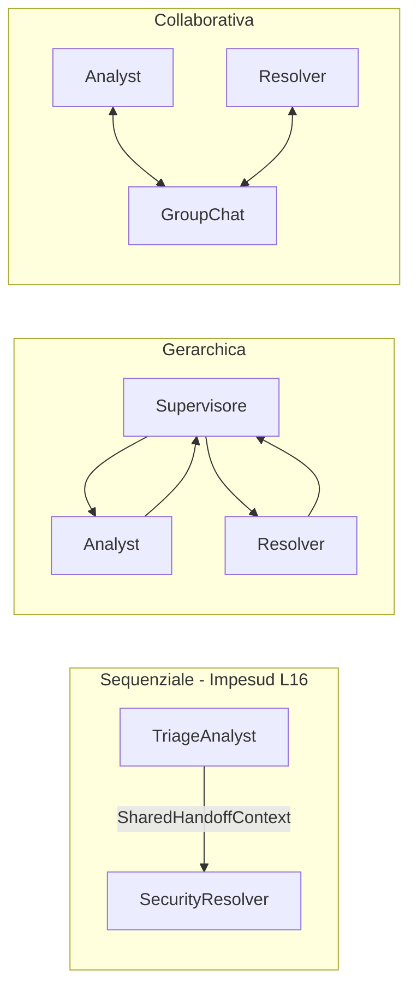

# Lezione 15 — Modelli di Coordinazione, Ruoli e Sistemi Distribuiti

**Settimana 12 (parte 1)** — complementa [CORSO_LEZIONI.md](CORSO_LEZIONI.md).

**Branch:** `lesson-15-multi-agent-topologies` (include lezioni 9–15; L16 sul branch successivo).

**Durata:** 2 ore — architettura distribuita e comunicazione concettuale (nessun framework esterno).

## Obiettivi didattici

1. Comprendere il **limite dell'agente monolitico** (`react_triage`, Lezione 14).
2. Applicare la **Separazione delle Responsabilità** con Role, Goal, Backstory.
3. Confrontare le **topologie di comunicazione**: Gerarchica, Sequenziale, Collaborativa.
4. Introdurre il pattern **Blackboard** (`SharedHandoffContext`) per il hand-off tra agenti.

## 15.1 Il limite dell'agente monolitico

Fino alla Settimana 9 abbiamo spinto al limite il singolo agente stateful. Di fronte a flussi articolati (analisi incident, policy, report board, script mitigazione), un agente unico soffre della **sindrome del tuttofare**: prompt sovraccarico, perdita di focus, allucinazioni sui parametri dei tool.

I **Sistemi Multi-Agente (MAS)** scompongono il macro-problema in una squadra:

| Componente | Significato |
|------------|-------------|
| **Role** | Specializzazione (es. SOC Triage Analyst) |
| **Goal** | Missione microscopica dell'agente |
| **Backstory** | Prompt identitario: tono, vincoli, esperienza |

### Confronto con Lezione 14

| Aspetto | L14 (`react_triage`) | L15 (concettuale) |
|---------|---------------------|-------------------|
| Agenti | 1 con tutti i tool | Squadra con ruoli e tool partizionati |
| Stato | `_SHORT_TERM_STORE` | `SharedHandoffContext` (blackboard) |
| Coordinazione | Loop ReAct lineare | Topologia scelta (gerarchica / pipeline / swarm) |

## 15.2 Topologie di comunicazione

| Topologia | Meccanismo di controllo | Caso d'uso ideale |
|-----------|----------------------|-------------------|
| **Gerarchica** | Supervisore delega e valida il risultato finale | Flussi rigidi con approvazione (triage + report formale) |
| **Sequenziale / Pipeline** | Output Agente A → input Agente B | Estrazione → Analisi → Traduzione |
| **Collaborativa / Swarm** | Chat condivisa, intervento autonomo | Investigazione minacce non strutturate |



Nel contesto di sistemi distribuiti reali, gli agenti possono risiedere su microservizi diversi e comunicare in modo asincrono tramite code di messaggi o database condivisi (**Blackboard Pattern**).

## Squadra Impesud (definizione statica)

Definita in [`src/orchestration/topologies.py`](../src/orchestration/topologies.py):

| Agente | Role | Tool |
|--------|------|------|
| **TriageAnalyst** | Anagrafica, sentiment, storico | `search_long_term_history` |
| **SecurityResolver** | Policy RAG, escalation, JSON | `search_policy`, `notify_manager` |

Il partizionamento dei tool riduce le allucinazioni sui parametri: ogni agente vede solo ciò che gli compete.

## SharedHandoffContext (Blackboard)

Modello in [`src/orchestration/models.py`](../src/orchestration/models.py):

```python
from orchestration.topologies import simulate_analyst_handoff

handoff = simulate_analyst_handoff(ticket_message)
# → cliente_nome, sentiment, analyst_notes, source_agent, target_agent
```

Campi principali: `ticket_message`, `cliente_nome`, `sentiment`, `storico_summary`, `analyst_notes`, `topology`.

## Demo L15

```bash
git checkout lesson-15-multi-agent-topologies
PYTHONPATH=src python3 src/main.py --scenario l15
```

La demo **non richiede OPENAI_API_KEY**: stampa le topologie, la squadra e simula il hand-off sul ticket Marco Rossi.

## Test automatici (L15)

| Test | Verifica |
|------|----------|
| `test_agent_spec_fields` | Role/goal/backstory/tools valorizzati |
| `test_handoff_context_roundtrip` | Serializzazione `SharedHandoffContext` |
| `test_topology_enum_values` | 3 topologie presenti |
| `test_analyst_resolver_tool_partition` | Nessun overlap tool |
| `test_simulate_handoff_marco_rossi` | Hand-off popola `cliente_nome` |

```bash
pytest tests/test_orchestration.py -q
pytest tests/ -q   # ~76 su branch L15; ~83 su branch L16 (include test_multi_agent)
```

## File chiave

| File | Ruolo L15 |
|------|-----------|
| [`orchestration/models.py`](../src/orchestration/models.py) | `AgentSpec`, `CommunicationTopology`, `SharedHandoffContext` |
| [`orchestration/topologies.py`](../src/orchestration/topologies.py) | Catalogo topologie, squadra Impesud, `simulate_analyst_handoff` |
| [`main.py`](../src/main.py) | `run_l15_topology_demo`, `--scenario l15` |

## Checklist docente

- [ ] Studente spiega perché un agente monolitico non scala su flussi SOC articolati
- [ ] Studente confronta le 3 topologie con un esempio Impesud ciascuna
- [ ] Demo L15: hand-off mostra `cliente_nome=Marco` e sentiment sul ticket demo
- [ ] Studente descrive come il Resolver consuma il Blackboard in L16 (`l16a`/`l16b`)
- [ ] Benchmark L12 e demo L13/L14 ancora verdi

## Prerequisito

[LEZIONE_14_PLANNING_LOOPS.md](LEZIONE_14_PLANNING_LOOPS.md) — `react_triage`, STM, max_steps.

## Prossimo passo (Lezione 16)

Orchestrazione pratica: [LEZIONE_16_CREW_AUTOGEN.md](LEZIONE_16_CREW_AUTOGEN.md) — branch `lesson-16-crew-autogen-orchestration`.
