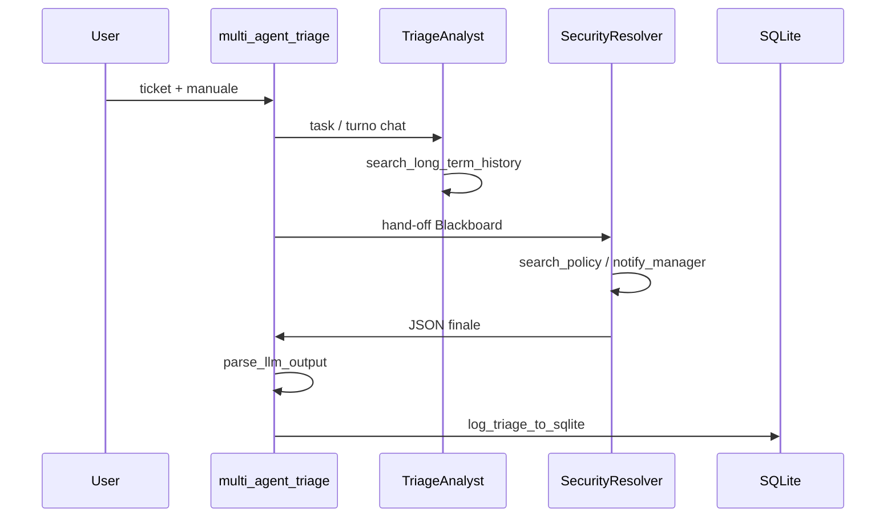

# Lezione 16 — Orchestrazione con Framework (CrewAI & AutoGen)

**Settimana 12 (parte 2)** — complementa [LEZIONE_15_MULTI_AGENT_COORDINATION.md](LEZIONE_15_MULTI_AGENT_COORDINATION.md) e [CORSO_LEZIONI.md](CORSO_LEZIONI.md).

**Demo live:** [SETTIMANA_12_DEMO_LIVE.md](SETTIMANA_12_DEMO_LIVE.md) — sezioni `l16a` e `l16b`.

**Branch:** `lesson-16-crew-autogen-orchestration` (include lezioni 9–16). Demo CLI anche su `lesson-17-multi-agent-performance` (`l16a`/`l16b`).

**Durata:** 2 ore — laboratorio pratico con framework industriali.

## Obiettivi didattici

1. Confrontare **CrewAI** (process-driven, pipeline) e **AutoGen** (event-driven, GroupChat).
2. Orchestrare **TriageAnalyst → SecurityResolver** con hand-off su `SharedHandoffContext`.
3. Produrre `TriageResult` valido + persistenza SQLite.
4. Mantenere retrocompatibilità con `triage_message`, `react_triage`, benchmark L12.

## 16.1 Filosofie a confronto

| Aspetto | CrewAI (`l16a`) | AutoGen (`l16b`) |
|---------|-----------------|------------------|
| Paradigma | Process-driven, task definiti a monte | Event-driven, conversazione di gruppo |
| Topologia L15 | Sequenziale / pipeline | Collaborativa / swarm |
| Coordinazione | `Process.sequential`, `context=[task1]` | `RoundRobinGroupChat`, turni alternati |
| Ideale per | Flussi rigidi a catena | Problem solving iterativo |



## 16.2 Implementazione Impesud

### Facade

[`multi_agent_triage()`](../src/logic.py) delega a:

| Orchestratore | Modulo | Topologia |
|---------------|--------|-----------|
| `crewai` | [`crew_pipeline.py`](../src/orchestration/crew_pipeline.py) | Sequenziale |
| `autogen` | [`autogen_team.py`](../src/orchestration/autogen_team.py) | Collaborativa |

### Tool partizionati

| Agente | Tool |
|--------|------|
| TriageAnalyst | `search_long_term_history` |
| SecurityResolver | `search_policy`, `notify_manager` |

Adapter: [`tool_adapters.py`](../src/orchestration/tool_adapters.py) — delega a [`TOOL_MAP`](../src/tools/registry.py).

### Stato condiviso

Il Resolver riceve il Blackboard serializzato (`SharedHandoffContext`) nel prompt di sistema e nella descrizione task (CrewAI) o nel messaggio iniziale del team (AutoGen).

### Validazione output

[`finalize_multi_agent_output()`](../src/orchestration/result_parser.py) → `parse_llm_output` → `TriageResult`.  
Se JSON invalido: `multi_agent_fallback` in `activity.jsonl` + emergency fallback strutturato.

## Installazione

```bash
git checkout lesson-16-crew-autogen-orchestration
python3 -m venv .venv && source .venv/bin/activate
pip install -e ".[test,multiagent]"
```

Dipendenze opzionali `[multiagent]`: `crewai`, `autogen-agentchat`, `autogen-ext[openai]`.

> Usare **`autogen-agentchat`** (API moderna), non il vecchio pacchetto `pyautogen`. Microsoft AutoGen core è in maintenance.

## Demo live

```bash
# Bootstrap SQLite (se assente)
PYTHONPATH=src python3 scripts/init_triage_db.py

# CrewAI — pipeline sequenziale
PYTHONPATH=src python3 src/main.py --scenario l16a

# AutoGen — GroupChat collaborativo
PYTHONPATH=src python3 src/main.py --scenario l16b
```

**Prerequisito:** `OPENAI_API_KEY` in `.env` (non `export` in shell).

Ticket demo: Marco Rossi, budget 15.000€, richiesta manager (riuso L13/L15).

## Test automatici (L16)

| Test | Verifica |
|------|----------|
| `test_crew_pipeline_mocked` | CrewAI mock → `TriageResult` |
| `test_autogen_team_mocked` | AutoGen mock → `TriageResult` |
| `test_handoff_injected_in_resolver_prompt` | Blackboard nel task Resolver |
| `test_multi_agent_triage_missing_deps` | Messaggio install `[multiagent]` |
| `test_triage_message_unchanged_for_benchmark` | Nessuna regressione L12 |

```bash
pytest tests/test_multi_agent.py -q
pytest tests/ -q   # ~83 su questo branch
```

## File chiave

| File | Ruolo L16 |
|------|-----------|
| [`logic.py`](../src/logic.py) | `multi_agent_triage()` |
| [`orchestration/crew_pipeline.py`](../src/orchestration/crew_pipeline.py) | Pipeline CrewAI |
| [`orchestration/autogen_team.py`](../src/orchestration/autogen_team.py) | Team AutoGen |
| [`prompts/agents/`](../src/prompts/agents/) | System prompt per ruolo |
| [`main.py`](../src/main.py) | Demo `l16a`, `l16b` |

## Checklist docente

- [ ] `pip install -e ".[multiagent]"` completato in aula
- [ ] Demo L16a: studente spiega `Process.sequential` e `context=[task1]`
- [ ] Demo L16b: studente spiega GroupChat vs pipeline
- [ ] Output JSON valido su ticket Marco Rossi
- [ ] Evento `crew_triage_complete` / `autogen_triage_complete` in `activity.jsonl`
- [ ] Benchmark L12 e demo L13–L15 ancora verdi

## Prerequisito

[LEZIONE_15_MULTI_AGENT_COORDINATION.md](LEZIONE_15_MULTI_AGENT_COORDINATION.md) — topologie, `AgentSpec`, Blackboard.

## Collegamenti

- [GESTIONE_ERRORI.md](../GESTIONE_ERRORI.md) — errori a confine multi-agent
- [LEZIONE_14_PLANNING_LOOPS.md](LEZIONE_14_PLANNING_LOOPS.md) — agente monolitico ReAct (confronto)

## Prossimo passo (Lezione 17)

[LEZIONE_17_MULTI_AGENT_PERFORMANCE.md](LEZIONE_17_MULTI_AGENT_PERFORMANCE.md) — branch `lesson-17-multi-agent-performance`.
