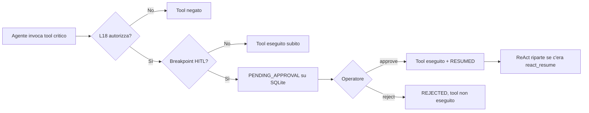

# Lezione 19 — Scalabilità del Flusso e Stato Human-in-the-Loop (HITL)

**Settimana 14** — complementa [LEZIONE_18_MULTI_AGENT_SECURITY.md](LEZIONE_18_MULTI_AGENT_SECURITY.md) e [CORSO_LEZIONI.md](CORSO_LEZIONI.md).

**Stato:** lezione **completata** — branch `lesson-19-hitl-breakpoints` (checkpoint storico). Il corso prosegue con la [Lezione 20](LEZIONE_20_STRUCTURED_TELEMETRY.md) su `lesson-20-structured-telemetry`.

**Demo live:** [SETTIMANA_14_DEMO_LIVE.md](SETTIMANA_14_DEMO_LIVE.md) — sezioni `l19a`, `l19b` (su branch L20, `all` include anche L20: [SETTIMANA_15_DEMO_LIVE.md](SETTIMANA_15_DEMO_LIVE.md)).

**Branch didattico L19:** `lesson-19-hitl-breakpoints` (include lezioni 9–19).

**Durata:** 2 ore — Breakpoint deterministici, persistenza STM, resume workflow.

## Obiettivi didattici

1. Spiegare perché le **azioni irreversibili** richiedono approvazione umana oltre al tool gate L18.
2. Implementare **breakpoint deterministici** prima di `isolate_account` e `notify_manager` priority ≥ 4.
3. Persistere **STM e contesto pipeline** su SQLite (`ticket_states`) con `PENDING_APPROVAL`.
4. Eseguire **resume** via CLI operatore (`approve` / `reject`) e **riprendere il loop ReAct** dopo approvazione.

---

## Come usare i breakpoint (guida pratica)

Un **breakpoint HITL** è una pausa automatica **prima** che un tool critico venga eseguito. L'agente non resta bloccato in attesa: salva lo stato su SQLite e si ferma con un messaggio chiaro. Un operatore umano decide se procedere.

### Cosa fa scattare il breakpoint

La regola è in [`is_hitl_breakpoint()`](../src/orchestration/hitl_breakpoints.py):

| Tool | Breakpoint? | Condizione |
|------|-------------|------------|
| `isolate_account` | **Sì, sempre** | Dopo che il tool gate L18 ha già autorizzato l'azione |
| `notify_manager` | **Sì, se** `priority >= 4` | Priorità 1–3 → esecuzione immediata |
| Tutti gli altri (`search_policy`, `search_long_term_history`, …) | **No** | Nessuna pausa HITL |

**Importante — due livelli di controllo:**

1. **Lezione 18 (tool gate):** può **negare** un'azione (es. `notify_manager` senza evidenza policy).
2. **Lezione 19 (breakpoint):** se L18 ha **autorizzato**, l'azione critica viene **messa in pausa** per approvazione umana.

### Flusso in 4 passi (operatore)



| Passo | Chi | Cosa succede |
|-------|-----|----------------|
| **1** | Agente | Nel loop ReAct (o in demo), l'LLM chiede `isolate_account` o `notify_manager` con priority ≥ 4 |
| **2** | Sistema | Salva sessione in `ticket_states`, logga `hitl_breakpoint_reached`, solleva `HitlApprovalRequired` con `session_id` |
| **3** | Operatore | Consulta le sessioni in attesa e decide |
| **4a** | Operatore → **approve** | Il tool pendente viene eseguito; status → `RESUMED`; se era un ticket ReAct, il loop continua |
| **4b** | Operatore → **reject** | Il tool **non** viene eseguito; status → `REJECTED` |

### Comandi operatore (dopo la pausa)

```bash
# 1. Elenco sessioni in attesa
PYTHONPATH=src python3 -m orchestration.hitl_cli list

# 2a. Approva ed esegui il tool pendente
PYTHONPATH=src python3 -m orchestration.hitl_cli approve hitl-l19a-isolate --operator mario.rossi

# 2b. Oppure rifiuta (il tool non parte)
PYTHONPATH=src python3 -m orchestration.hitl_cli reject hitl-l19a-isolate --operator mario.rossi --reason "falso positivo"
```

Output tipico di `list`:

```
session_id             tool               status             excerpt
------------------------------------------------------------------------
hitl-l19a-isolate      isolate_account    PENDING_APPROVAL   Ransomware su FIN-042...
```

Dopo `approve`, verificare in console: `APPROVED session_id=...` e anteprima dell'output del tool.

### Uso automatico con `react_triage` (caso più comune)

I breakpoint sono **attivi di default** (`enable_hitl=True`). Non serve configurare nulla oltre al database inizializzato.

```python
from logic import react_triage
from errors import HitlApprovalRequired

try:
    result = react_triage(
        "Ransomware su account FIN-042, isolare subito.",
        manuale=manuale_it,
        session_id="ticket-soc-001",   # opzionale ma consigliato per STM multi-turno
        enable_hitl=True,              # default: True
    )
except HitlApprovalRequired as exc:
    # L'agente si è fermato al breakpoint
    print(exc)                       # contiene session_id HITL
    print(exc.session_id)            # es. hitl-ticket-soc-001
    # A questo punto l'operatore usa hitl_cli approve/reject
```

**Cosa succede internamente:**

1. L'agente arriva a un tool critico nel loop ReAct.
2. Il sistema crea una sessione HITL con id `hitl-{session_id}` (es. `hitl-ticket-soc-001`).
3. Salva conversazione + metadati `react_resume` in SQLite.
4. Aggiorna la short-term memory e solleva `HitlApprovalRequired`.
5. Dopo `approve`, `react_triage_resume()` riprende dal passo successivo fino al JSON finale.

**Per disattivare i breakpoint** (es. test automatici o fallback L11):

```python
react_triage(ticket, manuale, enable_hitl=False)
```

### Uso manuale / demo senza LLM

Per laboratorio o integrazione custom si può chiamare direttamente la pipeline HITL:

```python
from errors import HitlApprovalRequired
from orchestration.hitl_breakpoints import HitlPauseContext
from orchestration.hitl_pipeline import invoke_critical_tool_with_hitl, approve_session
from orchestration.tool_policy_gate import ToolPolicyContext
from tools.registry import TOOL_MAP

ctx = ToolPolicyContext(
    cache=cache,                      # deve contenere evidenza policy per L18
    pipeline_categoria="SECURITY",
    enable_hitl=True,                 # attiva i breakpoint
)
pause_ctx = HitlPauseContext(
    session_id="hitl-demo-1",         # id scelto dall'operatore
    stm_messages=conversazione,
    user_input_excerpt=ticket[:200],
)

try:
    invoke_critical_tool_with_hitl(
        "isolate_account",
        {"account_name": "FIN-042", "reason": "Ransomware"},
        TOOL_MAP["isolate_account"],
        ctx,
        pause_ctx=pause_ctx,
    )
except HitlApprovalRequired as exc:
    print(f"In attesa approvazione: {exc.session_id}")

# Operatore approva (da CLI o da codice)
approve_session("hitl-demo-1", operator="docente.demo")
```

### Tabella riepilogativa — cosa usare e quando

| Obiettivo | Cosa fare |
|-----------|-----------|
| Triage ReAct con pausa su azioni critiche | `react_triage(..., enable_hitl=True)` + gestire `HitlApprovalRequired` |
| Solo eseguire tool critici senza pausa | `enable_hitl=False` su `react_triage` o su `ToolPolicyContext` |
| Vedere cosa è in attesa | `hitl_cli list` |
| Autorizzare un'azione in sospeso | `hitl_cli approve <session_id> --operator <nome>` |
| Bloccare un'azione in sospeso | `hitl_cli reject <session_id> --operator <nome> --reason "..."` |
| Riprendere ReAct dopo approve | Automatico se la pausa veniva da `react_triage` (blocco `react_resume` in SQLite) |
| Demo rapida senza API key | `python3 src/main.py --scenario l19a` poi `l19b` |

### Messaggi da riconoscere

| Messaggio | Significato |
|-----------|-------------|
| `[HITL PAUSED] session_id=... tool=...` | Breakpoint attivo; azione **non** ancora eseguita |
| `HitlApprovalRequired` | Eccezione Python: interrompi il flusso applicativo e passa all'operatore |
| `APPROVED session_id=...` (CLI) | Tool eseguito; sessione `RESUMED` |
| `[HITL REJECTED] session_id=...` | Operatore ha rifiutato; tool **non** eseguito |

### Prerequisito tecnico

Prima del primo utilizzo:

```bash
PYTHONPATH=src python3 scripts/init_triage_db.py
```

Senza la tabella `ticket_states` la pausa fallisce al salvataggio.

---

## 19.1 Azioni irreversibili e concorrenza

> Per i comandi operatore e gli esempi di codice, vedi la sezione [Come usare i breakpoint](#come-usare-i-breakpoint-guida-pratica) sopra.

Il tool gate L18 **nega** azioni senza evidenza policy. La L19 **mette in pausa** azioni ammesse ma ad alto impatto (tabella regole nella guida pratica).

Al breakpoint il runtime:

1. interrompe l'esecuzione del tool (non blocca il server con thread in attesa);
2. serializza STM (`stm_json`) e contesto (`pipeline_context_json`);
3. salva su `ticket_states` con `status = PENDING_APPROVAL`;
4. restituisce observation `[HITL PAUSED] session_id=…` e solleva `HitlApprovalRequired`.

**Moduli:** [`hitl_breakpoints.py`](../src/orchestration/hitl_breakpoints.py), [`hitl_pipeline.py`](../src/orchestration/hitl_pipeline.py)

## 19.2 Architettura database `ticket_states`

Tabella SQLite (oltre a `tickets` LTM e `security_alerts` L18):

| Colonna | Ruolo |
|---------|--------|
| `session_id` | Chiave univoca sessione HITL |
| `status` | `PENDING_APPROVAL` \| `RESUMED` \| `REJECTED` |
| `pending_tool` / `pending_args_json` | Azione in sospeso |
| `stm_json` | Snapshot conversazione ReAct |
| `pipeline_context_json` | Cache policy/LTM, handoff, categoria |

**Modulo:** [`hitl_store.py`](../src/orchestration/hitl_store.py)

Per i comandi `list` / `approve` / `reject` vedi [Come usare i breakpoint — Comandi operatore](LEZIONE_19_HITL_BREAKPOINTS.md#comandi-operatore-dopo-la-pausa).

## Integrazione pipeline

| Entry point | Flag | Note |
|-------------|------|------|
| `react_triage` | `enable_hitl=True` (default) | Pausa su tool critici nel loop ReAct |
| `triage_message` fallback L11 | `enable_hitl=False` | Fallback automatici VIP/ARRABBIATO senza pausa |
| `tool_adapters` | via `ToolPolicyContext.enable_hitl` | CrewAI / AutoGen Resolver |

**Eccezione:** `HitlApprovalRequired` in [`errors.py`](../src/errors.py)

## Resume ReAct completo

Dopo `approve_session`, se `pipeline_context_json` contiene `react_resume`:

1. l'observation del tool approvato viene aggiunta a `stm_json`;
2. `_SHORT_TERM_STORE` viene ripristinato con la conversazione aggiornata;
3. `react_triage_resume()` continua il loop dal passo successivo (`from_step + 1`) fino a JSON finale o `max_steps`.

Alias didattico: `resume_session = approve_session` in [`hitl_pipeline.py`](../src/orchestration/hitl_pipeline.py).

**Modulo:** [`logic.py`](../src/logic.py) — `react_triage_resume`, `_react_triage_loop`

## Installazione

```bash
git checkout lesson-19-hitl-breakpoints
python3 -m venv .venv && source .venv/bin/activate
pip install -e ".[test,multiagent]"
PYTHONPATH=src python3 scripts/init_triage_db.py
```

## Demo live

```bash
PYTHONPATH=src python3 src/main.py --scenario l19a   # breakpoint (no LLM)
PYTHONPATH=src python3 src/main.py --scenario l19b   # approve/reject (no LLM)
PYTHONPATH=src python3 src/main.py --scenario all    # L15 → L19
```

KPI HITL:

```bash
PYTHONPATH=src python3 -m analytics.log_kpi
```

## Test automatici (L19)

```bash
pytest tests/test_hitl_breakpoints.py tests/test_hitl_store.py \
       tests/test_hitl_pipeline.py tests/test_hitl_cli.py \
       tests/test_logic.py -k "hitl or react_triage_resume" -q
pytest tests/ -q   # 174 test su questo branch; ~184 su `lesson-20-structured-telemetry`
```

## File chiave

| File | Ruolo L19 |
|------|-----------|
| [`hitl_breakpoints.py`](../src/orchestration/hitl_breakpoints.py) | Regole breakpoint |
| [`hitl_store.py`](../src/orchestration/hitl_store.py) | SQLite `ticket_states` |
| [`hitl_pipeline.py`](../src/orchestration/hitl_pipeline.py) | Pause / approve / reject |
| [`hitl_cli.py`](../src/orchestration/hitl_cli.py) | CLI operatore |
| [`logic.py`](../src/logic.py) | `react_triage`, `react_triage_resume`, `_react_triage_loop` |
| [`main.py`](../src/main.py) | Demo `l19a`/`l19b` |

## Checklist docente

- [ ] Branch `lesson-19-hitl-breakpoints` attivo
- [ ] Demo `l19a`: `isolate_account` → `PENDING_APPROVAL` in SQLite
- [ ] Demo `l19b`: approve → `RESUMED`; reject → `REJECTED`
- [ ] Con `react_resume` in SQLite, `approve` riprende il loop ReAct (`react_triage_resume`)
- [ ] Eventi `hitl_breakpoint_reached`, `hitl_session_resumed` in `activity.jsonl`
- [ ] `pytest tests/ -q` verde

## Fine Settimana 14 (lezione 19)

Con la Lezione 19 si completa la Settimana 14 (HITL). **Prossimo passo:** [LEZIONE_20_STRUCTURED_TELEMETRY.md](LEZIONE_20_STRUCTURED_TELEMETRY.md) — telemetria strutturata, costo USD e query SQLite (branch `lesson-20-structured-telemetry`).

Riepilogo Settimana 14:

| Settimana | Lezioni | Competenza chiave |
|-----------|---------|-------------------|
| 8 | 11–12 | Resilienza, benchmark, KPI |
| 9 | 13–14 | ReAct, SQLite LTM, planning loop |
| 12 | 15–17 | Multi-agente, CrewAI/AutoGen, performance |
| 13 | 18 | Sicurezza MAS (guardrail, tool gate) |
| 14 | 19 | HITL, breakpoint, resume operatore |

**Branch di riferimento L19:** `lesson-19-hitl-breakpoints` — `174 test`, demo `l15` … `l19b`, CLI `hitl_cli`. **Corso completo 9–20:** `lesson-20-structured-telemetry` — vedi [LEZIONE_20](LEZIONE_20_STRUCTURED_TELEMETRY.md).

Percorsi paralleli: [MANUALE_PROGETTINO_DATASET_TEST.md](MANUALE_PROGETTINO_DATASET_TEST.md) (progettino SOC L9–L14); fork avanzato `progetto-2`.

## Prerequisito

[LEZIONE_18_MULTI_AGENT_SECURITY.md](LEZIONE_18_MULTI_AGENT_SECURITY.md) — guardrail e tool policy gate.

## Collegamenti

- [LEZIONE_17_MULTI_AGENT_PERFORMANCE.md](LEZIONE_17_MULTI_AGENT_PERFORMANCE.md) — latenza pipeline
- [SETTIMANA_14_DEMO_LIVE.md](SETTIMANA_14_DEMO_LIVE.md) — manuale operativo
- [LEZIONE_20_STRUCTURED_TELEMETRY.md](LEZIONE_20_STRUCTURED_TELEMETRY.md) — telemetria e costo LLM (prossimo passo)
- [GESTIONE_ERRORI.md](../GESTIONE_ERRORI.md) — eventi audit L19

## Documentazione correlata

- [CORSO_LEZIONI.md](CORSO_LEZIONI.md) — mappa branch e comandi
- [README.md](../README.md) — architettura cumulativa
